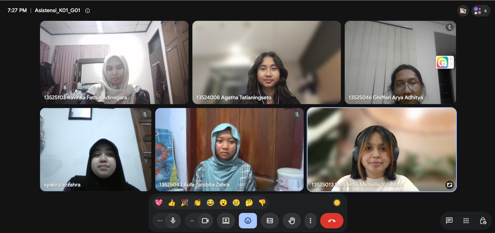

# Form Asistensi

## Tugas Besar IF2150 - Rekayasa Perangkat Lunak

| Informasi | Keterangan |
| --- | --- |
| **Hari** | *Selasa* |
| **Tanggal** | *01/09/2026* |
| **Kelas** | *K01* |
| **Nomor Kelompok** | *1*  |
| **Nama Kelompok** | *berjiwa ksatria*  |
| **Nama Perangkat Lunak** | *RAWAT (Ruang Aspirasi Warga dan Aduan Terpadu)*  |
| **Dokumen** | *K01_G01_Final_TB.md*  |

### Anggota Kelompok

| NIM | Nama |
| --- | --- |
| *13525103* | *Ravinka Fathia Adinegara* |
| *13525013* | *Samantha Michelle S. Silaban* |
| *13525055* | *Syakira Azzahra Rachmania* |
| *13525043* | *Aufa Tatsbita Zahra* |
| *13525046* | *Ghiffari Arya Adhitya* |

### Catatan

| Catatan |
| --- |
| 1. *Asumsi dan batasan bisa dilengkapi lagi sama cakupannya, misalnya kalo di kota bandung apakah mencakup transportasi umum, penerangan, dsb. Biasanya asumsi dari eksternal, batasan dari internal*  |
| 2. *Kebutuhan awal sebaiknya berbentuk poin-poin* |
| 3. *Buat Activity Diagram berdasarkan aktivitas yang utamanya saja, dapat diidentifikasi dari awal usernya hingga akhir. Activty Diagram sebaiknya berbentuk swimlane* |
| 4. *Untuk tabel aktivitas (3.3) adopsi dari user story pengguna awal.* | 
| 5. *Untuk referensi dapat dimasukkan daftar pustaka format APA, lampiran, serta link workspace ketika membuat diagram* | 

## Dokumentasi

<!--  -->

  

  <i>Gambar 1. Dokumentasi kegiatan asistensi.</i>

