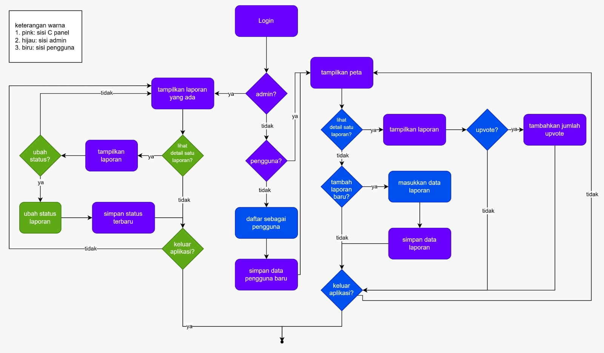

<h1>
IF2150 REKAYASA PERANGKAT LUNAK
 
TUGAS 1
 
TOPIC BRAINSTORMING
</h1>
 

## *Nama Perangkat Lunak*

### Untuk: *Agatha*

Dipersiapkan oleh:
| Informasi | Keterangan |
| --- | --- |
| Kelas | *K01* |
| Kelompok | *01*  |

| NIM | Nama |
|---|---|
| *13525103* | *Ravinka Fathia Adinegara* |
| *13525013* | *Samantha Michelle S Silaban* |
| *13525055* | *Syakira Azzahra Rachmania* |
| *13525043* | *Aufa Tatsbita Zahra* |
| *13525046* | *Ghiffari Arya Adhitya* |
---

 
 

# BAB 1: Analisis Permasalahan

## 1.1 Latar Belakang Masalah
Tuliskan deskripsi permasalahan yang kalian pilih secara naratif dan spesifik. Tambahkan keterkaitan permasalahan tersebut dengan Tujuan Pembangunan Berkelanjutan (SDGs) yang telah disepakati. Dukung argumen kalian dengan data yang kredibel, serta jelaskan urgensi mengapa masalah ini perlu dan layak untuk segera diselesaikan.

## 1.2 Analisis Kondisi Saat Ini
Beberapa solusi terhadap masalah tersebut telah dilakukan di Indonesia. Berikut adalah beberapa contohnya beserta masing-masing kekurangannya.
### A. Media Sosial
Salah satu hal sederhana yang dilakukan masyarakat saat ini adalah melakukan posting di berbagai media sosial. Contoh nyata yang berkaitan adalah sebuah konten yang menyuarakan keresahan jalanan di Lampung yang viral sehingga pengerjaan perbaikan jalan tersebut dipercepat. Menurut Pratiwi (2025), _clicktivism_, yaitu pemanfaatan fitur _like, comment, dan share_, mampu menciptakan tekanan publik yang signifikan terhadap pemerintah. Sehingga, aduan menggunakan media sosial dinilai cukup berdampak.   
Kekurangan dari solusi ini adalah identitas dan validitas pelapor tidak selalu terverifikasi. Dengan memanfaatkan algoritma, seseorang dapat mengakali agar kontennya viral menggunakan beberapa akun palsu. Akibatnya, popularitas suatu aduan belum tentu merepresentasikan urgensi. Selain itu, media sosial adalah ruang yang terlalu luas untuk melakukan keluhan. Sehingga, pemerintah harus memilah berbagai konten terlebih dahulu untuk menemukan keluhan masyarakat yang membutuhkan tindak lanjut. 

### B. SP4N-LAPOR! 

 

<i>Gambar 1.1 Tampilan Antarmuka SP4N-LAPOR! </i>

 
SP4N-Lapor! adalah situs layanan aspirasi dan pengaduan online dari rakyat ke instansi pemerintah yang berwenang. Teknis pengaduan yang digunakan adalah seperti pengisian formulir. Pengguna diarahkan untuk mengisi klasifikasi laporan, judul dan isi laporan, tanggal, lokasi, lampiran, dan instansi tujuan. Pengguna juga dapat memilih aduan akan dikirim secara anonim (tidak ada nama di laporan) atau rahasia (laporan tidak dipublikasikan). Setelah melapor, laporan akan diverifikasi dan ditindaklanjuti. Pengguna dapat menanggapi kembali balasan yang diberikan oleh instansi dan laporan akan terus ditindaklanjuti hingga benar-benar selesai.   
Celah sistem pada situs SP4N-Lapor! adalah belum _discovery-based_ melainkan hanya melaporkan aduan. Sehingga, pengguna hanya membuka situs ini untuk melapor, bukan untuk meningkatkan kesadaran masalah yang terjadi di sekitar. Berdasarkan hasil analisis cepat, sangat sedikit warga yang berkomentar terhadap suatu laporan. Ini dapat mengindikasikan, meskipun ada fitur komentar dan dukungan, laporan masih bersifat individualis. 	Selain itu, tidak adanya label urgensi suatu masalah menyebabkan tidak ada indikator yang membantu membedakan tingkat urgensi laporan. 

### Sapawarga

<table width="100%">
<tr>
<td width="50%" align="center" valign="top">

 
<i>Gambar 1.2 Tampilan Antarmuka Sapawarga</i>
</td>
<td width="50%" align="center" valign="top">

 
<i>Gambar 1.3 Tampilan Detail Antarmuka Sapawarga</i>
</td>
</tr>
</table>

Sapawarga adalah salah satu aplikasi resmi pemerintah Provinsi Jawa Barat yang mewadahi aspirasi berbagai sektor yang terintegrasi. Salah satu fitur yang membuat aplikasi ini cukup menjawab permasalahan adalah Aduan Warga. Fitur ini memampukan warga Jawa Barat untuk mengadukan masalah-masalah yang dihadapi ke pemerintah. Seluruh aduan warga dapat terlihat, sehingga pengguna dapat melihat aduan apa saja yang sudah diunggah. Pengguna juga dapat melihat status aduan, seperti menunggu verifikasi, terverifikasi, gagal diverifikasi, dialihkan ke Hotline Jabar, ditindaklanjuti, ditinjau ulang, dikoordinasikan, dialihkan ke SP4N Lapor, ditolak, pengerjaan ditunda, dan selesai. Hingga saat ini, sudah ada 12.8 ribu aduan yang masuk dan masih tetap aktif.   
Berbeda dengan solusi yang pertama, aplikasi Sapawarga tidak dapat dilihat seberapa populer aduan yang dibuat. Walaupun ada fitur like (_upvote_), namun pengguna tidak dapat mengetahui berapa orang yang melakukan like. Pengguna lain juga tidak bisa menanggapi aduan tersebut, seperti membuat keluhan yang berkaitan hingga memvalidasi aduan tersebut. Dari celah tersebut, dapat ditarik masalah utamanya adalah aplikasi ini tidak mengizinkan warga untuk berkolaborasi dalam permintaan layanan. Padahal Menurut Schiff (2025), melalui studi yang dilakukan di Oakland dan San Francisco, ditemukan bahwa permintaan dengan komentar dan follow diselesaikan 5 hari lebih cepat rata-rata daripada permintaan tanpa kolaborasi antar warga. 

---

# BAB 2: Analisis Solusi

## 2.1 Deskripsi Perangkat Lunak
Abstraksikan solusi perangkat lunak yang diusulkan dari sudut pandang pengguna. Jelaskan target platform yang akan digunakan (misalnya: desktop application) beserta alasan pemilihannya. Deskripsikan juga nilai unik (inovasi inti) dari perangkat lunak kalian dan apa yang membedakannya dari solusi yang sudah ada.
---
RuangRespons (Temporary(?) name) adalah suatu sistem untuk melaporkan kerusakan sarana/prasarana serta kondisi kritis (Contohnya seperti ada pohon tumbang/hewan liar). Untuk sistem pelaporannya, pengguna mengisi sebuah form berisi lokasi (bisa otomatis terisi), nama masalah, tag kategori, tingkat permasalahan (sgt urgent, urgent, tdk urgent), foto (opsional), deskripsi (opsional). Untuk platform, dipilih sebagai web app sehingga dapat digunakan secara universal asalkan mempunyai browser dan koneksi internet.

Improvement sistem ini dibandingkan dengan sistem yang sudah ada (seperti yang di aplikasi sapawarga) adalah sebagai berikut:
1. Sistem ini bisa mencangkup lebih banyak hal tidak hanya masalah infrastuktur.
2. Sistem ini tidak perlu menginstall aplikasi dan dapat diakses melalui browser.
3. Sistem ini dapat bekerja secara universal di berbagai daerah.

## 2.2 Asumsi dan Batasan
Definisikan secara tegas asumsi (baik teknis maupun dari sisi pengguna) yang menjadi dasar pengembangan. Tuliskan batasan seperti regulasi/hukum, keterbatasan sumber daya, dan ruang lingkup solusi.
---
Pengguna utama dari perangkat lunak ini adalah civitas sebuah kota dan pemerintahnya. 

Regulasi / Hukum
- Harus memastikan keamanan data pengguna
Keterbatasan Sumber Daya
- Tim development kecil
Ruang Lingkup
- Terbatas di Indonesia

{Note: Kurang kepikiran T^T -Arya}
---

# BAB 3: Spesifikasi Kebutuhan dan Proses Bisnis

## 3.1 Identifikasi Aktor
Buatlah daftar seluruh aktor (pengguna) yang akan berinteraksi langsung dengan sistem solusi yang kalian kembangkan. Berikan penjelasan singkat mengenai peran dan karakteristik dari masing-masing aktor tersebut.

| Aktor | Deskripsi |
| :--- | :--- |
| *Pengguna* | *Pengguna merupakan masyarakat yang menggunakan sistem untuk memperoleh informasi mengenai permasalahan di lingkungan sekitar dan melaporkan permasalahan yang ditemukan. Pengguna dapat melihat peta dan laporan yang tersedia, melihat detail suatu laporan, memberikan upvote pada laporan, serta membuat dan menyimpan laporan baru. Karakteristik pengguna adalah membutuhkan proses pelaporan yang sederhana dan akses informasi yang mudah mengenai permasalahan di lingkungan.* |
| *Admin* | *Admin merupakan pihak yang bertanggung jawab untuk memantau dan mengelola laporan yang dibuat oleh pengguna. Admin dapat melihat daftar laporan, melihat detail laporan, serta mengubah dan menyimpan status laporan sesuai dengan perkembangan penanganannya di lapangan. Karakteristik admin adalah membutuhkan informasi laporan yang jelas agar dapat melakukan pemantauan dan memperbarui status laporan secara tepat.* |

## 3.2 Kebutuhan Pengguna Awal
Definisikan apa yang ingin dicapai oleh pengguna saat menggunakan sistem ini dalam format *User Story* (Sebagai [Aktor], saya ingin [Aktivitas/Kebutuhan], sehingga [Tujuan/Nilai]). Pastikan kalian berfokus pada "apa yang ingin dilakukan pengguna".

| ID | Aktor | Kebutuhan / Aktivitas | Tujuan / Nilai |
| :--- | :--- | :--- | :--- |
| US-01 | *Kasir* |  *Memindai barcode barang* | *Proses pembayaran berjalan cepat dan akurat* |
| US-02 | *[Nama Aktor]* | *[Kebutuhan pengguna]* | *[Tujuan yang dicapai pengguna]* |
| ... | ... | ... | ... |

## 3.3 Model Proses Bisnis
Berikut ini adalah _activity diagram_ perangkat lunak ini mencakup kegiatan yang dapat dilakukan oleh pengelola (admin) serta kegiatan yang dapat dilakukan oleh pengguna sesuai dengan bagian 3.1.
 

<i>Gambar 1. Activity Diagram</i>

 

# Referensi
- Diagram UML: https://www.drawio.com/, https://staruml.io/
