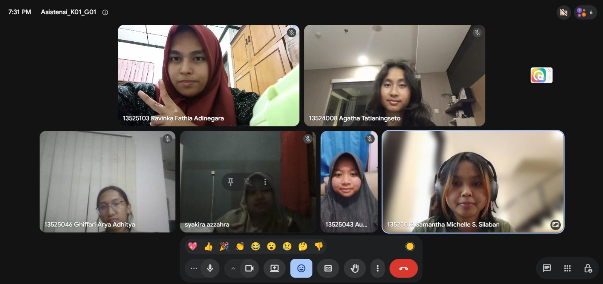

# Form Asistensi

## Tugas Besar IF2150 - Rekayasa Perangkat Lunak

| Informasi | Keterangan |
| --- | --- |
| **Hari** | *Selasa* |
| **Tanggal** | *08/09/2026* |
| **Kelas** | *K01* |
| **Nomor Kelompok** | *1*  |
| **Nama Kelompok** | *berjiwa ksatria*  |
| **Nama Perangkat Lunak** | *RAWAT (Ruang Aspirasi Warga dan Aduan Terpadu)*  |
| **Dokumen** | *K01_G01_RG.md*  |

### Anggota Kelompok

| NIM | Nama |
| --- | --- |
| *13525103* | *Ravinka Fathia Adinegara* |
| *13525013* | *Samantha Michelle S. Silaban* |
| *13525055* | *Syakira Azzahra Rachmania* |
| *13525043* | *Aufa Tatsbita Zahra* |
| *13525046* | *Ghiffari Arya Adhitya* |

### Catatan

| Catatan |
| --- |
| 1. Deskripsi aktivitas, coba ubah dari segi usernya |
| 2. Kalau ada fitur login berarti seharusnya bisa edit profile, edit password. |
| 3. Lebih sinkronisasi antara kebutuhan sama deskripsi kebutuhan |
| 4. P/L itu artinya apakah kebutuhan didukung oleh perangkat lunak, kalo ada kebutuhan bisnis yang tidak disupport sama perangkat lunak gapapa|
| 5. Tulis sumber yang dipakai, referensi pecah aja jadi daftar pustaka sama lampiran|
| 6. Di pemetaan kebutuhan/kebutuhan non fungsional, tulisin juga sistem harus mampu merespon dalam waktu kurang dari berapa detik, sistem harus bisa menampung berapa pengguna dalam waktu yang sama, perangkat lunak dapat diakses di Windows/IOS?|
| 7. * Kebutuhan non fungsional masih kurang tepat, sesuain sama contoh yang ada di tabel di bawah. Kebutuhan non fungsional itu cenderung berupa something in the background tapi kerasa manfaatnya sama pengguna.|

 

## Dokumentasi

<!--  -->

  

  <i>Gambar 1. Dokumentasi kegiatan asistensi.</i>

