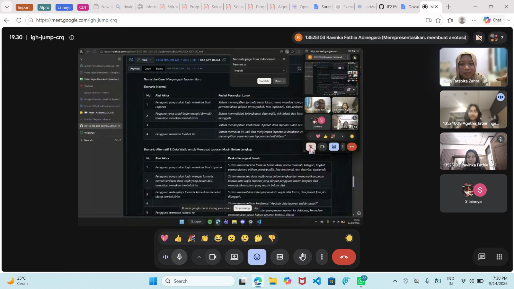

# Form Asistensi

## Tugas Besar IF2150 - Rekayasa Perangkat Lunak

| Informasi | Keterangan |
| --- | --- |
| **Hari** | *Senin* |
| **Tanggal** | *14/09/2026* |
| **Kelas** | *K01* |
| **Nomor Kelompok** | *1*  |
| **Nama Kelompok** | *berjiwa ksatria*  |
| **Nama Perangkat Lunak** | *RAWAT (Ruang Aspirasi Warga dan Aduan Terpadu)*  |
| **Dokumen** | *K01_G01_UC.md*  |

### Anggota Kelompok

| NIM | Nama |
| --- | --- |
| *13525103* | *Ravinka Fathia Adinegara* |
| *13525013* | *Samantha Michelle S. Silaban* |
| *13525055* | *Syakira Azzahra Rachmania* |
| *13525043* | *Aufa Tatsbita Zahra* |
| *13525046* | *Ghiffari Arya Adhitya* |

### Catatan

| Catatan |
| --- |
| 1. *Lihat detail laporan bisa disatuin sama UC lain*  |
| 2. *Sinkronisasi bukan event tertentu, tidak perlu dimasukkan sebagai UC* |
| 3. *UC adalah subevent* |
| 4. *Kalo bisa KF dimasukin ke UC, tapi kalau kurang penting tidak perlu masuk UC* |
| 5. *Navigasi tidak perlu dijadikan UC* |
| 6. *UC diagram diusahakan rapi* |
| 7. *kalo dalam 1 UC ada lebih dari 1 aktor, pisah kolom saja* |
| 8. *UC jangan terlalu banyak, 10-12 oke, soalnya UC bakal didetailin lagi di dokumen berikutnya* | 

## Dokumentasi

<!--  -->

  

  <i>Gambar 1. Dokumentasi kegiatan asistensi.</i>

