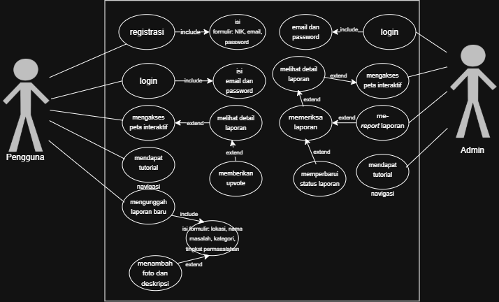

<h1>
IF2150 REKAYASA PERANGKAT LUNAK
 
TUGAS 3
 
USE CASE & SCENARIO USE CASE
</h1>
 

## *Nama Perangkat Lunak*

### Untuk: *[Nama Asisten]*

Dipersiapkan oleh:
| Informasi | Keterangan |
| --- | --- |
| Kelas | *\[Kelas\]* |
| Kelompok | *\[Nomor Kelompok\]*  |

| NIM | Nama |
|---|---|
| *[NIM 1]* | *[Nama Anggota 1]* |
| *[NIM 2]* | *[Nama Anggota 2]* |
| *[NIM 3]* | *[Nama Anggota 3]* |
| *[NIM 4]* | *[Nama Anggota 4]* |
| *[NIM 5]* | *[Nama Anggota 5]* |
---

## Daftar Perubahan

| Revisi | Deskripsi |
| :--- | :--- |
| *A* | *Deskripsikan perubahan yang dilakukan dari dokumen sebelumnya pada dokumen ini. Jika tidak terdapat perubahan, harap kosongkan tabel.* |
| *B* |  |
| *C* |  |
| ... |  |

 
 

# BAB 1: Deskripsi Perangkat Lunak
Bagian ini boleh disalin dari 1.1 Deskripsi Umum Sistem pada dokumen *Requirement Gathering*. Pastikan isinya memang membahas deskripsi perangkat lunak kalian, seperti fitur, fungsi utama, dan cakupan sistem.

---

# BAB 2: Kebutuhan Fungsional (KF)
Salin ulang **seluruh Kebutuhan Fungsional (KF)** yang telah didefinisikan pada dokumen *Requirement Gathering*. Tabel ini menjadi acuan *traceability*, dimana setiap Use Case pada BAB 3 wajib ditelusuri ke satu atau lebih ID KF di tabel ini, dan sebaliknya setiap KF idealnya tercakup oleh minimal satu Use Case. Pastikan juga sudah menggunakan **format EARS** dalam penulisan KF.

| ID KF | Kebutuhan | Penjelasan |
| :--- | :--- | :--- |
| *KF01* | *Menampilkan pilihan metode pembayaran* | *Perangkat lunak dapat menampilkan pilihan antarmuka metode pembayaran (transfer bank, e-wallet, kartu kredit) setelah pengguna melakukan checkout.* |
| *KF02* | *Mengirim permintaan otorisasi pembayaran* | *Perangkat lunak dapat mengirimkan permintaan otorisasi transaksi ke API Payment Gateway beserta nominal tagihan dan ID Pesanan.* |
| *...* | *...* | *...* |

 ***Catatan***: *Jika ada KF dari ML2 yang berubah/bertambah/dihapus setelah asistensi, pastikan tabel ini konsisten dengan versi KF terbaru sebelum dikumpulkan.*

---

# BAB 3: Model Use Case

## 3.1 Identifikasi Aktor
Daftarkan seluruh aktor yang terlibat dalam use case yang akan dimodelkan. Aktor berupa pengguna manusia yang berinteraksi dengan solusi. Perlu diperhatikan bahwa Admin/Developer/ Pihak Eksternal lain yang bisa diotomisasi, tidak perlu dijadikan aktor.

| Aktor | Deskripsi |
| :--- | :--- |
| *Pelanggan* | *Pengguna yang melakukan transaksi pembelian dan pembayaran melalui sistem.* |
| *Kasir* | *Pengguna internal toko yang memverifikasi status pembayaran pelanggan sebelum menyerahkan barang.* |
| *...* | *...* |

## 3.2 Identifikasi Use Case
Identifikasi seluruh use case yang mencakup Kebutuhan Fungsional pada BAB 2. Satu use case boleh mencakup lebih dari satu KF, dan sebaliknya satu KF boleh muncul di lebih dari satu use case bila memang relevan.

| ID UC | Nama Use Case | Deskripsi Singkat | Aktor Terlibat | ID KF Terkait |
| :--- | :--- | :--- | :--- | :--- |
| *UC01* | *Melakukan Registrasi Akun* | *User membuat sebuah akun baru.* | *Pengguna, Admin* | *KF01, KF02* |
| *UC02* | *Melakukan Proses Login* | *User dapat login atau masuk ke akun yang telah dibuat* | *Pengguna, Admin* | *KF01, KF02* |
| *UC03* | *Mengakses Peta Interaktif dan Melihat Detail Laporan* | *Pengguna dapat melihat peta interaktif yang menampilkan lokasi dari laporan yang ada. Jika titik lokasi diklik, pengguna dapat melihat detail informasi dari laporan berupa lokasi, nama masalah, kategori, label tingkat kedaruratan laporan, serta foto dan deskripsi apabila tersedia.* | *Pengguna, Admin* | *KF03, KF04, KF05, KF06* |
| *UC04* | *Mendapat Tutorial Navigasi antar halaman* | *Pengguna mendapat tutorial cara navigasi antar halaman untuk saat pertama kali menggunakan perangkat lunak* | *Pengguna, Admin* | *KF07* |
| *UC05* | *Melakukan Upvote* | *Pengguna dapat memberikan upvote untuk laporan yang menurutnya relevan serta mendapat notifikasi apakah upvote berhasil atau tidak, kemudian laporan yang memiliki poin upvote dan atau urgensi tinggi akan cenderung muncul di feeds laporan.* | *Pengguna* | *KF09, KF10, KF11* |
| *UC06* | *Mengunggah Laporan Baru* | *Pengguna dapat membuat laporan baru dengan mengisi formulir data terkait laporan tersebut, seperti lokasi, nama masalah, kategori, tingkat permasalahan, foto (opsional), dan deskripsi (opsional). Jika pengguna akan mengunggah file, pengguna akan mendapat notifikasi jika format file tidak sesuai dan notifikasi terkait keberhasilan proses upload file.* | *Pengguna* | *KF12, KF13, KF15* |
| *UC07* | *Memeriksa Laporan* | *Admin dapat mengakses dan memproses laporan yang masuk. Jika laporan yang diajukan tidak benar atau tidak sesuai kondisi nyata, maka admin dapat melakukan report laporan.* | *Admin* | *KF08, KF14, KF15* |
| *UC08* | *Memperbarui Status Penanganan Laporan* | *Admin dapat mengupdate status penanganan laporan sesuai kondisi lapangan.* | *Admin* | *KF17, KF18* |

## 3.3 Use Case Diagram
Buatlah **satu** use case diagram yang mencakup seluruh aktor dan use case. Sertakan relasi *include*/*extend* apabila ada use case yang saling bergantung.
 

<i>Gambar 1. Contoh Use Case Diagram</i>

 

Hal-hal yang perlu diperhatikan dalam pembuatan use case diagram:
- Pastikan notasi UML use case (aktor, oval use case, garis asosiasi, *include/extend*) digambar dengan benar.
- Seluruh aktor dan use case yang telah didefinisikan harus muncul di diagram, tidak ada yang terlewat maupun berlebih.
- Hindari garis yang saling bersilangan tanpa alasan jelas, susun diagram agar mudah dibaca.
- Hindari istilah solusi teknis (misalnya nama tabel database, nama endpoint API) muncul di dalam diagram use case karena use case menjelaskan *interaksi fungsional*, bukan detail implementasi.

## 3.4 Skenario Use Case
Buat skenario untuk **setiap** use case yang telah diidentifikasi pada 3.2. Setiap skenario dapat terdiri dari dua jenis alur:
- **Skenario Normal**: alur utama (*happy path*) di mana interaksi aktor-sistem berjalan lancar tanpa kendala hingga tujuan use case tercapai.
- **Skenario Alternatif**: alur percabangan dari skenario normal, misalnya kondisi gagal, input tidak valid, atau pilihan lain yang tersedia bagi aktor. Boleh ada lebih dari satu skenario alternatif per use case jika ada beberapa titik percabangan berbeda.

Format tabel skenario: kolom **Aksi Aktor** berisi apa yang dilakukan/diinput aktor, kolom **Reaksi Perangkat Lunak** berisi respons sistem terhadap aksi tersebut secara **berurutan** (nomor langkah harus berpasangan/selaras antar dua kolom).

### 3.4.1 Skenario UC01

**Nama Use Case:** *Melakukan Registrasi Akun*

**Skenario Normal**

| No | Aksi Aktor | Reaksi Perangkat Lunak |
| :--- | :--- | :--- |
| 1 | *Pengguna menekan pilihan Registrasi* | *Sistem menampilkan formulir berisi NIK, email, dan password* |
| 2 | *Pengguna mengisi formulir dan menekan tombol Daftar.* | *Sistem memvalidasi kelengkapan data, format NIK (jumlah digit), serta ketentuan password (minimal 8 karakter, 1 huruf kapital, 1 angka, dan simbol). Sistem mematikan NIK dan email belum terdaftar.* |
| 3 | *-* | *Sistem melakukan hashing password dan menyimpan data akun ke database* |
| 4 | *-* | *Sistem menampilkan pesan akun berhasil dibuat dan menampilkan halaman utama* |

 

**Skenario Alternatif 1: Data Registrasi Tidak Lengkap**

| No | Aksi Aktor | Reaksi Perangkat Lunak |
| :--- | :--- | :--- |
| 1 | *Pengguna menekan pilihan Registrasi* | *Sistem menampilkan formulir berisi NIK, email, dan password* |
| 2 | *Pengguna mengisi hanya sebagian data formulir dan menekan tombol Daftar.* | *Sistem memvalidasi kelengkapan data, format NIK (jumlah digit), serta ketentuan password (minimal 8 karakter, 1 huruf kapital, 1 angka, dan simbol). Sistem menyadari input data pengguna tidak lengkap.* |
| 3 | *-* | *Sistem menampilkan pesan bahwa data registrasi yang diinput pengguna belum lengkap dan menunjukkan kolom yang masih belum diisi* |
| 4 | *Pengguna melengkapi data formulir dan menekan ulang tombol Daftar* | *Sistem memvalidasi ulang kelengkapan data, format NIK (jumlah digit), serta ketentuan password (minimal 8 karakter, 1 huruf kapital, 1 angka, dan simbol). Sistem memastikan NIK dan email belum terdaftar.* |
| 5 | *-* | *Sistem melakukan hashing password dan menyimpan data akun ke database* |
| 6 | *-* | *Sistem menampilkan pesan akun berhasil dibuat dan menampilkan halaman utama* |

**Skenario Alternatif 2: Format NIK Tidak Valid**

| No | Aksi Aktor | Reaksi Perangkat Lunak |
| :--- | :--- | :--- |
| 1 | *Pengguna menekan pilihan Registrasi* | *Sistem menampilkan formulir berisi NIK, email, dan password* |
| 2 | *Pengguna mengisi data registrasi, namun menginput NIK dengan jumlah digit yang tidak sesuai.* | *Sistem memvalidasi kelengkapan data, format NIK (jumlah digit), serta ketentuan password (minimal 8 karakter, 1 huruf kapital, 1 angka, dan simbol), sistem menyadari kesalahan jumlah digit NIK yang diinput oleh pengguna.* |
| 3 | *-* | *Sistem menampilkan pesan bahwa data NIK yang diinput pengguna belum valid dan meminta pengguna untuk menginput ulang NIK yang sesuai* |
| 4 | *Pengguna membetulkan NIK yang diinput dan menekan ulang tombol Daftar* | *Sistem memvalidasi ulang kelengkapan data, termasuk format NIK (jumlah digit). Sistem memastikan NIK dan email belum terdaftar* |
| 5 | *-* | *Sistem melakukan hashing password dan menyimpan data akun ke database* |
| 6 | *-* | *Sistem menampilkan pesan akun berhasil dibuat dan menampilkan halaman utama* |

**Skenario Alternatif 3: Format Password Tidak Valid**

| No | Aksi Aktor | Reaksi Perangkat Lunak |
| :--- | :--- | :--- |
| 1 | *Pengguna menekan pilihan Registrasi* | *Sistem menampilkan formulir berisi NIK, email, dan password* |
| 2 | *Pengguna mengisi data registrasi, namun menginput password yang tidak sesuai dengan ketentuan.* | *Sistem memvalidasi kelengkapan data, format NIK (jumlah digit), serta ketentuan password (minimal 8 karakter, 1 huruf kapital, 1 angka, dan simbol), sistem menerima password yang ternyata tidak sesuai dengan ketentuan.* |
| 3 | *-* | *Sistem menampilkan pesan bahwa password tidak valid, di mana password minimal terdiri dari 8 karakter, 1 huruf kapital, 1 angka, dan simbol. Lalu, meminta pengguna untuk menginput ulang password* |
| 4 | *Pengguna memperbaiki password sesuai ketentuan dan menekan ulang tombol Daftar* | *Sistem memvalidasi ulang kelengkapan data, format NIK (jumlah digit), serta ketentuan password (minimal 8 karakter, 1 huruf kapital, 1 angka, dan simbol). Sistem memastikan NIK dan email belum terdaftar.* |
| 5 | *-* | *Sistem melakukan hashing password dan menyimpan data akun ke database* |
| 6 | *-* | *Sistem menampilkan pesan akun berhasil dibuat dan menampilkan halaman utama* |

### 3.4.2 Skenario UC02

**Nama Use Case:** *Melakukan Proses Login*

**Skenario Normal**

| No | Aksi Aktor | Reaksi Perangkat Lunak |
| :--- | :--- | :--- |
| 1 | *Pengguna/Admin menekan tombol* | *Sistem menampilkan formulir berisi email dan password* |
| 2 | *Pengguna memasukkan email dan password dan menekan tombol masuk* | *Sistem mencari akun berdasarkan email dan memverifikasi kecocokan password* |
| 3 | *-* | *Sistem menampilkan halaman utama sesuai peran pengguna/admin* |

 

**Skenario Alternatif 1: Data Login Belum Terisi Lengkap**

| No | Aksi Aktor | Reaksi Perangkat Lunak |
| :--- | :--- | :--- |
| 1 | *Pengguna/Admin menekan tombol* | *Sistem menampilkan formulir berisi email dan password* |
| 2 | *Pengguna hanya memasukkan email/password saja, atau bahkan tidak mengisi keduanya, lalu menekan tombol masuk* | *Sistem tidak menerima input data login yang lengkap* |
| 3 | *-* | *Sistem menampilkan pesan bahwa data login yang diinput masih belum lengkap (email/password masih belum terisi), dan meminta pengguna melengkapi inputnya* |
| 4 | *Pengguna melengkapi data login (email/password yang tadi belum terisi) dan menekan tombol masuk* | *Sistem mencari akun berdasarkan email dan memverifikasi kecocokan password* |
| 5 | *-* | *Sistem menampilkan halaman utama sesuai peran pengguna/admin* |

**Skenario Alternatif 2: Email Belum Terdaftar**

| No | Aksi Aktor | Reaksi Perangkat Lunak |
| :--- | :--- | :--- |
| 1 | *Pengguna/Admin menekan tombol* | *Sistem menampilkan formulir berisi email dan password* |
| 2 | *Pengguna memasukkan email dan password dan menekan tombol masuk* | *Sistem tidak menemukan akun yang cocok dengan email yang diinput pengguna* |
| 3 | *-* | *Sistem menampilkan pesan bahwa email yang diinput masih belum terdaftar* |
| 4 | *Pengguna memasukkan ulang email dan password dan menekan tombol masuk* | *Sistem mencari akun berdasarkan email dan memverifikasi kecocokan password* |
| 5 | *-* | *Sistem menampilkan halaman utama sesuai peran pengguna/admin* |

**Skenario Alternatif 3: Password Tidak Sesuai**

| No | Aksi Aktor | Reaksi Perangkat Lunak |
| :--- | :--- | :--- |
| 1 | *Pengguna/Admin menekan tombol* | *Sistem menampilkan formulir berisi email dan password* |
| 2 | *Pengguna memasukkan email dan password dan menekan tombol masuk* | *Sistem menerima password yang tidak sesuai* |
| 3 | *-* | *Sistem menampilkan pesan bahwa password yang diinput salah dan meminta pengguna untuk menginput ulang email dan password yang benar* |
| 4 | *Pengguna memasukkan ulang email dan password dan menekan tombol masuk* | *Sistem mencari akun berdasarkan email dan memverifikasi kecocokan password* |
| 5 | *-* | *Sistem menampilkan halaman utama sesuai peran pengguna/admin* |

### 3.4.3 Skenario UC03

**Nama Use Case:** *Mengakses Peta Interaktif*

**Skenario Normal**

| No | Aksi Aktor | Reaksi Perangkat Lunak |
| :--- | :--- | :--- |
| 1 | *Pengguna/Admin menekan menu Peta Laporan* | *Sistem menampilkan peta dengan penanda lokai laporan* |
| 2 | *Pengguna/Admin menekan salah satu titik penanda lokasi* | *Sistem menampilkan pop-up detail laporan* |

 

**Skenario Alternatif 1: Gagal Memuat Data Laporan**

| No | Aksi Aktor | Reaksi Perangkat Lunak |
| :--- | :--- | :--- |
| 1 | *Pengguna/Admin menekan menu Peta Laporan* | *Sistem menampilkan peta dengan penanda lokasi laporan* |
| 2 | *Pengguna/Admin menekan salah satu titik penanda lokasi* | *Sistem gagal menampilkan pop-up detail laporan karena koneksi terputus atau jaringan tidak stabil* |
| 3 | *-* | *Sistem menampilkan pesan error tidak dapat menampilkan detail laporan karena koneksi terputus atau jaringan tidak stabil* |
| 4 | *Pengguna/Admin menekan ulang salah satu titik penanda lokasi setelah koneksi membaik* | *Sistem menampilkan pop-up detail laporan* |

### 3.4.x Skenario UC09
**Nama Use Case:** *Melakukan Upvote*

**Skenario Normal**

| No | Aksi Aktor | Reaksi Perangkat Lunak |
| :--- | :--- | :--- |
| 1 | *Pengguna menekan tombol Upvote pada suatu laporan di halaman utama* | *Sistem mencatat upvote pengguna dan memperbarui jumlah laporan.*|
| 2 | *-* | *Sistem menghitung ulang skor popularitas berdasarkan bobot urgensi 60% dan upvote 40%* |
| 3 | *-* | *Sistem memperbarui tampilan jumlah upvote dan jika pengurutan Populer sedang aktif, sistem memperbarui urutan laporan* |

 

**Skenario Alternatif 1: Pengguna Gagal Melakukan Upvote**

| No | Aksi Aktor | Reaksi Perangkat Lunak |
| :--- | :--- | :--- |
| 1 | *Pengguna menekan tombol Upvote pada suatu laporan di halaman utama* | *Sistem gagal mencatat upvote pengguna karena gangguan jaringan.*|
| 2 | *-* | *Sistem menampilkan pesan error, upvote gagal karena koneksi terputus atau jaringan tidak stabil* |
| 3 | *Pengguna merefresh sistem, lalu menekan ulang tombol Upvote pada suatu laporan di halaman utama* | *Sistem mencatat upvote pengguna dan memperbarui jumlah laporan.*|
| 4 | *-* | *Sistem menghitung ulang skor popularitas berdasarkan bobot urgensi 60% dan upvote 40%* |
| 5 | *-* | *Sistem memperbarui tampilan jumlah upvote dan jika pengurutan Populer sedang aktif, sistem memperbarui urutan laporan* |

### 3.4.x Skenario UC12
**Nama Use Case:** *Mengunggah Laporan Baru*

**Skenario Normal**

| No | Aksi Aktor | Reaksi Perangkat Lunak |
| :--- | :--- | :--- |
| 1 | *Pengguna yang sudah login menekan Buat Laporan* | *Sistem menampilkan formulir berisi lokasi, nama masalah, kategiri, tingkat permasalahan, pilihan privat/publik, foto (opsional), dan deskripsi (opsional).*|
| 2 | *Pegguna yang sudah login mengisi formulir kemudian menekan tombol kirim* | *Sistem memvalidasi kelengkapan data wajib, titik lokasi, dan format foto jika diunggah.* |
| 3 | *-* | *Sistem menampilkan konfirmasi "Apakah data laporan sudah sesuai?"* |
| 4 | *Pengguna menekan tombol Ya* | *Sistem membuat ID unik dan menyimpan laporan ke database, kemudian menampilkan pesan bahwa laporan berhasil dibuat"* |

 

**Skenario Alternatif 1: Data Wajib untuk Membuat Laporan Masih Belum Lengkap**

| No | Aksi Aktor | Reaksi Perangkat Lunak |
| :--- | :--- | :--- |
| 1 | *Pengguna yang sudah login menekan Buat Laporan* | *Sistem menampilkan formulir berisi lokasi, nama masalah, kategori, tingkat permasalahan, pilihan privat/publik, foto (opsional), dan deskripsi (opsional).*|
| 2 | *Pengguna yang sudah login mengisi formulir, namun terdapat data wajib yang belum diisi, kemudian menekan tombol kirim* | *Sistem menerima data wajib yang belum lengkap dan menampilkan pesan bahwa data wajib laporan yang diinput pengguna belum lengkap dan menunjukkan kolom yang masih belum diisi.* |
| 3 | *Pengguna melengkapi formulir kemudian menekan ulang tombol kirim* | *Sistem memvalidasi kelengkapan data wajib, titik lokasi, dan format foto jika diunggah.* |
| 4 | *-* | *Sistem menampilkan konfirmasi "Apakah data laporan sudah sesuai?"* |
| 5 | *Pengguna menekan tombol Ya* | *Sistem membuat ID unik dan menyimpan laporan ke database, kemudian menampilkan pesan bahwa laporan berhasil dibuat"* |

**Skenario Alternatif 2: Format File Foto yang Diunggah Tidak Sesuai**

| No | Aksi Aktor | Reaksi Perangkat Lunak |
| :--- | :--- | :--- |
| 1 | *Pengguna yang sudah login menekan Buat Laporan* | *Sistem menampilkan formulir berisi lokasi, nama masalah, kategori, tingkat permasalahan, pilihan privat/publik, foto (opsional), dan deskripsi (opsional).*|
| 2 | *Pengguna yang sudah login mengisi formulir, lalu mengunggah foto yang tidak sesuai dengan ketentuan sistem* | *Sistem menyadari kesalahan format file foto dan menolak input dari pengguna, lalu menampilkan pesan bahwa input foto harus dalam format yang sesuai.* |
| 3 | *Pengguna memperbaiki input foto dengan mengunggah file yang sesuai, lalu melengkapi formulir, kemudian menekan tombol kirim* | *Sistem memvalidasi kelengkapan data wajib, titik lokasi, dan format foto.* |
| 4 | *-* | *Sistem menampilkan konfirmasi "Apakah data laporan sudah sesuai?"* |
| 5 | *Pengguna menekan tombol Ya* | *Sistem membuat ID unik dan menyimpan laporan ke database, kemudian menampilkan pesan bahwa laporan berhasil dibuat"* |

**Skenario Alternatif 3: Pengguna Membatalkan Konfirmasi Pengiriman Laporan**

| No | Aksi Aktor | Reaksi Perangkat Lunak |
| :--- | :--- | :--- |
| 1 | *Pengguna yang sudah login menekan Buat Laporan* | *Sistem menampilkan formulir berisi lokasi, nama masalah, kategori, tingkat permasalahan, pilihan privat/publik, foto (opsional), dan deskripsi (opsional).*|
| 2 | *Pengguna yang sudah login mengisi formulir kemudian menekan tombol kirim* | *Sistem memvalidasi kelengkapan data wajib, titik lokasi, dan format foto jika diunggah.* |
| 3 | *-* | *Sistem menampilkan konfirmasi "Apakah data laporan sudah sesuai?"* |
| 4 | *Pengguna menekan tombol Tidak* | *Sistem mengembalikan pengguna ke laman pengisian formulir"* |
| 5 | *Pengguna diperbolehkan untuk mengedit data input terlebih dahulu, kemudian menekan ulang tombol kirim* | *Sistem memvalidasi kelengkapan data wajib, titik lokasi, dan format foto jika diunggah.* |
| 6 | *-* | *Sistem menampilkan konfirmasi "Apakah data laporan sudah sesuai?"* |
| 7 | *Pengguna menekan tombol Ya* | *Sistem membuat ID unik dan menyimpan laporan ke database, kemudian menampilkan pesan bahwa laporan berhasil dibuat"* |

### 3.4.x Skenario UC17
**Nama Use Case:** *Memperbarui Status Penanganan Laporan*

**Skenario Normal**

| No | Aksi Aktor | Reaksi Perangkat Lunak |
| :--- | :--- | :--- |
| 1 | *Admin menekan menu Kelola Laporan* | *Sistem menampilkan daftar laporan dengan pilihan pengurutan berdasarkan terbaru, urgensi, dan popularitas.*|
| 2 | *Admin memilih salah satu lappran* | *Sistem menampilkan detail laporan* |
| 3 | *Admin menekan tombol Lakukan Tindakan* | *Sistem menampilkan formulir pop-up berisi kolom tanggapan dan dropdown status laporan yang dapat dipilih."* |
| 4 | *Admin mengisi tanggapan, memilih status, kemudian menekan tombol Simpan* | *Sistem memvalidasi isian dan menampilkan konfirmasi "Apakah tanggapan dan status laporan sudah sesuai?"* |
| 5 | *Admin menekan tombol Ya* | *Sistem menyimpan tanggapan, memperbarui status laporan, menutup pop-up, dan menampilkan tanggapan admin sebagai komentar teratas pada laporan tersebut* |

 

**Skenario Alternatif 1: Admin Membatalkan Konfirmasi Perubahan Status Laporan**

| No | Aksi Aktor | Reaksi Perangkat Lunak |
| :--- | :--- | :--- |
| 1 | *Admin menekan menu Kelola Laporan* | *Sistem menampilkan daftar laporan dengan pilihan pengurutan berdasarkan terbaru, urgensi, dan popularitas.*|
| 2 | *Admin memilih salah satu lappran* | *Sistem menampilkan detail laporan* |
| 3 | *Admin menekan tombol Lakukan Tindakan* | *Sistem menampilkan formulir pop-up berisi kolom tanggapan dan dropdown status laporan yang dapat dipilih."* |
| 4 | *Admin mengisi tanggapan, memilih status, kemudian menekan tombol Simpan* | *Sistem memvalidasi isian dan menampilkan konfirmasi "Apakah tanggapan dan status laporan sudah sesuai?"* |
| 5 | *Admin menekan tombol Tidak* | *Sistem kembali menampilkan formulir pop-up berisi kolom tanggapan dan dropdown status laporan yang dapat dipilih.* |
| 6 | *Admin dapat mengedit kembali tanggapan, memilih status, kemudian menekan tombol Simpan lagi* | *Sistem memvalidasi isian dan menampilkan konfirmasi "Apakah tanggapan dan status laporan sudah sesuai?"* |
| 7 | *Admin menekan tombol Ya* | *Sistem menyimpan tanggapan, memperbarui status laporan, menutup pop-up, dan menampilkan tanggapan admin sebagai komentar teratas pada laporan tersebut* |

