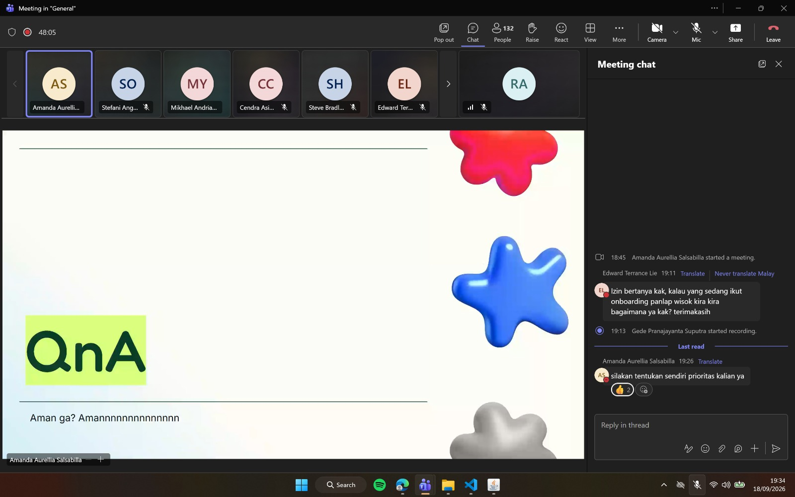

# Form Asistensi

## Tugas Besar IF2150 - Rekayasa Perangkat Lunak

| Informasi | Keterangan |
| --- | --- |
| **Hari** | *Jumat* |
| **Tanggal** | *18/09/2026* |
| **Kelas** | *K01* |
| **Nomor Kelompok** | *1*  |
| **Nama Kelompok** | *berjiwa ksatria*  |
| **Nama Perangkat Lunak** | *RAWAT (Ruang Aspirasi Warga dan Aduan Terpadu)*  |
| **Dokumen** | *K01_G01_CD.md*  |

### Anggota Kelompok

| NIM | Nama |
| --- | --- |
| *13525103* | *Ravinka Fathia Adinegara* |
| *13525013* | *Samantha Michelle S. Silaban* |
| *13525055* | *Syakira Azzahra Rachmania* |
| *13525043* | *Aufa Tatsbita Zahra* |
| *13525046* | *Ghiffari Arya Adhitya* |

### Catatan

| Catatan |
| --- |
| 1. *Untuk diagram perangkat lunak, tulis deskripsi, kebutuhan fungsional, model usecase, diagram kelas, diagram kelas keseluruhan, dan traceability.*  |
| 2. *Diagram kelas memiliki identifikasi kelas, diagram kelas per use case, dan diagram kelas keseluruhan* |
| 3. *Terdapat notasi diagram kelas, yakni asosiasi, agregasi, komposisi, generalisasi, dependensi, dan realisasi* |
| 4. *Terdapat beberapa tools untuk membuat class diagram, yaitu draw.io, plantuml/staruml, mermaid, dan lucidchard/visual paradigm* |

<!-- **Notes for this section:**  
*Catatan dapat dituliskan dalam bentuk paragraf atau poin-poin, disesuaikan saja.*  -->

## Dokumentasi

<!--  -->

  

  <i>Gambar 1. Dokumentasi kegiatan asistensi.</i>

