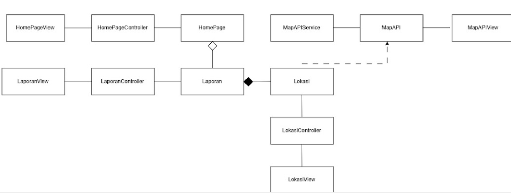
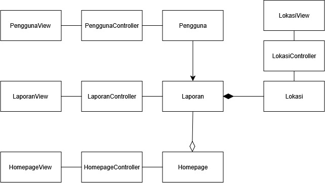
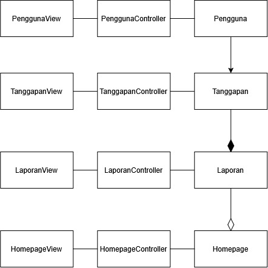

<h1>
IF2150 REKAYASA PERANGKAT LUNAK
 
TUGAS 4
 
CLASS DIAGRAM
</h1>
 

## *Nama Perangkat Lunak*

### Untuk: *[Nama Asisten]*

Dipersiapkan oleh:
| Informasi | Keterangan |
| --- | --- |
| Kelas | *\[Kelas\]* |
| Kelompok | *\[Nomor Kelompok\]*  |

| NIM | Nama |
|---|---|
| *[NIM 1]* | *[Nama Anggota 1]* |
| *[NIM 2]* | *[Nama Anggota 2]* |
| *[NIM 3]* | *[Nama Anggota 3]* |
| *[NIM 4]* | *[Nama Anggota 4]* |
| *[NIM 5]* | *[Nama Anggota 5]* |
---

## Daftar Perubahan

| Revisi | Deskripsi |
| :--- | :--- |
| *A* | *Deskripsikan perubahan yang dilakukan dari dokumen sebelumnya pada dokumen ini. Jika tidak terdapat perubahan, harap kosongkan tabel.* |
| *B* |  |
| *C* |  |
| ... |  |

 
 

# BAB 1: Deskripsi Perangkat Lunak

Tuliskan overview perangkat lunak dalam narasi yang dapat memberikan gambaran tentang konteks perangkat lunak aplikasi Anda.

Pada bagian ini, Anda diperbolehkan untuk menyalin dari dokumen sebelumnya.

---

# BAB 2: Kebutuhan Fungsional

## 2.1 Kebutuhan Fungsional

Salin ulang seluruh Kebutuhan Fungsional (KF) yang telah dirumuskan pada dokumen sebelumnya, lengkap dengan ID KF, ID Kebutuhan (mengacu ke ID pada tabel Pemetaan Kebutuhan di dokumen *Requirement Gathering*), dan penjelasannya.

Pada bagian ini, Anda diperbolehkan untuk menyalin dari dokumen sebelumnya.

 ***Catatan***: *Kebutuhan ditulis mengikuti pola EARS. Pada contoh di bawah, sebagian besar KF dipicu oleh satu aksi pelanggan, sehingga memakai pola event-driven "Ketika ⟨pemicu⟩, sistem harus ⟨respons⟩".*

Tabel 2.1. Daftar Kebutuhan Fungsional

| ID KF | ID Kebutuhan | Penjelasan |
| :--- | :--- | :--- |
| *KF01* | *R01* | *Ketika pelanggan membuka halaman katalog, sistem harus menampilkan daftar produk yang tersedia.* |
| *KF02* | *R02* | *Ketika pelanggan memilih "Tambah ke Keranjang" pada suatu produk, sistem harus menyimpan produk tersebut ke dalam keranjang pelanggan.* |
| *KF03* | *R03* | *Ketika pelanggan menekan tombol checkout, sistem harus menampilkan pilihan metode pembayaran yang tersedia.* |
| *KF04* | *R04* | *Ketika pelanggan memilih metode pembayaran, sistem harus mengirimkan permintaan otorisasi beserta nominal tagihan dan ID pesanan ke payment gateway (dummy).* |
| *KF05* | *R04* | *Ketika payment gateway (dummy) mengembalikan status pembayaran berhasil, sistem harus memperbarui status pesanan menjadi "Lunas" dan menampilkan notifikasi pembayaran berhasil.* |
| *KF06* | *R05* | *Ketika pelanggan membuka menu riwayat pesanan, sistem harus menampilkan daftar pesanan beserta statusnya.* |
| *KFXX* | *...* | *...* |

---

# BAB 3: Model Use Case

## 3.1 Identifikasi Aktor

Tuliskan kembali daftar aktor yang terlibat dan deskripsi perannya dalam perangkat lunak (P/L). Deskripsi peran harus menjelaskan wewenang aktor tersebut dalam perangkat lunak. Perlu diingat bahwa aktor yang dimaksud adalah pengguna yang berinteraksi langsung dengan P/L. Komponen seperti database, payment gateway, atau library bukan aktor.

Pada bagian ini, Anda diperbolehkan untuk menyalin dari dokumen sebelumnya.

| Aktor | Deskripsi |
| :--- | :--- |
| *Pelanggan* | *Pengguna yang memesan produk, mengelola keranjang, dan menyelesaikan pembayaran melalui sistem.* |
| *...* | *...* |

## 3.2 Identifikasi Use Case

Use case berfungsi untuk mendeskripsikan interaksi aktor-aktor yang terlibat dengan sistem. Isi daftar use case dan deskripsi singkatnya dalam tabel di bawah.

Pada bagian ini, Anda diperbolehkan untuk menyalin dari dokumen sebelumnya.

| ID UC | Nama Use Case | Deskripsi Singkat | Aktor | ID KF |
| :--- | :--- | :--- | :--- | :--- |
| *UC01* | *Memesan Produk* | *Pelanggan memilih produk hingga pesanan tersimpan di sistem.* | *Pelanggan* | *KF01, KF02* |
| *UC02* | *Melihat Keranjang* | *Pelanggan melihat daftar item yang telah dipilih sebelum checkout.* | *Pelanggan* | *KF02* |
| *UC03* | *Melakukan Pembayaran* | *Pelanggan menyelesaikan pembayaran atas pesanan yang dibuat.* | *Pelanggan* | *KF03, KF04, KF05* |
| *UC04* | *Memilih Metode Pembayaran* | *Pelanggan memilih metode pembayaran alternatif (kartu atau e-wallet).* | *Pelanggan* | *KF03* |
| *UC05* | *Melihat Riwayat Pesanan* | *Pelanggan melihat daftar pesanan yang pernah dibuat beserta statusnya.* | *Pelanggan* | *KF06* |
| *...* | *...* | *...* | *...* | *...* |

## 3.3 Use Case Diagram
Buatlah diagram use case keseluruhan berdasarkan identifikasi use case beserta aktor yang melakukan use case tersebut. Perhatikan garis `<<extend>>` dan `<<include>>`.

Pada bagian ini, Anda diperbolehkan untuk menyalin dari dokumen sebelumnya.

 

<i>Gambar 1. Use Case Diagram</i>

 

## 3.4 Skenario Use Case
Salin ulang skenario **setiap** use case (skenario normal dan alternatif) dari dokumen *Use Case & Scenario Use Case*. Skenario ini menjadi dasar penentuan atribut dan metode/operasi kelas pada BAB 4.

Pada bagian ini, Anda diperbolehkan untuk menyalin dari dokumen sebelumnya.

### 3.4.1 Skenario UC01

**Nama Use Case:** *Memesan Produk*

**Skenario Normal**

| No | Aksi Aktor | Reaksi Perangkat Lunak |
| :--- | :--- | :--- |
| 1 | *Pelanggan memilih produk dari katalog* | *Sistem menampilkan detail produk dan menambahkannya ke keranjang* |
| 2 | *Pelanggan menekan tombol checkout* | *Sistem membuat pesanan baru dari isi keranjang dan menampilkan ringkasan pesanan* |
| ... | *...* | *...* |

**Skenario Alternatif 1: Produk Tidak Tersedia**

| No | Aksi Aktor | Reaksi Perangkat Lunak |
| :--- | :--- | :--- |
| 1 | *Pelanggan memilih produk dari katalog* | *Sistem menampilkan pesan "Produk tidak tersedia" karena stok habis* |
| 2 | *Pelanggan memilih produk lain* | *Sistem kembali ke langkah 1 skenario normal* |
| ... | *...* | *...* |

### 3.4.3 Skenario UC03

**Nama Use Case:** *Melakukan Pembayaran*

**Skenario Normal**

| No | Aksi Aktor | Reaksi Perangkat Lunak |
| :--- | :--- | :--- |
| 1 | *Pelanggan menekan tombol "Bayar" pada ringkasan pesanan* | *Sistem menampilkan pilihan metode pembayaran yang tersedia (mis. Kartu, E-Wallet)* |
| 2 | *Pelanggan memilih salah satu metode pembayaran* | *Sistem mengirimkan permintaan otorisasi ke payment gateway (dummy) sesuai metode yang dipilih* |
| 3 | *-* | *Payment gateway (dummy) mengembalikan status pembayaran berhasil; sistem memperbarui status pesanan menjadi "Lunas" dan menampilkan notifikasi pembayaran berhasil* |
| ... | *...* | *...* |

**Skenario Alternatif 1: Pembayaran Dummy Gagal**

| No | Aksi Aktor | Reaksi Perangkat Lunak |
| :--- | :--- | :--- |
| 1 | *Pelanggan menekan tombol "Bayar" pada ringkasan pesanan* | *Sistem menampilkan pilihan metode pembayaran yang tersedia* |
| 2 | *Pelanggan memilih salah satu metode pembayaran* | *Sistem mengirimkan permintaan otorisasi ke payment gateway (dummy), yang mengembalikan status gagal (mis. saldo e-wallet dummy tidak mencukupi)* |
| 3 | *Pelanggan memilih untuk mencoba lagi atau memilih metode lain* | *Sistem kembali ke langkah 1 skenario normal* |
| ... | *...* | *...* |

*Lanjutkan pola 3.4.x ini untuk setiap ID UC pada 3.2, sampai seluruh use case tercakup.*

---

# BAB 4: Diagram Kelas
Bagian ini berisi identifikasi kelas dan pemodelan struktur kelas yang diperlukan untuk merealisasikan use case pada BAB 3. Gunakan skenario use case (3.4) sebagai dasar untuk menentukan kelas, atribut, metode, dan hubungan antarkelas.

## 4.1 Identifikasi Kelas
Identifikasi seluruh kelas yang diperlukan berdasarkan use case dan skenarionya. Satu kelas boleh terkait dengan lebih dari satu use case.

| ID Kelas | Nama Kelas | Deskripsi Kelas | ID Use Case |
| :--- | :--- | :--- | :--- |
| *C01* | *Pengguna* | *Menyimpan data pengguna maupun admin yang dapat melakukan registrasi, login, mengedit profil, membuat laporan, melihat laporan dan peta lokasi laporan, memberikan upvote, memeriksa laporan, mengatur status laporan, dan memberikan tanggapan sesuai dengan hak akses berdasarkan role.* | *UC01, UC02, UC03, UC04, UC05, UC06, UC07, UC08, UC09, UC10* |
| *C02* | *Homepage* | *Menyimpan informasi yang ditampilkan pada halaman utama sistem, termasuk daftar laporan, fitur-fitur yang tersedia, dan informasi ringkas laporan.* | *UC03, UC04, UC06, UC07, UC08, UC09, UC10* |
| *C03* | *Laporan* | *Menyimpan informasi laporan mengenai masalah fasilitas atau ruang umum, termasuk nama masalah, lokasi, kategori, tingkat permasalahan, foto (opsional), deskripsi (opsional), dan status laporan.* | *UC04, UC06, UC07, UC08, UC09* |
| *C04* | *Lokasi* | *Menyimpan informasi lokasi geografis yang terkait dengan suatu laporan dan digunakan untuk menampilkan laporan pada peta.* | *UC03, UC04, UC07* |
| *C05* | *Upvote* | *Menyimpan informasi pemberian upvote oleh pengguna terhadap suatu laporan.* | *UC06* |
| *C06* | *Tanggapan* | *Menyimpan tanggapan yang diberikan admin terhadap laporan yang sedang diproses.* | *UC09* |
| *C07* | *Tutorial* | *Menyimpan informasi tutorial navigasi yang ditampilkan kepada pengguna.* | *UC05* |
| *C08* | *PenggunaView* | *Menampilkan halaman registrasi dan login serta informasi pengguna sesuai dengan hak akses berdasarkan role.* | *UC01, UC02* |
| *C09* | *HomepageView* | *Menampilkan halaman utama sistem beserta daftar laporan dan fitur yang dapat diakses pengguna maupun admin.* | *UC03, UC04, UC06, UC07, UC08, UC09, UC10* |
| *C10* | *LaporanView* | *Menampilkan informasi laporan serta halaman untuk membuat, melihat, memeriksa, dan memperbarui laporan.* | *UC04, UC07, UC08, UC09* |
| *C11* | *LokasiView* | *Menampilkan informasi lokasi laporan dan peta interaktif yang digunakan untuk melihat laporan berdasarkan lokasi.* | *UC03, UC04, UC07* |
| *C12* | *UpvoteView* | *Menampilkan tombol dan jumlah upvote pada laporan serta memungkinkan pengguna memberikan upvote.* | *UC06* |
| *C13* | *TanggapanView* | *Menampilkan tanggapan admin pada laporan serta menyediakan tampilan untuk memberikan tanggapan terhadap laporan.* | *UC09* |
| *C14* | *TutorialView* | *Menampilkan tutorial navigasi dan menyediakan tombol Next, Skip, dan Selesai.* | *UC05* |
| *C15* | *PenggunaController* | *Menangani proses registrasi, login, validasi data akun, verifikasi kredensial, dan pengaturan hak akses pengguna berdasarkan role.* | *UC01, UC02* |
| *C16* | *HomepageController* | *Menangani proses pengambilan dan pengelolaan informasi yang ditampilkan pada halaman utama serta navigasi ke fitur laporan dan fitur-fitur lainnya yang tersedia.* | *UC03, UC04, UC06, UC07, UC08, UC09, UC10* |
| *C17* | *LaporanController* | *Menangani proses pembuatan, pengambilan, pemeriksaan, dan pembaruan data laporan serta pengelolaan informasi terkait laporan.* | *UC04, UC07, UC08, UC09* |
| *C18* | *LokasiController* | *Menangani proses pengambilan dan pengelolaan data lokasi laporan serta pencarian laporan berdasarkan lokasi untuk ditampilkan pada peta.* | *UC03, UC04, UC07* |
| *C19* | *UpvoteController* | *Menangani proses pemberian upvote oleh pengguna terhadap suatu laporan serta pengelolaan jumlah upvote.* | *UC06* |
| *C20* | *TanggapanController* | *Menangani proses pembuatan, pengambilan, dan penyimpanan tanggapan admin terhadap suatu laporan.* | *UC09* |
| *C21* | *TutorialController* | *Menangani proses perpindahan langkah tutorial serta aksi Next, Skip, dan Selesai.* | *UC05* |
| *C22* | *MapAPI* | *Menyimpan data lokasi yang diperoleh dari API peta eksternal yang dibutuhkan oleh sistem.* | *UC03, UC04* |
| *C23* | *MapAPIService* | *Mengatur proses request ke API, memproses response, dan mengirim hasilke MapAPIView* | *UC03, UC04* |
| *C24* | *MapAPIView* | *Menampilkan peta, lokasi, dan informasi yang diperoleh dari API peta kepada pengguna.* | *UC03, UC04* |

Pastikan setiap kelas memiliki tanggung jawab yang jelas dan memang diperlukan untuk merealisasikan fungsi yang dimodelkan. Hindari kelas yang tidak memiliki keterkaitan dengan KF atau use case manapun.

## 4.2 Diagram Kelas per Use Case
Buat diagram kelas untuk setiap use case pada 3.2.

### 4.2.1 Use Case UC01

**Nama Use Case:** *Melakukan Registrasi Akun*

#### Identifikasi Kelas

| ID Kelas | Nama Kelas | Deskripsi Kelas |
| :--- | :--- | :--- |
| *C08* | *PenggunaView* | *Menampilkan halaman registrasi dan login serta informasi pengguna sesuai dengan hak akses berdasarkan role.* |
| *C15* | *PenggunaController* | *Menangani proses registrasi, login, validasi data akun, verifikasi kredensial, dan pengaturan hak akses pengguna berdasarkan role.* |
| *C01* | *Pengguna* | *Menyimpan data pengguna maupun admin yang dapat melakukan registrasi, login, mengedit profil, membuat laporan, melihat laporan dan peta lokasi laporan, memberikan upvote, memeriksa laporan, mengatur status laporan, dan memberikan tanggapan sesuai dengan hak akses berdasarkan role.* |

#### Diagram Kelas

<i>Gambar 2. Diagram Kelas Use Case UC01</i>

 

| ID Kelas | Nama Kelas | Atribut | Metode/Operasi |
| :--- | :--- | :--- | :--- |
| *C08* | *PenggunaView* | *-* | *+ tampilkanFormRegistrasi(), + tampilkanErrorMsgs()* |
| *C15* | *PenggunaController* | *-* | *+registrasi, -hashPassword(), -cekAkunTerdaftar() -validasiData()* |
| *C01* | *Pengguna* | *- idPengguna, - nama, - NIK, - email, - password, - role, - NoTelp * | * +simpanDataPengguna()* |

### 4.2.2 Use Case UC02

**Nama Use Case:** *Melakukan Login*

#### Identifikasi Kelas

| ID Kelas | Nama Kelas | Deskripsi Kelas |
| :--- | :--- | :--- |
| *C08* | *PenggunaView* | *Menampilkan halaman registrasi dan login serta informasi pengguna sesuai dengan hak akses berdasarkan role.* |
| *C15* | *PenggunaController* | *Menangani proses registrasi, login, validasi data akun, verifikasi kredensial, dan pengaturan hak akses pengguna berdasarkan role.* |
| *C01* | *Pengguna* | *Menyimpan data pengguna maupun admin yang dapat melakukan registrasi, login, mengedit profil, membuat laporan, melihat laporan dan peta lokasi laporan, memberikan upvote, memeriksa laporan, mengatur status laporan, dan memberikan tanggapan sesuai dengan hak akses berdasarkan role.* |

#### Diagram Kelas

<i>Gambar 3. Diagram Kelas Use Case UC02</i>

 

 ID Kelas | Nama Kelas | Atribut | Metode/Operasi |
| :--- | :--- | :--- | :--- |
| *C08* | *PenggunaView* | *-* | *+ tampilkanFormLogin(), + tampilkanErrorMsgs()* |
| *C15* | *PenggunaController* | *-* | *+login(), -hashPassword(), -validasiKredensial()* |
| *C01* | *Pengguna* | *- idPengguna, - email, - password, - role* | * +getRole(), + getPenggunaByEmail(), +getPenggunaByNIK* |

### 4.2.3 Use Case UC03

**Nama Use Case:** *Mengakses Peta Interaktif*

#### Identifikasi Kelas

| ID Kelas | Nama Kelas | Deskripsi Kelas |
| :--- | :--- | :--- |
| *C08* | *PenggunaView* | *Menampilkan halaman registrasi dan login serta informasi pengguna sesuai dengan hak akses berdasarkan role.* |
| *C15* | *PenggunaController* | *Menangani proses registrasi, login, validasi data akun, verifikasi kredensial, dan pengaturan hak akses pengguna berdasarkan role.* |
| *C01* | *Pengguna* | *Menyimpan data pengguna maupun admin yang dapat melakukan registrasi, login, mengedit profil, membuat laporan, melihat laporan dan peta lokasi laporan, memberikan upvote, memeriksa laporan, mengatur status laporan, dan memberikan tanggapan sesuai dengan hak akses berdasarkan role.* |
| *C11* | *LokasiView* | *Menampilkan informasi lokasi laporan dan peta interaktif yang digunakan untuk melihat laporan berdasarkan lokasi.* |
| *C18* | *LokasiController* | *Menangani proses pengambilan dan pengelolaan data lokasi laporan serta pencarian laporan berdasarkan lokasi untuk ditampilkan pada peta.* |
| *C04* | *Lokasi* | *Menyimpan informasi lokasi geografis yang terkait dengan suatu laporan dan digunakan untuk menampilkan laporan pada peta.* |
| *C03* | *Laporan* | *Menyimpan informasi laporan mengenai masalah fasilitas atau ruang umum, termasuk nama masalah, lokasi, kategori, tingkat permasalahan, foto (opsional), deskripsi (opsional), dan status laporan.* |
| *C10* | *LaporanView* | *Menampilkan informasi laporan serta halaman untuk membuat, melihat, memeriksa, dan memperbarui laporan.* |
| *C17* | *LaporanController* | *Menangani proses pembuatan, pengambilan, pemeriksaan, dan pembaruan data laporan serta pengelolaan informasi terkait laporan.* |
| *C22* | *MapAPI* | *Menyimpan data lokasi yang diperoleh dari API peta eksternal yang dibutuhkan oleh sistem* |
| *C23* | *MapAPIService* | *Mengatur proses request ke API, memproses response, dan mengirim hasil ke MapAPIView* |
| *C24* | *MapAPIView* | *Menampilkan peta, lokasi, dan informasi yang diperoleh dari API peta kepada pengguna* |

#### Diagram Kelas

<i>Gambar 4. Diagram Kelas Use Case UC04</i>

 

| ID Kelas | Nama Kelas | Atribut | Metode/Operasi |
| :--- | :--- | :--- | :--- |
| *C08* | *PenggunaView* | *-* | *+ tampilkanPermintaanIzinLokasi() * |
| *C15* | *PenggunaController* | *-* | *+setIzinLokasi() +cekIzinLokasi()* |
| *C01* | *Pengguna* | *- idPengguna, -lokasiSaatIni, -izinLokasi* | * +getIzinLokasi()* |
| *C11* | *LokasiView* | *map* |*+tampilkan[eta() ,  +tampilkanErrorMsgs(),+tampilkanLaporanSektiar(), +tampilkanTitikLaporan(), +zoomLokasi()* |
| *C18* |*LokasiController* | *-* | *+cariLaporanTerdekat(), -ambilLokasiPengguna(), -mintaIzinLokasi(), +ambilLokasiLaporan(), -hitungJarak() * |
| *C04* | *Lokasi* | *- latitude, -longitude,  -alamat* | * +getKoordinat(), +getAlamat()* |
| *C03* | *Laporan* | *- idLaporan, - namaMasalah, - kategori, - tingkatPermasalahan, -foto, -deskripsi, -statusLaporan* | * +getDetailLaporan* |
| *C03* | *Laporan* | *- idLaporan, - namaMasalah, - kategori, - tingkatPermasalahan, -foto, -deskripsi, -statusLaporan* | * +getDetailLaporan*() |
| *C10* | *LaporanView* | *-* | * +tampilkanDetailLaporan() |
| *C17* | *LaporanController* | *-* | * +lihatDetailLaporan() |
| *C22* | *MapAPI* | *- apiKey, -baseURL* | * +getAPIKey(), +getBaseURL() * |
| *C23* | *MapAPIService* | *-* | *+geocode(), -kirimRequest(), -prosesResponse()* |
| *C24* | *MapAPIView* | *-* | *+renderMap(), +renderMarker(), +setCenter()* |

### 4.2.4 Use Case UC04

**Nama Use Case:** *Melihat Detail Laporan*

#### Identifikasi Kelas

| ID Kelas | Nama Kelas | Deskripsi Kelas |
| :--- | :--- | :--- |
| *C09* | *HomepageView* | *Menampilkan halaman utama sistem beserta daftar laporan dan fitur yang dapat diakses pengguna maupun admin.* |
| *C16* | *HomepageController* | *Menangani proses pengambilan dan pengelolaan informasi yang ditampilkan pada halaman utama serta navigasi ke fitur laporan dan fitur-fitur lainnya yang tersedia.* |
| *C02* | *Homepage* | *Menyimpan informasi yang ditampilkan pada halaman utama sistem, termasuk daftar laporan, fitur-fitur yang tersedia, dan informasi ringkas laporan.* |
| *C11* | *LokasiView* | *Menampilkan informasi lokasi laporan dan peta interaktif yang digunakan untuk melihat laporan berdasarkan lokasi.* |
| *C18* | *LokasiController* | *Menangani proses pengambilan dan pengelolaan data lokasi laporan serta pencarian laporan berdasarkan lokasi untuk ditampilkan pada peta.* |
| *C04* | *Lokasi* | *Menyimpan informasi lokasi geografis yang terkait dengan suatu laporan dan digunakan untuk menampilkan laporan pada peta.* |
| *C03* | *Laporan* | *Menyimpan informasi laporan mengenai masalah fasilitas atau ruang umum, termasuk nama masalah, lokasi, kategori, tingkat permasalahan, foto (opsional), deskripsi (opsional), dan status laporan.* |
| *C10* | *LaporanView* | *Menampilkan informasi laporan serta halaman untuk membuat, melihat, memeriksa, dan memperbarui laporan.* |
| *C03* | *Laporan* | *Menyimpan informasi laporan mengenai masalah fasilitas atau ruang umum, termasuk nama masalah, lokasi, kategori, tingkat permasalahan, foto (opsional), deskripsi (opsional), dan status laporan.* |
| *C22* | *MapAPI* | *Menyimpan data lokasi yang diperoleh dari API peta eksternal yang dibutuhkan oleh sistem* |
| *C23* | *MapAPIService* | *Mengatur proses request ke API, memproses response, dan mengirim hasil ke MapAPIView* |
| *C24* | *MapAPIView* | *Menampilkan peta, lokasi, dan informasi yang diperoleh dari API peta kepada pengguna* |

#### Diagram Kelas

<i>Gambar 5. Diagram Kelas Use Case UC05</i>

 

| ID Kelas | Nama Kelas | Atribut | Metode/Operasi |
| :--- | :--- | :--- | :--- |
| *C09* | *HomepageView* | *-* | *+tampilkanDaftarLaporan(), +tampilkanMenuFilterLaporan()* |
| *C16* | *HomepageController* | *-* | *+loadHomepage(), +pilihLaporan, urutkanLaporan(), filterLaporan()* |
| *C01* | *Homepage* | *- daftarLaporan* | * +getDaftarLaporan(), +refreshPage()* |
| *C11* | *LokasiView* | *map* |*+tampilkanPeta() ,  +tampilkanErrorMsgs(),+ +tampilkanTitikLaporan()* |
| *C18* |*LokasiController* | *-* | *+ambilLokasiLaporan()* |
| *C04* | *Lokasi* | *- latitude, -longitude,  -alamat* | * +getKoordinat(), +getAlamat()* |
| *C03* | *Laporan* | *- idLaporan, - namaMasalah, - kategori, - tingkatPermasalahan, -foto, -deskripsi, -statusLaporan* | * +getDetailLaporan() * |
| *C10* | *LaporanView* | *-* | * +tampilkanDetailLaporan() |
| *C17* | *LaporanController* | *-* | * +lihatDetailLaporan() |
| *C22* | *MapAPI* | *- apiKey, -baseURL* | * +getAPIKey(), +getBaseURL() * |
| *C23* | *MapAPIService* | *-* | *+geocode(), -kirimRequest(), -prosesResponse()* |
| *C24* | *MapAPIView* | *-* | *+renderMap(), +renderMarker(), +setCenter()* |

### 4.2.5 Use Case UC05

**Nama Use Case:** *Mendapat Tutorial Navigasi antar halaman*

#### Identifikasi Kelas
| ID Kelas | Nama Kelas | Deskripsi Kelas |
| :--- | :--- | :--- |
| *C08* | *PenggunaView* | *Menampilkan halaman registrasi dan login serta informasi pengguna sesuai dengan hak akses berdasarkan role.* |
| *C15* | *PenggunaController* | *Menangani proses registrasi, login, validasi data akun, verifikasi kredensial, dan pengaturan hak akses pengguna berdasarkan role.* |
| *C01* | *Pengguna* | *Menyimpan data pengguna maupun admin yang dapat melakukan registrasi, login, mengedit profil, membuat laporan, melihat laporan dan peta lokasi laporan, memberikan upvote, memeriksa laporan, mengatur status laporan, dan memberikan tanggapan sesuai dengan hak akses berdasarkan role.* |
| *C11* | *TutorialView* | *Menampilkan tutorial navigasi dan menyediakan tombol Next, Skip, dan Selesai.* |
| *C18* | *TutorialController* | *Menangani proses perpindahan langkah tutorial serta aksi Next, Skip, dan Selesai.* |
| *C04* | *Tutorial* | *Menyimpan informasi tutorial navigasi yang ditampilkan kepada pengguna.* |
| *C09* | *HomepageView* | *Menampilkan halaman utama sistem beserta daftar laporan dan fitur yang dapat diakses pengguna maupun admin.* |
| *C10* | *LaporanView* | *Menampilkan informasi laporan serta halaman untuk membuat, melihat, memeriksa, dan memperbarui laporan.* |

#### Diagram Kelas

<i>Gambar 6. Diagram Kelas Use Case UC05</i>

 

| ID Kelas | Nama Kelas | Atribut | Metode/Operasi |
| :--- | :--- | :--- | :--- |
| *C08* | *PenggunaView* | *-* | *+tampilkanOpsiTutorial()* |
| *C15* | *PenggunaController* | *-* | *+cekStatusTutorial() |
| *C01* | *Pengguna* | *-statusTutorial* | * +sudahLihatTutorial()* |
| *C11* | *TutorialView* | *-* | *+tampilkanTutorial(), +tampilkanLangkah(), +tutupTutorial*|
| *C18* | *TutorialController* | *-* | *+skipTutorial(), nextTutorial(), finisihTutorial(), startTutorial()*|
| *C04* | *Tutorial* | *-langkahSaatIni, -totalLangkah* | *+getLangkahSaatIni(), +getTotalLangkah()*|
| *C10* | *LaporanView* | *-* | * +tampilkanDetailLaporan()*|
| *C09* | *HomepageView* | *-* | *+tampilkanDaftarLaporan(), +tampilkanMenuFilterLaporan()* |

### 4.2.6 Use Case UC06

**Nama Use Case:** *Melakukan Upvote*

#### Identifikasi Kelas

| ID Kelas | Nama Kelas | Deskripsi Kelas |
| :--- | :--- | :--- |
| *C01* | *Pelanggan* | *Menyimpan data akun pelanggan yang membuat pesanan.* |
| *C02* | *Pesanan* | *Menyimpan data pesanan yang dibuat dari isi keranjang.* |
| *C03* | *Keranjang* | *Menyimpan sementara item yang dipilih sebelum checkout.* |
| *...* | *...* | *...* |

#### Diagram Kelas

<i>Gambar 7. Diagram Kelas Use Case UC06</i>

 

| ID Kelas | Nama Kelas | Atribut | Metode/Operasi |
| :--- | :--- | :--- | :--- |
| *C01* | *Pengguna* | *-idPengguna, -nama* | *+getPenggunaById()* |
| *C02* | *HomePage* | *-sortBy* | *+getDaftarLaporan(), +getSortBy(), +refreshPage()* |
| *C03* | *Laporan* | *-idLaporan, -jumlahUpvote, -skorPopuler, -skorUrgensi* | *+tambahUpvote(), +hitungSkorPopularitas(), +getJumlahUpvote(), +getSkorPopuler()* |
| *C05* | *Upvote* | *-waktuUpvote, -statusUpvote* | *+upvote()* |
| *C08* | *PenggunaView* | *-* | *-* |
| *C09* | *HomePageView* | *-* | *+tampilkanHomepage()* |
| *C10* | *LaporanView* | *-* | *-* |
| *C12* | *UpvoteView* | *-* | *+klikUpvote(), +tampilkanJumlahUpvote(), +tampilkanPesanError(), +updateUpvoteButton()* |
| *C15* | *PenggunaController* | *-* | *-* |
| *C16* | *HomePageController* | *-* | *+urutkanLaporan(), +ambilListLaporan()* |
| *C17* | *LaporanController* | *-* | *-* |
| *C19* | *UpvoteController* | *-* | *+prosesUpvote(), +sudahUpvote()* |

### 4.2.7 Use Case UC07

**Nama Use Case:** *Mengunggah Laporan Baru*

#### Identifikasi Kelas

| ID Kelas | Nama Kelas | Deskripsi Kelas |
| :--- | :--- | :--- |
| *C01* | *Pelanggan* | *Menyimpan data akun pelanggan yang membuat pesanan.* |
| *C02* | *Pesanan* | *Menyimpan data pesanan yang dibuat dari isi keranjang.* |
| *C03* | *Keranjang* | *Menyimpan sementara item yang dipilih sebelum checkout.* |
| *...* | *...* | *...* |

#### Diagram Kelas

<i>Gambar 8. Diagram Kelas Use Case UC07</i>

 

| ID Kelas | Nama Kelas | Atribut | Metode/Operasi |
| :--- | :--- | :--- | :--- |
| *C01* | *Pengguna* | *-idPengguna, -nama* | *+getPenggunaById()* |
| *C02* | *HomePage* | *-* | *+getDaftarLaporan()* |
| *C03* | *Laporan* | *-idLaporan, -namaMasalah, -kategori, -tingkatPermasalahan, -statusPrivasi, -foto, -deskripsi, -statusLaporan, -titikLokasi, -bobotUrgensi* | *+simpanLaporan()* |
| *C04* | *Lokasi* | *-latitude, -longitude, -alamat* | *+getKoordinat(), +getAlamat()* |
| *C08* | *PenggunaView* | *-* | *-* |
| *C09* | *HomepageView* | *-* | *+tampilkanHomepage()* |
| *C10* | *LaporanView* | *-dataForm* | *+tampilkanForm(), +tampilkanErrorMsg(), +tampilkanKonfirmasi(), +tampilkanPesanBerhasil(), +klikPost(), +klikYa(), +klikTidak()* |
| *C11* | *LokasiView* | *-map* | *+tampilkanMap(), +pilihTitikLokasi()* |
| *C15* | *PenggunaController* | *-* | *+sudahLogin()* |
| *C16* | *HomepageController* | *-* | *+loadHomepage()* |
| *C17* | *LaporanController* | *-* | *+validasiKelengkapanData(), +validasiFoto(), +buatIdUnik(), +simpanLaporan()* |
| *C18* | *LokasiController* | *-* | *+getDataLokasi(), +cariLokasi()* |

### 4.2.8 Use Case UC08

**Nama Use Case:** *Memeriksa Laporan*

#### Identifikasi Kelas

| ID Kelas | Nama Kelas | Deskripsi Kelas |
| :--- | :--- | :--- |
| *C01* | *Pelanggan* | *Menyimpan data akun pelanggan yang membuat pesanan.* |
| *C02* | *Pesanan* | *Menyimpan data pesanan yang dibuat dari isi keranjang.* |
| *C03* | *Keranjang* | *Menyimpan sementara item yang dipilih sebelum checkout.* |
| *...* | *...* | *...* |

#### Diagram Kelas

<i>Gambar 9. Diagram Kelas Use Case UC08</i>

 

| ID Kelas | Nama Kelas | Atribut | Metode/Operasi |
| :--- | :--- | :--- | :--- |
| *C01* | *Pengguna* | *-idPengguna, -nama, -role* | *getPenggunaById(), getRole()* |
| *C02* | *HomePage* | *-* | *getDaftarLaporan()* |
| *C03* | *Laporan* | *-idLaporan, -namaMasalah, -kategori, -tingkatPermasalahan, -statusPrivasi, -foto, -deskripsi, -statusLaporan, -titikLokasi, -bobotUrgensi, -logWaktu* | *+getDetailLaporan(), +updateStatusLaporan(), +hapusLaporan()* |
| *C08* | *PenggunaView* | *-* | *+tampilkanFormKonfirmasi(), +tampilkanNotifAdmin(), +klikKonfirmasi* |
| *C09* | *HomepageView* | *-* | *+tampilkanHomepage()* |
| *C10* | *LaporanView* | *-* | *+tampilkanDetailLaporan()* |
| *C15* | *PenggunaController* | *-* | *kirimKonfirmasiUlang()* |
| *C16* | *HomepageController* | *-* | *loadHomepage()* |
| *C17* | *LaporanController* | *-* | *+lihatDetailLaporan(), +updateStatusLaporan(), kirimPermintaanKonfirmasi(), +setBatasWaktu2Minggu(), +cekBatasWaktu(), +hapusLaporanOtomatis()* |

### 4.2.9 Use Case UC09

**Nama Use Case:** *Memperbarui Status Penanganan Laporan*

#### Identifikasi Kelas

| ID Kelas | Nama Kelas | Deskripsi Kelas |
| :--- | :--- | :--- |
| *C01* | *Pelanggan* | *Menyimpan data akun pelanggan yang membuat pesanan.* |
| *C02* | *Pesanan* | *Menyimpan data pesanan yang dibuat dari isi keranjang.* |
| *C03* | *Keranjang* | *Menyimpan sementara item yang dipilih sebelum checkout.* |
| *...* | *...* | *...* |

#### Diagram Kelas

<i>Gambar 10. Diagram Kelas Use Case UC09</i>

 

| ID Kelas | Nama Kelas | Atribut | Metode/Operasi |
| :--- | :--- | :--- | :--- |
| *C01* | *Pengguna* | *-idPengguna, -nama, -role* | *+getRole()* |
| *C02* | *HomePage* | *-sortBy* | *+getDaftarLaporan()* |
| *C03* | *Laporan* | *-idLaporan, -namaMasalah, -kategori, -tingkatPermasalahan, -statusPrivasi, -foto, -deskripsi, -statusLaporan, -titikLokasi, -bobotUrgensi* | *+getDetailLaporan(), +perbaruiStatus()* |
| *C06* | *Tanggapan* | *-statusTanggapan, -waktuTanggapan, -deskripsiTanggapan* | *+simpanTanggapan()* |
| *C08* | *PenggunaView* | *-* | *-* |
| *C09* | *HomepageView* | *-* | *+tampilkanHomepage(), +pilihFilter()* |
| *C10* | *LaporanView* | *-* | *+tampilkanDetailLaporan(), +tampilkanTanggapanTeratas()* |
| *C02* | *TanggapanView* | *-dataPopupForm* | *+tampilkanPopup(), +submitPopupForm(), +tampilkanKonfirmasi()* |
| *C15* | *PenggunaController* | *-* | *-* |
| *C16* | *HomepageController* | *-* | *+loadHomepage(), +filterLaporan()* |
| *C17* | *LaporanController* | *-* | *+ambilDetailLaporan()* |
| *C20* | *TanggapanController* | *-* | *validasiTanggapan(), simpanTanggapan(), simpanStatus()* |

### 4.2.9 Use Case UC10

**Nama Use Case:** *Mengedit Profil*

#### Identifikasi Kelas

| ID Kelas | Nama Kelas | Deskripsi Kelas |
| :--- | :--- | :--- |
| *C08* | *PenggunaView* | *Menampilkan halaman registrasi dan login serta informasi pengguna sesuai dengan hak akses berdasarkan role.* |
| *C15* | *PenggunaController* | *Menangani proses registrasi, login, validasi data akun, verifikasi kredensial, dan pengaturan hak akses pengguna berdasarkan role.* |
| *C01* | *Pengguna* | *Menyimpan data pengguna maupun admin yang dapat melakukan registrasi, login, mengedit profil, membuat laporan, melihat laporan dan peta lokasi laporan, memberikan upvote, memeriksa laporan, mengatur status laporan, dan memberikan tanggapan sesuai dengan hak akses berdasarkan role.* |

#### Diagram Kelas

<i>Gambar 11. Diagram Kelas Use Case UC10</i>

 

| ID Kelas | Nama Kelas | Atribut | Metode/Operasi |
| :--- | :--- | :--- | :--- |
| *C08* | *PenggunaView* | *-* | *+ tampilkanProfill(), + tampilkanFormUbahProfil(), +tampilkanPesanBerhasil(), +tampilkanErrorMsgs()* |
| *C15* | *PenggunaController* | *-* | *+ ubahProfil(), -validasiDataProfil()* |
| *C01* | *Pengguna* | *- idPengguna, - nama, - NIK, - email, - password, - role, - NoTelp* | *+simpanDataPengguna(), hapusAkun(), + updateDataPengguna()* |

> Lanjutkan pola **4.2.x** untuk setiap use case pada 3.2.

## 4.3 Diagram Kelas Keseluruhan

Gabungkan seluruh kelas dan hubungan antarkelas dari diagram kelas setiap use case menjadi satu diagram kelas keseluruhan. Pastikan tidak ada kelas yang terduplikasi.

<i>Gambar 12. Diagram Kelas Keseluruhan</i>

 

| ID Kelas | Nama Kelas | Atribut | Metode/Operasi |
| :--- | :--- | :--- | :--- |
| *C01* | *Pelanggan* | *idPelanggan, nama, email* | *lihatRiwayatPesanan()* |
| *C02* | *Pesanan* | *idPesanan, total, status* | *hitungTotal(), perbaruiStatus()* |
| *C03* | *Keranjang* | *daftarItem* | *tambahItem(), checkout()* |
| *C04* | *MetodePembayaran* | *-* | *kirimKePaymentGatewayDummy()* |
| *C05* | *Kartu* | *nomorKartu, masaBerlaku* | *kirimKePaymentGatewayDummy()* |
| *C06* | *EWallet* | *saldo, idAkun* | *cekSaldo(), kirimKePaymentGatewayDummy()* |
| *C07* | *RiwayatTransaksi* | *idTransaksi, waktu, status* | *catatTransaksi(), tampilkanNotifikasi()* |

---

# BAB 5: Traceability
Cocokkan setiap kebutuhan fungsional, use case, dengan diagram kelas yang mendukung atau mengimplementasikan kebutuhan tersebut.

| ID Kelas | ID Use Case | ID KF |
| :--- | :--- | :--- |
| *C01* | *UC01, UC05* | *KF01, KF06* |
| *C02* | *UC01, UC03, UC05* | *KF01, KF02, KF05, KF06* |
| *C03* | *UC01, UC02* | *KF01, KF02* |
| *C04* | *UC03, UC04* | *KF03* |
| *C05* | *UC03, UC04* | *KF03* |
| *C06* | *UC03, UC04* | *KF03, KF04* |
| *C07* | *UC03, UC05* | *KF04, KF05* |

---

# Referensi

- Diagram UML: [https://www.drawio.com/](https://www.drawio.com/), [https://staruml.io/](https://staruml.io/)
