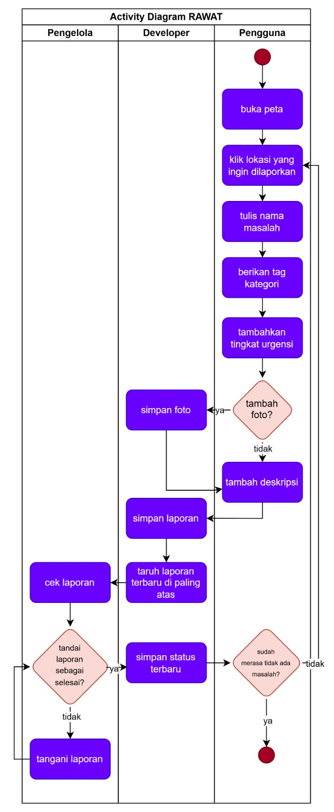
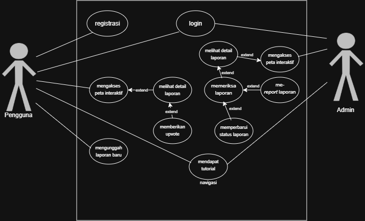
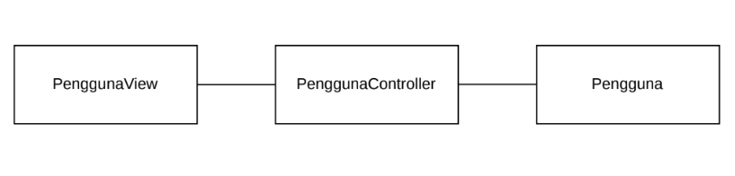
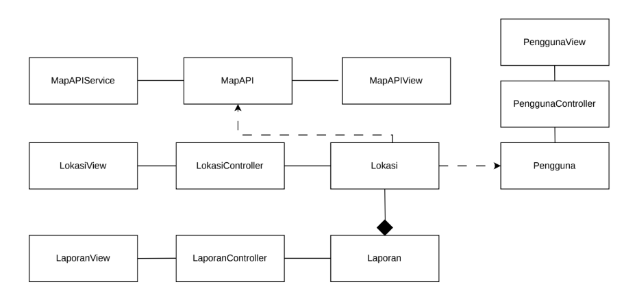
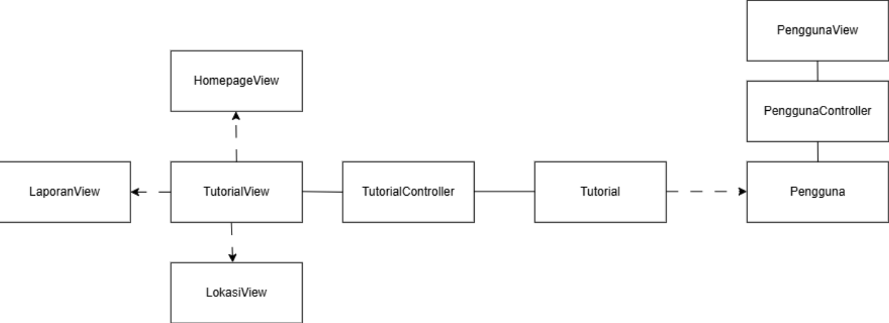
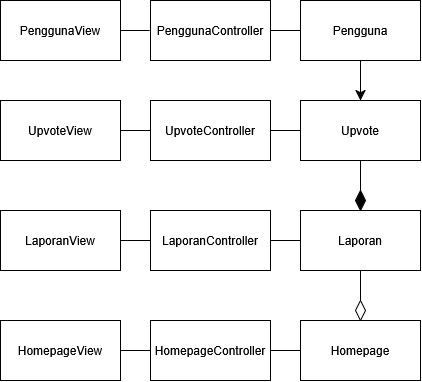
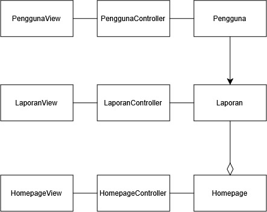
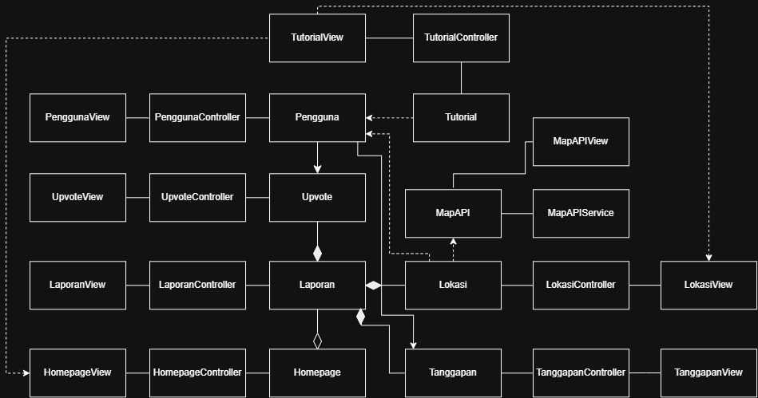

<h1>
IF2150 REKAYASA PERANGKAT LUNAK
 
TUGAS 5
 
SPESIFIKASI KEBUTUHAN PERANGKAT LUNAK (SKPL)
</h1>
 

## *RAWAT (Ruang Aspirasi Warga dan Aduan Terpadu)*

### Untuk: *Agatha Tatianingseto*

Dipersiapkan oleh:
| Informasi | Keterangan |
| --- | --- |
| Kelas | *K01* |
| Kelompok | *01* |

| NIM | Nama |
|---|---|
| *13525103* | *Ravinka Fathia Adinegara* |
| *13525013* | *Samantha Michelle S Silaban* |
| *13525055* | *Syakira Azzahra Rachmania* |
| *13525043* | *Aufa Tatsbita Zahra* |
| *13525046* | *Ghiffari Arya Adhitya* |
---

## Daftar Perubahan

| Revisi | Deskripsi |
| :--- | :--- |

 

# BAB 1: Pendahuluan

## 1.1 Tujuan Penulisan Dokumen
Tuliskan dengan ringkas tujuan dokumen SKPL ini dibuat dan siapa saja yang akan menggunakan dokumen ini.

## 1.2 Lingkup Masalah
Tuliskan dengan ringkas nama aplikasi dan deskripsi singkatnya. Bagian ini maksimal berisi satu paragraf, dapat diringkas dari BAB 1 *Analisis Permasalahan* pada dokumen *Topic Brainstorming*.

## 1.3 Definisi, Istilah, dan Singkatan
<!-- Semua definisi dan singkatan yang digunakan dalam dokumen ini beserta penjelasannya. -->

Tabel 1.3. Definisi Istilah dan Singkatan

| Singkatan, Akronim, atau Istilah | Penjelasan |
| :--- | :--- |
| *P/L* | *Singkatan dari Perangkat Lunak, yaitu aplikasi yang memberikan perintah kepada komputer untuk menjalankan tugas tertentu.* |
| *SKPL* | *Singkatan dari Spesifikasi Kebutuhan Perangkat Lunak, yaitu dokumen yang merangkum kriteria-kriteria yang diperlukan untuk membangun aplikasi menjalankan tugasnya.* |
| *KF* | *Singkatan dari Kebutuhan Fungsional.* |
| *KNF* | *Singkatan dari Kebutuhan Non-Fungsional.* |
| *UC* | *Singkatan dari Use Case.* |
| *EARS* | *Easy Approach to Requirements Syntax, yaitu pola penulisan kebutuhan agar konsisten dan mudah diuji.* |
| *...* | *...* |

## 1.4 Aturan Penomoran
<!-- Tuliskan aturan penomoran (ID) yang digunakan dalam dokumen ini. Gunakan pola ID yang **sama** dengan yang sudah dipakai pada dokumen-dokumen sebelumnya, jangan membuat pola baru di dokumen ini. -->

Tabel 1.4. Aturan Penomoran

| Hal/Bagian | Penomoran | Keterangan |
| :--- | :--- | :--- |
| *Kebutuhan Fungsional* | *KFXX* | |
| *Kebutuhan Non-Fungsional* | *KNFXX* | |
| *Aktor* | *AXX* | |
| *Use Case* | *UCXX* | |
| *Kelas* | *CXX* | |
| *...* | *...* |

## 1.5 Referensi
<!-- Dokumentasi P/L yang dirujuk oleh dokumen ini. Referensi dapat berupa buku, panduan, ataupun dokumentasi lain yang dipakai dalam pengembangan P/L ini. -->

## 1.6 Deskripsi Umum Dokumen (Ikhtisar)
<!-- Tuliskan sistematika pembahasan dokumen SKPL ini secara runut (misalnya: BAB 2 membahas deskripsi umum P/L, BAB 3 membahas kebutuhan fungsional dan non-fungsional, dst). -->

---

# BAB 2: Deskripsi Perangkat Lunak

## 2.1 Deskripsi Umum Sistem
<!-- Bagian ini dapat disalin dari BAB 1.1 *Deskripsi Umum Sistem* pada dokumen *Requirement Gathering*, disesuaikan bila ada perubahan alur bisnis. Lengkapi dengan gambaran proses bisnis dalam bentuk *Activity Diagram* (boleh disalin dan diperbarui dari 3.3 *Model Proses Bisnis* pada dokumen *Topic Brainstorming*). -->

Secara umum, sistem dengan nama RAWAT (Ruang Aspirasi Warga dan Aduan Terpadu) adalah sebuah sistem yang memungkinkan pengubungan lebih lanjut antara para pengguna fasilitas umum seperti penduduk kota dan pengelolanya seperti pemerintah agar keluhan dan masalah terkait kerusakan fasilitas umum dapat ditangani dan pengelola dapat lebih mudah mengawasi fasilitas umum apa saja yang perlu perhatian lebih. Dalam sistem ini, pengguna dapat melapor hal-hal yang terasa mengganggu atau rusak di lingkungan atau di tempat publik. Pemerintah lokal dapat menggunakan sistem ini untuk mengawasi kondisi lapangan langsung dari warga yang menggunakan fasilitas yang tersedia.

Fungsi utama dari RAWAT adalah untuk melaporkan kondisi tertentu yang menyangkut fasilitas umum atau hal yang berkaitan dengan ruang masyarakat yang dinilai mengganggu banyak pengguna fasilitas, seperti pohon tumbang atau banyaknya ular yang berkeliaran. Dalam sistem ini, terdapat sebuah seksi yang memungkinkan pengguna untuk menuliskan lokasi, nama kerusakan, jenis kerusakan, tingkat urgensi, serta hal-hal yang bersifat opsional seperti foto dan deskripsi singkat. Laporan tersebut akan disimpan dan ditampilkan di suatu halaman yang dapat diurutkan berdasarkan urgensi, tag, waktu posting, atau jumlah upvote. Setiap laporan terdapat fitur upvote dan komentar agar masyarakat dapat lebih menekankan suatu isu. Untuk platform, dipilih sebagai web app sehingga dapat digunakan secara universal asalkan mempunyai browser dan koneksi internet.

Inovasi sistem ini dibandingkan dengan sistem yang sudah ada bisa dilihat dari hal-hal berikut.
* Sistem ini dapat mengkategorikan laporan berdasarkan urgensi.
* Sistem ini tidak perlu menginstall aplikasi dan dapat diakses melalui browser.
* Sistem ini mempunyai fitur komentar dan upvote untuk setiap postingannya.

Seperti yang telah disebutkan, fitur utama dari aplikasi adalah pelaporan fasilitas umum yang rusak. Berikut ini alur lengkap dari sistem kerja RAWAT.
1. Pengguna membuka peta dan memilih lokasi fasilitas atau ruang umum yang ingin dilaporkan.
2. Pengguna mengisi formulir yang berisi nama, tingkat penggunaan, jenis yang dapat ditulis sendiri atau memilih yang sudah ada, serta menambah foto dan deskripsi apabila dibutuhkan.
3. Pengguna menekan tombol simpan.
4. Sistem menyimpan laporan tersebut dan menampilkannya bersama laporan lain.
5. Admin mengecek laporan dan menangani laporan.
6. Admin menandai laporan tersebut sebagai selesai setelah ditangani.
7. Sistem menandai laporan tersebut sebagai selesai dan tidak menampilkannya di laman utama lagi.

Berikut ini adalah gambar diagram proses bisnis dari sistem terkait.

<i>Gambar 2. Activity Diagram Proses Bisnis</i>

## 2.2 Deskripsi Umum Perangkat Lunak
<!-- Diisi dengan deskripsi umum perangkat lunak untuk mendukung proses bisnis yang telah diuraikan pada sub-bab sebelumnya. Uraian harus menunjukkan lingkup perangkat lunak, mencakup keterkaitan perangkat lunak dengan sistem lain di luar (misalnya *Payment Gateway* atau layanan pihak ketiga lain yang dipakai).

*Contoh narasi:* "*[Nama P/L]* merupakan aplikasi *[deskripsi singkat]* yang berinteraksi dengan *Payment Gateway (dummy)* untuk memproses otorisasi pembayaran. Sistem menerima input dari *Pelanggan* melalui antarmuka aplikasi dan mengirimkan permintaan transaksi ke *Payment Gateway* setiap kali pelanggan melakukan checkout." -->

## 2.3 Pengguna dan Kebutuhan Pengguna Perangkat Lunak
<!-- Tuliskan seluruh jenis pengguna (*role*/aktor) yang terlibat dalam perangkat lunak (P/L), beserta kebutuhannya secara umum. Bagian ini dapat disalin dari 1.2 *Deskripsi Pengguna Perangkat Lunak* (dokumen Requirement Gathering) atau 3.1 *Identifikasi Aktor* (dokumen Use Case), pastikan sudah konsisten dengan aktor final yang dipakai di BAB 4. -->

| Pengguna | Kebutuhan |
| :--- | :--- |
| *Pengguna* | *Pihak ini harus dapat melaporkan isu-isu yang terjadi di daerah dan berhak memperoleh informasi terkait laporan yang tersedia. Karakteristik dari pengguna ini mengutamakan kemudahan pelaporan dan keakuratan informasi lingkungan* |
| *Admin* | *Pengguna ini harus dapat memantau dan mengelola sistem, mengutamakan kejelasan informasi di laporan dan integritas data laporan* |

## 2.4 Batasan Perangkat Lunak
Batasan yang harus dituliskan, di antaranya:
1. *P/L harus memakai file data/API dari sistem lain (sebutkan, misal Payment Gateway dummy).*
2. *P/L harus memakai format data yang sama dengan sistem lain.*
3. *P/L harus berfungsi pada platform tertentu (misal: web browser modern, atau desktop Windows dan Linux).*
4. *...*

## 2.5 Lingkungan Operasi Perangkat Lunak
Spesifikasi *operating system* atau lingkungan yang dibutuhkan P/L untuk beroperasi. Bagian ini digunakan untuk memastikan pengguna memiliki spesifikasi yang cukup untuk menjalankan P/L. Misalnya mencakup komponen server, client, OS, DBMS, tetapi tidak menutupi kemungkinan komponen lain.

| Komponen | Spesifikasi |
| :--- | :--- |
| *Server* | *[contoh: Node.js v20, dijalankan pada layanan cloud]* |
| *Client* | *[contoh: Web Browser modern (Chrome, Firefox terbaru)]* |
| *DBMS* | *[contoh: PostgreSQL 15]* |
| *OS* | *[contoh: Cross-platform (Windows/Linux/MacOS) melalui browser]* |
| *...* | *...* |

---

# BAB 3: Deskripsi Kebutuhan Perangkat Lunak

## 3.1 Kebutuhan Fungsional (KF)
<!-- Salin ulang **seluruh Kebutuhan Fungsional (KF)** versi terbaru dari BAB 2.1 dokumen *Class Diagram* (sudah versi final dan sudah memakai format EARS). Pastikan ID Kebutuhan (kolom "ID Kebutuhan") juga konsisten dengan ID pada tabel Pemetaan Kebutuhan di dokumen *Requirement Gathering*. -->

Tabel 3.1. Kebutuhan Fungsional

| ID KF | ID Kebutuhan | Penjelasan |
| :--- | :--- | :--- |
| *KF01* | *R01* | *Perangkat lunak dapat menyediakan fitur registrasi akun untuk pengguna baru dan fitur login bagi admin maupun pengguna.* |
| *KF02* | *R02* | *Ketika pengguna atau admin hendak mengakses perangkat lunak, perangkat lunak dapat memvalidasi kredensial pengguna atau admin tersebut.* |
| *KF03* | *R04* | *Perangkat lunak dapat menampilkan peta interaktif yang terintegrasi dengan sistem berdasarkan data lokasi laporan yang tersimpan.* |
| *KF04* | *R04* | *Perangkat lunak dapat menampilkan informasi umum suatu laporan pada peta dengan menggunakan simbol, penanda, dan tata letak yang konsisten.* |
| *KF05* | *R05* | *Ketika pengguna hendak melihat detail laporan, perangkat lunak harus dapat menampilkan detail informasi berupa lokasi, nama masalah, kategori, tingkat permasalahan, serta foto dan deskripsi apabila tersedia.* |
| *KF06* | *R06* | *Perangkat lunak dapat menampilkan tingkat kedaruratan atau tingkat permasalahan pada setiap laporan dengan label yang sesuai dengan tingkat kedaruratannya.* |
| *KF07* | *R07* | *Perangkat lunak dapat menyediakan navigasi dari halaman utama hingga ke halaman detail laporan dan memberikan tutorial awal mengenai cara penggunaannya.* |
| *KF08* | *R08* | *Perangkat lunak harus menampilkan dan mengelola informasi laporan sesuai dengan ketentuan perundang-undangan* |
| *KF09* | *R09* | *Bila pengguna merasa laporan pengguna lain relevan, maka perangkat lunak harus memungkinkan pengguna memberikan upvote pada laporan tersebut.* |
| *KF10* | *R09* | *Ketika upvote yang dilakukan oleh pengguna gagal ataupun berhasil, perangkat lunak harus memberikan notifikasi singkat kepada pengguna .* |
| *KF11* | *R10* | *Perangkat lunak dapat menampilkan laporan yang sedang trending dengan mengurutkan atau memprioritaskan tampilan laporan berdasarkan jumlah upvote terbaru yang diperoleh.* |
| *KF12* | *R11* | *Ketika pengguna hendak membuat laporan baru, perangkat lunak harus menyediakan formulir isian untuk data yang diperlukan, seperti informasi lokasi, nama masalah, kategori, tingkat permasalahan, foto (opsional), dan deskripsi (opsional).* |
| *KF13* | *R11* | *Perangkat lunak dapat memberikan informasi mengenai format file foto yang dapat diinput oleh pengguna dan memvalidasi apakah input file dari pengguna sesuai dengan ketentuan, juga memberikan notifikasi apakah pengiriman laporan gagal/berhasil.* |
| *KF14* | *R12* | *Ketika admin hendak memeriksa laporan pengguna, perangkat lunak harus memungkinkan admin melihat dan memproses laporan yang masuk.* |
| *KF15* | *R13* | *Ketika ada laporan baru yang masuk, perangkat lunak dapat melakukan sinkronisasi dengan menyimpan dan menampilkan data terakhir yang berhasil diinput oleh user.* |
| *KF16* | *R14* | *Perangkat lunak dapat membatasi akses terhadap data dan fitur berdasarkan hak akses akun pengguna atau admin.* |
| *KF17* | *R15* | *Ketika terjadi perubahan status laporan di lapangan, perangkat lunak dapat memungkinkan admin memperbarui status penanganan laporan tersebut.* |
| *KF18* | *R16* | *Perangkat lunak dapat melakukan sinkronisasi dengan menyimpan dan menampilkan status laporan yang telah diperbarui oleh admin kepada pengguna.* |

## 3.2 Kebutuhan Non-Fungsional (KNF)
<!-- Salin ulang Kebutuhan Non-Fungsional dari BAB 2.5 dokumen *Requirement Gathering*, sesuaikan ID Kebutuhan (kolom "ID Kebutuhan") apabila terjadi perubahan penomoran pada BAB 3.1 di atas. -->

Berikut adalah kebutuhan non-fungsional perangkat lunak berdasarkan ISO/IEC 25010:2023.

Tabel 3.2. Kebutuhan Non-Fungsional

| ID KNF | ID Kebutuhan | Parameter | Deskripsi Kebutuhan |
| :--- | :--- | :--- | :--- |
| *KNF01* | *R01* | *Security* | *Sistem harus melindungi kredensial User melalui koneksi terenkripsi HTTPS dan password harus disimpan dalam bentuk hash.* |
| *KNF02* | *R04* | *Compatibility* |*Sistem harus dapat mengirimkan data alamat ke layanan peta eksternal melalui API dan menggunakan hasil geocoding yang dikembalikan untuk menampilkan lokasi pada peta.* |
| *KNF03* | *R07* | *Interaction Capability* |*Sistem harus memenuhi 90% UI/UX guideline yang dibuat berdasarkan Nielsen’s 10 Usability Heuristics.*| 
| *KNF04* | *R10* | *Performance Efficiency* |*Sistem harus dapat menghitung 95% permintaan untuk menampilkan ranking laporan trending selama maksimal 2 detik.*|
| *KNF05* | *R10* | *Performance Efficiency* |*Sistem harus mampu melayani 1000 pengguna aktif secara bersamaan pada fitur trending dengan tingkat kegagalan request kurang dari 1%* |
| *KNF06* | *R11* | *Availability* |*Sistem harus menjaga layanan pelaporan tetap dapat diakses oleh User selama 24 jam per hari di luar pemeliharaan terjadwal.* |
| *KNF07* | *R11* | *Flexibility* |*Sistem harus dapat berfungsi pada Google Chrome, Microsoft Edge, dan Mozilla Firefox tanpa kehilangan fungsi utama* |
| *KNF08* | *R11* | *Interaction Capability* |*Apabila pengguna mengisi kuesioner dengan format yang salah, sistem harus dapat  menolak jawaban tersebut tanpa menghapus data lain yang telah diisi.*|
| *KNF09* | *R13* | *Performance Efficiency* |*Sistem harus menyelesaikan sinkronisasi perubahan status laporan dalam waktu maksimal 5 detik setelah perubahan status berhasil disimpan.* |
| *KNF10* | *R13* | *Reliability* |*Apabila terjadi gangguan sinkronisasi, sistem harus dapat kembali memulihkan status laporan ke kondisi terbaru tanpa kehilangan data laporan lain.* |
| *KNF10* | *R14* | *Security* |*Sistem harus menerapkan Role-Based Access Control (RBAC) dengan memeriksa role User pada setiap permintaan akses ke data yang dilindungi.* |

<!-- *Silakan pilih parameter yang relevan dengan P/L kalian (Availability, Reliability, Ergonomy, Portability, Memory, Response time, Safety, Security, dsb), tidak perlu semua parameter diisi. Lihat kembali dokumen Requirement Gathering untuk penjelasan tiap parameter.* -->

---

# BAB 4: Pemodelan Use Case

## 4.1 Identifikasi Aktor
<!-- Salin ulang daftar aktor final dari BAB 3.1 dokumen *Use Case & Scenario Use Case* atau *Class Diagram*. Tambahkan ID Aktor mengikuti Aturan Penomoran pada 1.4. -->

| ID Aktor | Aktor | Deskripsi |
| :--- | :--- | :--- |
| *A01* | *Pelanggan* | *Pengguna yang memesan produk, mengelola keranjang, dan menyelesaikan pembayaran melalui sistem.* |
| *...* | *...* | *...* |

## 4.2 Identifikasi Use Case
<!-- Salin ulang daftar Use Case versi terbaru dari BAB 3.2 dokumen *Class Diagram*, pastikan seluruh ID KF yang dirujuk sudah sesuai dengan tabel pada 3.1. -->

| ID UC | Nama Use Case | Deskripsi Singkat | Aktor Terlibat | ID KF Terkait |
| :--- | :--- | :--- | :--- | :--- |
| *UC01* | *Melakukan Registrasi Akun* | *User membuat sebuah akun baru.* | *Pengguna, Admin* | *KF01, KF02* |
| *UC02* | *Melakukan Proses Login* | *User dapat login atau masuk ke akun yang telah dibuat* | *Pengguna, Admin* | *KF01, KF02* |
| *UC03* | *Mengakses Peta Interaktif* | *Pengguna dapat melihat peta interaktif yang menampilkan titik lokasi dari laporan yang ada. Jika titik lokasi diklik, pengguna dapat melihat popup informasi dari laporan tersebut.* | *Pengguna, Admin* | *KF03, KF04* |
| *UC04* | *Melihat Detail Laporan* | *Pengguna dapat melihat detail informasi dari laporan berupa lokasi, nama masalah, kategori, label tingkat kedaruratan laporan, serta foto dan deskripsi apabila tersedia.* | *Pengguna, Admin* | *KF05, KF06* |
| *UC05* | *Mendapat Tutorial Navigasi antar halaman* | *Pengguna mendapat tutorial cara navigasi antar halaman untuk saat pertama kali menggunakan perangkat lunak* | *Pengguna, Admin* | *KF07* |
| *UC06* | *Melakukan Upvote* | *Pengguna dapat memberikan upvote untuk laporan yang menurutnya relevan serta mendapat notifikasi apakah upvote berhasil atau tidak, kemudian laporan yang memiliki poin upvote dan atau urgensi tinggi akan cenderung muncul di feeds laporan.* | *Pengguna* | *KF09, KF10, KF11* |
| *UC07* | *Mengunggah Laporan Baru* | *Pengguna dapat membuat laporan baru dengan mengisi formulir data terkait laporan tersebut, seperti lokasi, nama masalah, kategori, tingkat permasalahan, foto (opsional), dan deskripsi (opsional). Jika pengguna akan mengunggah file, pengguna akan mendapat notifikasi jika format file tidak sesuai dan notifikasi terkait keberhasilan proses upload file.* | *Pengguna* | *KF12, KF13, KF15* |
| *UC08* | *Memeriksa Laporan* | *Admin dapat mengakses dan memproses laporan yang masuk. Jika laporan yang diajukan tidak benar atau tidak sesuai kondisi nyata, maka admin dapat melakukan report laporan.* | *Admin* | *KF08, KF14, KF15* |
| *UC09* | *Memperbarui Status Penanganan Laporan* | *Admin dapat mengupdate status penanganan laporan sesuai kondisi lapangan.* | *Admin* | *KF17, KF18* |

## 4.3 Use Case Diagram
<!-- Salin ulang Use Case Diagram dari BAB 3.3 dokumen *Use Case & Scenario Use Case* atau *Class Diagram* (gunakan versi paling akhir/terbaru apabila terdapat perubahan). -->

Berikut ini adalah use case diagram dari identifikasi use case yang telah dijabarkan pada 4.2.

<i>Gambar 2. Use Case Diagram</i>

## 4.4 Skenario Use Case
<!-- Salin ulang skenario **setiap** use case (skenario normal dan alternatif) dari BAB 3.4 dokumen *Use Case & Scenario Use Case*, sesuaikan dengan daftar UC final pada 4.2. Jika use case melibatkan lebih dari satu aktor manusia yang benar-benar berinteraksi langsung (misalnya *Kasir* yang memverifikasi transaksi setelah *Pelanggan* membayar), tambahkan kolom aksi tersendiri untuk aktor tersebut di samping kolom "Reaksi Perangkat Lunak". Sistem eksternal otomatis seperti *payment gateway* **bukan aktor**, sehingga interaksinya cukup dituliskan sebagai bagian dari "Reaksi Perangkat Lunak", bukan kolom aktor terpisah. -->
### 4.4.1 Skenario UC01

**Nama Use Case:** *Melakukan Registrasi Akun*

**Skenario Normal**

| No | Aksi Aktor | Reaksi Perangkat Lunak |
| :--- | :--- | :--- |
| 1 | *Pengguna menekan pilihan Registrasi* | *Sistem menampilkan formulir berisi NIK, email, dan password* |
| 2 | *Pengguna mengisi formulir dan menekan tombol Daftar.* | *Sistem memvalidasi kelengkapan data, format NIK (jumlah digit), serta ketentuan password (minimal 8 karakter, 1 huruf kapital, 1 angka, dan simbol). Sistem memastikan NIK dan email belum terdaftar.* |
| 3 | *-* | *Sistem melakukan hashing password dan menyimpan data akun ke database* |
| 4 | *-* | *Sistem menampilkan pesan akun berhasil dibuat dan menampilkan halaman utama* |

 

**Skenario Alternatif 1: Data Registrasi Tidak Lengkap**

| No | Aksi Aktor | Reaksi Perangkat Lunak |
| :--- | :--- | :--- |
| 1 | *Pengguna menekan pilihan Registrasi* | *Sistem menampilkan formulir berisi NIK, email, dan password* |
| 2 | *Pengguna mengisi hanya sebagian data formulir dan menekan tombol Daftar.* | *Sistem memvalidasi kelengkapan data, format NIK (jumlah digit), serta ketentuan password (minimal 8 karakter, 1 huruf kapital, 1 angka, dan simbol). Sistem menyadari input data pengguna tidak lengkap.* |
| 3 | *-* | *Sistem menampilkan pesan bahwa data registrasi yang diinput pengguna belum lengkap dan menunjukkan kolom yang masih belum diisi* |
| 4 | *Pengguna melengkapi data formulir dan menekan ulang tombol Daftar* | *Sistem memvalidasi ulang kelengkapan data, format NIK (jumlah digit), serta ketentuan password (minimal 8 karakter, 1 huruf kapital, 1 angka, dan simbol). Sistem memastikan NIK dan email belum terdaftar.* |
| 5 | *-* | *Sistem melakukan hashing password dan menyimpan data akun ke database* |
| 6 | *-* | *Sistem menampilkan pesan akun berhasil dibuat dan menampilkan halaman utama* |

**Skenario Alternatif 2: Format NIK Tidak Valid**

| No | Aksi Aktor | Reaksi Perangkat Lunak |
| :--- | :--- | :--- |
| 1 | *Pengguna menekan pilihan Registrasi* | *Sistem menampilkan formulir berisi NIK, email, dan password* |
| 2 | *Pengguna mengisi data registrasi, namun menginput NIK dengan jumlah digit yang tidak sesuai.* | *Sistem memvalidasi kelengkapan data, format NIK (jumlah digit), serta ketentuan password (minimal 8 karakter, 1 huruf kapital, 1 angka, dan simbol), sistem menyadari kesalahan jumlah digit NIK yang diinput oleh pengguna.* |
| 3 | *-* | *Sistem menampilkan pesan bahwa data NIK yang diinput pengguna belum valid dan meminta pengguna untuk menginput ulang NIK yang sesuai* |
| 4 | *Pengguna membetulkan NIK yang diinput dan menekan ulang tombol Daftar* | *Sistem memvalidasi ulang kelengkapan data, termasuk format NIK (jumlah digit). Sistem memastikan NIK dan email belum terdaftar* |
| 5 | *-* | *Sistem melakukan hashing password dan menyimpan data akun ke database* |
| 6 | *-* | *Sistem menampilkan pesan akun berhasil dibuat dan menampilkan halaman utama* |

**Skenario Alternatif 3: Format Password Tidak Valid**

| No | Aksi Aktor | Reaksi Perangkat Lunak |
| :--- | :--- | :--- |
| 1 | *Pengguna menekan pilihan Registrasi* | *Sistem menampilkan formulir berisi NIK, email, dan password* |
| 2 | *Pengguna mengisi data registrasi, namun menginput password yang tidak sesuai dengan ketentuan.* | *Sistem memvalidasi kelengkapan data, format NIK (jumlah digit), serta ketentuan password (minimal 8 karakter, 1 huruf kapital, 1 angka, dan simbol), sistem menerima password yang ternyata tidak sesuai dengan ketentuan.* |
| 3 | *-* | *Sistem menampilkan pesan bahwa password tidak valid, di mana password minimal terdiri dari 8 karakter, 1 huruf kapital, 1 angka, dan simbol. Lalu, meminta pengguna untuk menginput ulang password* |
| 4 | *Pengguna memperbaiki password sesuai ketentuan dan menekan ulang tombol Daftar* | *Sistem memvalidasi ulang kelengkapan data, format NIK (jumlah digit), serta ketentuan password (minimal 8 karakter, 1 huruf kapital, 1 angka, dan simbol). Sistem memastikan NIK dan email belum terdaftar.* |
| 5 | *-* | *Sistem melakukan hashing password dan menyimpan data akun ke database* |
| 6 | *-* | *Sistem menampilkan pesan akun berhasil dibuat dan menampilkan halaman utama* |

### 4.4.2 Skenario UC02

**Nama Use Case:** *Melakukan Proses Login*

**Skenario Normal**

| No | Aksi Aktor | Reaksi Perangkat Lunak |
| :--- | :--- | :--- |
| 1 | *Pengguna/Admin menekan tombol* | *Sistem menampilkan formulir berisi email dan password* |
| 2 | *Pengguna memasukkan email dan password dan menekan tombol masuk* | *Sistem mencari akun berdasarkan email dan memverifikasi kecocokan password* |
| 3 | *-* | *Sistem menampilkan halaman utama sesuai peran pengguna/admin* |

 

**Skenario Alternatif 1: Data Login Belum Terisi Lengkap**

| No | Aksi Aktor | Reaksi Perangkat Lunak |
| :--- | :--- | :--- |
| 1 | *Pengguna/Admin menekan tombol* | *Sistem menampilkan formulir berisi email dan password* |
| 2 | *Pengguna hanya memasukkan email/password saja, atau bahkan tidak mengisi keduanya, lalu menekan tombol masuk* | *Sistem tidak menerima input data login yang lengkap* |
| 3 | *-* | *Sistem menampilkan pesan bahwa data login yang diinput masih belum lengkap (email/password masih belum terisi), dan meminta pengguna melengkapi inputnya* |
| 4 | *Pengguna melengkapi data login (email/password yang tadi belum terisi) dan menekan tombol masuk* | *Sistem mencari akun berdasarkan email dan memverifikasi kecocokan password* |
| 5 | *-* | *Sistem menampilkan halaman utama sesuai peran pengguna/admin* |

**Skenario Alternatif 2: Email Belum Terdaftar**

| No | Aksi Aktor | Reaksi Perangkat Lunak |
| :--- | :--- | :--- |
| 1 | *Pengguna/Admin menekan tombol* | *Sistem menampilkan formulir berisi email dan password* |
| 2 | *Pengguna memasukkan email dan password dan menekan tombol masuk* | *Sistem tidak menemukan akun yang cocok dengan email yang diinput pengguna* |
| 3 | *-* | *Sistem menampilkan pesan bahwa email yang diinput masih belum terdaftar* |
| 4 | *Pengguna memasukkan ulang email dan password dan menekan tombol masuk* | *Sistem mencari akun berdasarkan email dan memverifikasi kecocokan password* |
| 5 | *-* | *Sistem menampilkan halaman utama sesuai peran pengguna/admin* |

**Skenario Alternatif 3: Password Tidak Sesuai**

| No | Aksi Aktor | Reaksi Perangkat Lunak |
| :--- | :--- | :--- |
| 1 | *Pengguna/Admin menekan tombol* | *Sistem menampilkan formulir berisi email dan password* |
| 2 | *Pengguna memasukkan email dan password dan menekan tombol masuk* | *Sistem menerima password yang tidak sesuai* |
| 3 | *-* | *Sistem menampilkan pesan bahwa password yang diinput salah dan meminta pengguna untuk menginput ulang email dan password yang benar* |
| 4 | *Pengguna memasukkan ulang email dan password dan menekan tombol masuk* | *Sistem mencari akun berdasarkan email dan memverifikasi kecocokan password* |
| 5 | *-* | *Sistem menampilkan halaman utama sesuai peran pengguna/admin* |

### 4.4.3 Skenario UC03

**Nama Use Case:** *Mengakses Peta Interaktif*

**Skenario Normal**

| No | Aksi Aktor | Reaksi Perangkat Lunak |
| :--- | :--- | :--- |
| 1 | *Pengguna/Admin menekan menu "Peta Laporan"* | *Sistem menampilkan peta yang menampilkan titik lokasi laporan* |
| 2 | *Pengguna/Admin menekan "lihat laporan sekitar saya"* | *Sistem menampilkan peta yang di zoom in mendekati area pengguna* |
| 3 | *Pengguna/Admin menekan salah satu titik laporan pada peta* | *Sistem menampilkan pop up detail laporan* |

 

**Skenario Alternatif 1: Pengguna Belum Mengaktifkan Akses Lokasi di Perangkat**

| No | Aksi Aktor | Reaksi Perangkat Lunak |
| :--- | :--- | :--- |
| 1 | *Pengguna/Admin menekan menu "Peta Laporan"* | *Sistem menampilkan peta yang menampilkan titik lokasi laporan* |
| 2 | *Pengguna/Admin menekan "lihat laporan sekitar saya"* | *Sistem meminta izin untuk mengakses lokasi perangkat* |
| 3 | *Pengguna/Admin menolak izin akses lokasi"* | *Sistem menampilkan pesan kesalahan bahwa lokasi pengguna tidak dapat diakses dan tidak dapat menampilkan laporan di sekitar pengguna* |
| 4 | *Pengguna/Admin kembali menekan "lihat laporan sekitar saya"* | *Sistem kembali meminta izin untuk mengakses lokasi perangkat. * |
| 5 | *Pengguna/Admin memberikan izin akses lokasi"* | *Sistem menampilkan peta yang di-zoom mendekati area pengguna* |
| 6 | *Pengguna/Admin menekan salah satu titik laporan pada peta* | *Sistem menampilkan pop up detail laporan* |

**Skenario Alternatif 2: API Peta Gagal Dimuat**

| No | Aksi Aktor | Reaksi Perangkat Lunak |
| :--- | :--- | :--- |
| 1 | *Pengguna/Admin menekan menu "Peta Laporan"* | *Sistem meminta data peta melalui API* |
| 2 | - | *API gagal memberikan respons sehingga sistem gagal memuat peta dan menampilkan pesan kesalahan bahwa peta tidak dapat dimuat* |
| 3 | *Pengguna/Admin melakukan refresh halaman* | *Sistem kembali meminta data peta melalui API* |
| 4 | - | *Sistem menampilkan peta yang menampilkan titik lokasi laporan apabila API berhasil memberikan respons* |
| 5 | *Pengguna/Admin menekan "lihat laporan sekitar saya"* | *Sistem menampilkan peta yang di zoom in mendekati area pengguna* |
| 6 | *Pengguna/Admin menekan salah satu titik laporan pada peta* | *Sistem menampilkan pop up detail laporan* |

**Skenario Alternatif 3: Tidak Terdapat Laporan di Sekitar Pengguna**

| No | Aksi Aktor | Reaksi Perangkat Lunak |
| :--- | :--- | :--- |
| 1 | *Pengguna/Admin menekan menu "Peta Laporan"* | *Sistem menampilkan peta yang menampilkan titik lokasi laporan* |
| 2 | *Pengguna/Admin menekan "lihat laporan sekitar saya"* | *Sistem tidak menemukan laporan di sekitar pengguna dan menampilkan pesan bahwa tidak terdapat laporan pada area tersebut* |
| 3 | *Pengguna/Admin memperbesar atau menggeser peta* | *Sistem memuat laporan yang tersedia pada area peta yang ditampilkan dan menampilkan titik lokasi laporan yang tersedia pada area tersebut* |
| 4 | *Pengguna/Admin menekan salah satu titik laporan pada peta* | *Sistem menampilkan pop up detail laporan* |

### 4.4.4 Skenario UC04

**Nama Use Case:** *Melihat laporan*

**Skenario Normal**

| No | Aksi Aktor | Reaksi Perangkat Lunak |
| :--- | :--- | :--- |
| 1 | *Pengguna/Admin menekan salah satu laporan pada halaman utama yang dapat difilter berdasarkan terbaru, urgensi, dan popularitas* | *Sistem menampilkan sebagian detail laporan* |
| 2 | *Pengguna/Admin menggulir halaman* | *Sistem menampilkan seluruh detail laporan* |

 

**Skenario Alternatif 1: Detail laporan tidak lengkap**

| No | Aksi Aktor | Reaksi Perangkat Lunak |
| :--- | :--- | :--- |
| 1 | *Pengguna/Admin menekan salah satu laporan pada halaman utama yang dapat difilter berdasarkan terbaru, urgensi, dan popularitas* | *Sistem menampilkan sebagian detail laporan* |
| 2 | *Pengguna/Admin menggulir halaman* | *Sistem hanya menampilkan detail laporan yang tersedia karena beberapa informasi, yakni foto atau deskripsi tidak tersedia* |

**Skenario Alternatif 2: Laporan gagal dimuat**

| No | Aksi Aktor | Reaksi Perangkat Lunak |
| :--- | :--- | :--- |
| 1 | *Pengguna/Admin menekan salah satu laporan pada halaman utama yang dapat difilter berdasarkan terbaru, urgensi, dan popularitas* | *Sistem gagal memuat detail laporan karena adanya gangguan* |
| 2 | *-* | *Sistem menampilkan pesan bahwa detail laporan gagal dimuat* |
| 3 | *Pengguna/Admin memilih untuk memuat ulang laporan* | *Sistem mencoba memuat kembali detail laporan tersebut* |
| 4 | *-* | *Sistem menampilkan detail laporan apabila berhasil dimuat* |

### 4.4.5 Skenario UC05

**Nama Use Case:** *Mendapat Tutorial Navigasi antar Halaman*

**Skenario Normal**

| No | Aksi Aktor | Reaksi Perangkat Lunak (Pengguna) |
| :--- | :--- | :--- |
| 1 | *Pengguna selesai melakukan registrasi* | *Sistem  onboarding tutorial* |
| 2 | *Pengguna menekan pilihan "Mulai Tutorial"* | *Sistem menampilkan penjelasan fitur halaman utama* |
| 3 | *Pengguna mengonfirmasi pilihan "Next"* | *Sistem berpindah ke halaman peta dan menampilkan penjelasannya* |
| 4 | *Pengguna mengonfirmasi pilihan "Next"* | *Sistem menampilkan cara membuat laporan* |
| 5 | *Pengguna memilih "Selesai" pada akhir tutorial* | *Sistem menutup oboarding tutorial* |

 

**Skenario Alternatif 1: Pengguna Memilih Skip Tutorial**

| No | Aksi Aktor | Reaksi Perangkat Lunak (Pengguna) |
| :--- | :--- | :--- |
| 1 | *Pengguna selesai melakukan registrasi* | *Sistem  onboarding tutorial* |
| 2 | *Pengguna menekan pilihan "Skip Tutorial"* | *Sistem menutup onboarding tutorial* |

### 4.4.6 Skenario UC06
**Nama Use Case:** *Melakukan Upvote*

**Skenario Normal**

| No | Aksi Aktor | Reaksi Perangkat Lunak |
| :--- | :--- | :--- |
| 1 | *Pengguna menekan tombol Upvote pada suatu laporan di halaman utama* | *Sistem mencatat upvote pengguna dan memperbarui jumlah laporan.*|
| 2 | *-* | *Sistem menghitung ulang skor popularitas berdasarkan bobot urgensi 60% dan upvote 40%* |
| 3 | *-* | *Sistem memperbarui tampilan jumlah upvote dan jika pengurutan Populer sedang aktif, sistem memperbarui urutan laporan* |

 

**Skenario Alternatif 1: Pengguna Gagal Melakukan Upvote**

| No | Aksi Aktor | Reaksi Perangkat Lunak |
| :--- | :--- | :--- |
| 1 | *Pengguna menekan tombol Upvote pada suatu laporan di halaman utama* | *Sistem gagal mencatat upvote pengguna karena gangguan jaringan.*|
| 2 | *-* | *Sistem menampilkan pesan error, upvote gagal karena koneksi terputus atau jaringan tidak stabil* |
| 3 | *Pengguna merefresh sistem, lalu menekan ulang tombol Upvote pada suatu laporan di halaman utama* | *Sistem mencatat upvote pengguna dan memperbarui jumlah laporan.*|
| 4 | *-* | *Sistem menghitung ulang skor popularitas berdasarkan bobot urgensi 60% dan upvote 40%* |
| 5 | *-* | *Sistem memperbarui tampilan jumlah upvote dan jika pengurutan Populer sedang aktif, sistem memperbarui urutan laporan* |

### 4.4.7 Skenario UC07
**Nama Use Case:** *Mengunggah Laporan Baru*

**Skenario Normal**

| No | Aksi Aktor | Reaksi Perangkat Lunak |
| :--- | :--- | :--- |
| 1 | *Pengguna yang sudah login menekan Buat Laporan* | *Sistem menampilkan formulir berisi lokasi, nama masalah, kategiri, tingkat permasalahan, pilihan privat/publik, foto (opsional), dan deskripsi (opsional).*|
| 2 | *Pegguna yang sudah login mengisi formulir kemudian menekan tombol kirim* | *Sistem memvalidasi kelengkapan data wajib, titik lokasi, dan format foto jika diunggah.* |
| 3 | *-* | *Sistem menampilkan konfirmasi "Apakah data laporan sudah sesuai?"* |
| 4 | *Pengguna menekan tombol Ya* | *Sistem membuat ID unik dan menyimpan laporan ke database, kemudian menampilkan pesan bahwa laporan berhasil dibuat"* |

 

**Skenario Alternatif 1: Data Wajib untuk Membuat Laporan Masih Belum Lengkap**

| No | Aksi Aktor | Reaksi Perangkat Lunak |
| :--- | :--- | :--- |
| 1 | *Pengguna yang sudah login menekan Buat Laporan* | *Sistem menampilkan formulir berisi lokasi, nama masalah, kategori, tingkat permasalahan, pilihan privat/publik, foto (opsional), dan deskripsi (opsional).*|
| 2 | *Pengguna yang sudah login mengisi formulir, namun terdapat data wajib yang belum diisi, kemudian menekan tombol kirim* | *Sistem menerima data wajib yang belum lengkap dan menampilkan pesan bahwa data wajib laporan yang diinput pengguna belum lengkap dan menunjukkan kolom yang masih belum diisi.* |
| 3 | *Pengguna melengkapi formulir kemudian menekan ulang tombol kirim* | *Sistem memvalidasi kelengkapan data wajib, titik lokasi, dan format foto jika diunggah.* |
| 4 | *-* | *Sistem menampilkan konfirmasi "Apakah data laporan sudah sesuai?"* |
| 5 | *Pengguna menekan tombol Ya* | *Sistem membuat ID unik dan menyimpan laporan ke database, kemudian menampilkan pesan bahwa laporan berhasil dibuat"* |

**Skenario Alternatif 2: Format File Foto yang Diunggah Tidak Sesuai**

| No | Aksi Aktor | Reaksi Perangkat Lunak |
| :--- | :--- | :--- |
| 1 | *Pengguna yang sudah login menekan Buat Laporan* | *Sistem menampilkan formulir berisi lokasi, nama masalah, kategori, tingkat permasalahan, pilihan privat/publik, foto (opsional), dan deskripsi (opsional).*|
| 2 | *Pengguna yang sudah login mengisi formulir, lalu mengunggah foto yang tidak sesuai dengan ketentuan sistem* | *Sistem menyadari kesalahan format file foto dan menolak input dari pengguna, lalu menampilkan pesan bahwa input foto harus dalam format yang sesuai.* |
| 3 | *Pengguna memperbaiki input foto dengan mengunggah file yang sesuai, lalu melengkapi formulir, kemudian menekan tombol kirim* | *Sistem memvalidasi kelengkapan data wajib, titik lokasi, dan format foto.* |
| 4 | *-* | *Sistem menampilkan konfirmasi "Apakah data laporan sudah sesuai?"* |
| 5 | *Pengguna menekan tombol Ya* | *Sistem membuat ID unik dan menyimpan laporan ke database, kemudian menampilkan pesan bahwa laporan berhasil dibuat"* |

**Skenario Alternatif 3: Pengguna Membatalkan Konfirmasi Pengiriman Laporan**

| No | Aksi Aktor | Reaksi Perangkat Lunak |
| :--- | :--- | :--- |
| 1 | *Pengguna yang sudah login menekan Buat Laporan* | *Sistem menampilkan formulir berisi lokasi, nama masalah, kategori, tingkat permasalahan, pilihan privat/publik, foto (opsional), dan deskripsi (opsional).*|
| 2 | *Pengguna yang sudah login mengisi formulir kemudian menekan tombol kirim* | *Sistem memvalidasi kelengkapan data wajib, titik lokasi, dan format foto jika diunggah.* |
| 3 | *-* | *Sistem menampilkan konfirmasi "Apakah data laporan sudah sesuai?"* |
| 4 | *Pengguna menekan tombol Tidak* | *Sistem mengembalikan pengguna ke laman pengisian formulir"* |
| 5 | *Pengguna diperbolehkan untuk mengedit data input terlebih dahulu, kemudian menekan ulang tombol kirim* | *Sistem memvalidasi kelengkapan data wajib, titik lokasi, dan format foto jika diunggah.* |
| 6 | *-* | *Sistem menampilkan konfirmasi "Apakah data laporan sudah sesuai?"* |
| 7 | *Pengguna menekan tombol Ya* | *Sistem membuat ID unik dan menyimpan laporan ke database, kemudian menampilkan pesan bahwa laporan berhasil dibuat"* |

### 4.4.8 Skenario UC08
**Nama Use Case:** *Memeriksa laporan*

**Skenario Normal**

| No | Aksi Aktor | Reaksi Perangkat Lunak |
| :--- | :--- | :--- |
| 1 | *Admin membuka salah satu laporan pada halaman utama* | *Sistem menampilkan detail laporan tersebut*|
| 2 | *Admin menentukan laporan valid* | *Sistem mempertahankan laporan sebagai laporan yang dapat ditindaklanjuti* |

 

**Skenario Alternatif 1: Laporan Ternyata Tidak Valid dan Pengguna Mengirimkan Konfirmasi Ulang Sebelum Jangka Waktu 2 Minggu Berakhir**

| No | Aksi Aktor | Reaksi Perangkat Lunak |
| :--- | :--- | :--- |
| 1 | *Admin membuka salah satu laporan pada halaman utama* | *Sistem menampilkan detail laporan tersebut*|
| 2 | *Admin menyadari terdapat kejanggalan dalam laporan, dan mengklasifikasikan laporan sebagai tidak valid* | *Sistem menyimpan status laporan sebagai tidak valid dan mengirimkan permintaan konfirmasi kepada Pengguna yang mengirimkan laporan tersebut, lalu menunggu paling lambat hingga 2 minggu setelah laporan ditetapkan sebagai tidak valid* |
| 3 | *Pengguna mengirimkan konfirmasi ulang sebelum jangka waktu 2 minggu berakhir* | *Sistem mengirimkan notifikasi kepada Admin mengenai adanya konfirmasi ulang dari Pengguna* |
| 4 | *Admin memeriksa konfirmasi laporan dan mengklasifikasikan ulang status laporan* | *Sistem menyimpan status laporan, jika valid maka laporan tersebut akan diproses dan ditangani, namun jika statusnya masih tidak valid, maka sistem akan membuang/menghapus laporan tersebut* |

**Skenario Alternatif 2: Laporan Ternyata Tidak Valid dan Pengguna Tidak Mengirimkan Konfirmasi Ulang Hingga Jangka Waktu 2 Minggu Berakhir**

| No | Aksi Aktor | Reaksi Perangkat Lunak |
| :--- | :--- | :--- |
| 1 | *Admin membuka salah satu laporan pada halaman utama* | *Sistem menampilkan detail laporan tersebut*|
| 2 | *Admin menyadari terdapat kejanggalan dalam laporan, dan mengklasifikasikan laporan sebagai tidak valid* | *Sistem menyimpan status laporan sebagai tidak valid dan mengirimkan permintaan konfirmasi kepada Pengguna yang mengirimkan laporan tersebut, lalu menunggu paling lambat hingga 2 minggu setelah laporan ditetapkan sebagai tidak valid* |
| 3 | *Pengguna ternyata tidak mengirimkan konfirmasi ulang hingga jangka waktu 2 minggu berakhir* | *Sistem secara otomatis membuang/menghapus laporan tersebut* |

### 4.4.9 Skenario UC09
**Nama Use Case:** *Memperbarui Status Penanganan Laporan*

**Skenario Normal**

| No | Aksi Aktor | Reaksi Perangkat Lunak |
| :--- | :--- | :--- |
| 1 | *Admin membuka halaman utama* | *Sistem menampilkan daftar laporan yang dapat difilter urutannya berdasarkan terbaru, urgensi, dan popularitas.*|
| 2 | *Admin memilih salah satu laporan* | *Sistem menampilkan detail laporan* |
| 3 | *Admin menekan tombol Lakukan Tindakan* | *Sistem menampilkan formulir pop-up berisi kolom tanggapan dan dropdown status laporan yang dapat dipilih."* |
| 4 | *Admin mengisi tanggapan, memilih status, kemudian menekan tombol Simpan* | *Sistem memvalidasi isian dan menampilkan konfirmasi "Apakah tanggapan dan status laporan sudah sesuai?"* |
| 5 | *Admin menekan tombol Ya* | *Sistem menyimpan tanggapan, memperbarui status laporan, menutup pop-up, dan menampilkan tanggapan admin sebagai komentar teratas pada laporan tersebut* |

 

**Skenario Alternatif 1: Admin Membatalkan Konfirmasi Perubahan Status Laporan**

| No | Aksi Aktor | Reaksi Perangkat Lunak |
| :--- | :--- | :--- |
| 1 | *Admin membuka halaman utama* | *Sistem menampilkan daftar laporan yang dapat difilter urutannya berdasarkan terbaru, urgensi, dan popularitas.*|
| 2 | *Admin memilih salah satu lappran* | *Sistem menampilkan detail laporan* |
| 3 | *Admin menekan tombol Lakukan Tindakan* | *Sistem menampilkan formulir pop-up berisi kolom tanggapan dan dropdown status laporan yang dapat dipilih."* |
| 4 | *Admin mengisi tanggapan, memilih status, kemudian menekan tombol Simpan* | *Sistem memvalidasi isian dan menampilkan konfirmasi "Apakah tanggapan dan status laporan sudah sesuai?"* |
| 5 | *Admin menekan tombol Tidak* | *Sistem kembali menampilkan formulir pop-up berisi kolom tanggapan dan dropdown status laporan yang dapat dipilih.* |
| 6 | *Admin dapat mengedit kembali tanggapan, memilih status, kemudian menekan tombol Simpan lagi* | *Sistem memvalidasi isian dan menampilkan konfirmasi "Apakah tanggapan dan status laporan sudah sesuai?"* |
| 7 | *Admin menekan tombol Ya* | *Sistem menyimpan tanggapan, memperbarui status laporan, menutup pop-up, dan menampilkan tanggapan admin sebagai komentar teratas pada laporan tersebut* |

<!-- ### 4.4.1 Skenario UC01

**Nama Use Case:** *Memesan Produk*

**Skenario Normal**

| No | Aksi Aktor | Reaksi Perangkat Lunak |
| :--- | :--- | :--- |
| 1 | *Pelanggan memilih produk dari katalog* | *Sistem menampilkan detail produk dan menambahkannya ke keranjang* |
| 2 | *Pelanggan menekan tombol checkout* | *Sistem membuat pesanan baru dari isi keranjang dan menampilkan ringkasan pesanan* |
| ... | *...* | *...* |

**Skenario Alternatif 1: Produk Tidak Tersedia**

| No | Aksi Aktor | Reaksi Perangkat Lunak |
| :--- | :--- | :--- |
| 1 | *Pelanggan memilih produk dari katalog* | *Sistem menampilkan pesan "Produk tidak tersedia" karena stok habis* |
| 2 | *Pelanggan memilih produk lain* | *Sistem kembali ke langkah 1 skenario normal* |
| ... | *...* | *...* |

*Lanjutkan pola 4.4.x ini untuk setiap ID UC pada 4.2, sampai seluruh use case memiliki skenarionya masing-masing.* -->

---

# BAB 5: Pemodelan Kelas

## 5.1 Identifikasi Kelas
<!-- Salin ulang seluruh kelas yang telah diidentifikasi dari BAB 4.1 dokumen *Class Diagram*.

| ID Kelas | Nama Kelas | Deskripsi Kelas | ID Use Case |
| :--- | :--- | :--- | :--- |
| *C01* | *Pelanggan* | *Menyimpan data akun pelanggan yang membuat pesanan.* | *UC01, UC05* |
| *C02* | *Pesanan* | *Menyimpan data pesanan beserta status pembayarannya.* | *UC01, UC03, UC05* |
| *C03* | *Keranjang* | *Menyimpan sementara item yang dipilih sebelum checkout.* | *UC01, UC02* |
| *...* | *...* | *...* | *...* | -->

| ID Kelas | Nama Kelas | Deskripsi Kelas | ID Use Case |
| :--- | :--- | :--- | :--- |
| *C01* | *Pengguna* | *Menyimpan data pengguna maupun admin yang dapat melakukan registrasi, login, mengedit profil, membuat laporan, melihat laporan dan peta lokasi laporan, memberikan upvote, memeriksa laporan, mengatur status laporan, dan memberikan tanggapan sesuai dengan hak akses berdasarkan role.* | *UC01, UC02, UC03, UC04, UC05, UC06, UC07, UC08, UC09, UC10* |
| *C02* | *Homepage* | *Menyimpan informasi yang ditampilkan pada halaman utama sistem, termasuk daftar laporan, fitur-fitur yang tersedia, dan informasi ringkas laporan.* | *UC03, UC04, UC06, UC07, UC08, UC09, UC10* |
| *C03* | *Laporan* | *Menyimpan informasi laporan mengenai masalah fasilitas atau ruang umum, termasuk nama masalah, lokasi, kategori, tingkat permasalahan, foto (opsional), deskripsi (opsional), dan status laporan.* | *UC04, UC06, UC07, UC08, UC09* |
| *C04* | *Lokasi* | *Menyimpan informasi lokasi geografis yang terkait dengan suatu laporan dan digunakan untuk menampilkan laporan pada peta.* | *UC03, UC04, UC07* |
| *C05* | *Upvote* | *Menyimpan informasi pemberian upvote oleh pengguna terhadap suatu laporan.* | *UC06* |
| *C06* | *Tanggapan* | *Menyimpan tanggapan yang diberikan admin terhadap laporan yang sedang diproses.* | *UC09* |
| *C07* | *Tutorial* | *Menyimpan informasi tutorial navigasi yang ditampilkan kepada pengguna.* | *UC05* |
| *C08* | *PenggunaView* | *Menampilkan halaman registrasi dan login serta informasi pengguna sesuai dengan hak akses berdasarkan role.* | *UC01, UC02* |
| *C09* | *HomepageView* | *Menampilkan halaman utama sistem beserta daftar laporan dan fitur yang dapat diakses pengguna maupun admin.* | *UC03, UC04, UC06, UC07, UC08, UC09, UC10* |
| *C10* | *LaporanView* | *Menampilkan informasi laporan serta halaman untuk membuat, melihat, memeriksa, dan memperbarui laporan.* | *UC04, UC07, UC08, UC09* |
| *C11* | *LokasiView* | *Menampilkan informasi lokasi laporan dan peta interaktif yang digunakan untuk melihat laporan berdasarkan lokasi.* | *UC03, UC04, UC07* |
| *C12* | *UpvoteView* | *Menampilkan tombol dan jumlah upvote pada laporan serta memungkinkan pengguna memberikan upvote.* | *UC06* |
| *C13* | *TanggapanView* | *Menampilkan tanggapan admin pada laporan serta menyediakan tampilan untuk memberikan tanggapan terhadap laporan.* | *UC09* |
| *C14* | *TutorialView* | *Menampilkan tutorial navigasi dan menyediakan tombol Next, Skip, dan Selesai.* | *UC05* |
| *C15* | *PenggunaController* | *Menangani proses registrasi, login, validasi data akun, verifikasi kredensial, dan pengaturan hak akses pengguna berdasarkan role.* | *UC01, UC02* |
| *C16* | *HomepageController* | *Menangani proses pengambilan dan pengelolaan informasi yang ditampilkan pada halaman utama serta navigasi ke fitur laporan dan fitur-fitur lainnya yang tersedia.* | *UC03, UC04, UC06, UC07, UC08, UC09, UC10* |
| *C17* | *LaporanController* | *Menangani proses pembuatan, pengambilan, pemeriksaan, dan pembaruan data laporan serta pengelolaan informasi terkait laporan.* | *UC04, UC07, UC08, UC09* |
| *C18* | *LokasiController* | *Menangani proses pengambilan dan pengelolaan data lokasi laporan serta pencarian laporan berdasarkan lokasi untuk ditampilkan pada peta.* | *UC03, UC04, UC07* |
| *C19* | *UpvoteController* | *Menangani proses pemberian upvote oleh pengguna terhadap suatu laporan serta pengelolaan jumlah upvote.* | *UC06* |
| *C20* | *TanggapanController* | *Menangani proses pembuatan, pengambilan, dan penyimpanan tanggapan admin terhadap suatu laporan.* | *UC09* |
| *C21* | *TutorialController* | *Menangani proses perpindahan langkah tutorial serta aksi Next, Skip, dan Selesai.* | *UC05* |
| *C22* | *MapAPI* | *Menyimpan data lokasi yang diperoleh dari API peta eksternal yang dibutuhkan oleh sistem.* | *UC03, UC04* |
| *C23* | *MapAPIService* | *Mengatur proses request ke API, memproses response, dan mengirim hasilke MapAPIView* | *UC03, UC04* |
| *C24* | *MapAPIView* | *Menampilkan peta, lokasi, dan informasi yang diperoleh dari API peta kepada pengguna.* | *UC03, UC04* |

## 5.2 Diagram Kelas per Use Case
<!-- Salin ulang diagram kelas untuk setiap use case dari BAB 4.2 dokumen *Class Diagram*, lengkap dengan tabel atribut dan metode/operasinya. -->

<!-- ### 5.2.1 Use Case UC01
**Nama Use Case:** *Memesan Produk*

<i>Gambar 3. Contoh Diagram Kelas Use Case UC01</i>

| ID Kelas | Nama Kelas | Atribut | Metode/Operasi |
| :--- | :--- | :--- | :--- |
| *C02* | *Pesanan* | *idPesanan, total, status* | *buatPesanan(), hitungTotal()* |
| *C03* | *Keranjang* | *daftarItem* | *tambahItem(), checkout()* |
| *...* | *...* | *...* | *...* |

> Lanjutkan pola **5.2.x** untuk setiap use case pada 4.2. -->

### 5.2.1 Use Case UC01

**Nama Use Case:** *Melakukan Registrasi Akun*

#### Identifikasi Kelas

| ID Kelas | Nama Kelas | Deskripsi Kelas |
| :--- | :--- | :--- |
| *C08* | *PenggunaView* | *Menampilkan halaman registrasi dan login serta informasi pengguna sesuai dengan hak akses berdasarkan role.* |
| *C15* | *PenggunaController* | *Menangani proses registrasi, login, validasi data akun, verifikasi kredensial, dan pengaturan hak akses pengguna berdasarkan role.* |
| *C01* | *Pengguna* | *Menyimpan data pengguna maupun admin yang dapat melakukan registrasi, login, mengedit profil, membuat laporan, melihat laporan dan peta lokasi laporan, memberikan upvote, memeriksa laporan, mengatur status laporan, dan memberikan tanggapan sesuai dengan hak akses berdasarkan role.* |

#### Diagram Kelas

<i>Gambar 2. Diagram Kelas Use Case UC01</i>

 

| ID Kelas | Nama Kelas | Atribut | Metode/Operasi |
| :--- | :--- | :--- | :--- |
| *C08* | *PenggunaView* | *-* | *+ tampilkanFormRegistrasi(), + tampilkanErrorMsgs()* |
| *C15* | *PenggunaController* | *-* | *+registrasi, -hashPassword(), -cekAkunTerdaftar() -validasiData()* |
| *C01* | *Pengguna* | *- idPengguna, - nama, - NIK, - email, - password, - role, - NoTelp* | *+simpanDataPengguna()* |

### 5.2.2 Use Case UC02

**Nama Use Case:** *Melakukan Login*

#### Identifikasi Kelas

| ID Kelas | Nama Kelas | Deskripsi Kelas |
| :--- | :--- | :--- |
| *C08* | *PenggunaView* | *Menampilkan halaman registrasi dan login serta informasi pengguna sesuai dengan hak akses berdasarkan role.* |
| *C15* | *PenggunaController* | *Menangani proses registrasi, login, validasi data akun, verifikasi kredensial, dan pengaturan hak akses pengguna berdasarkan role.* |
| *C01* | *Pengguna* | *Menyimpan data pengguna maupun admin yang dapat melakukan registrasi, login, mengedit profil, membuat laporan, melihat laporan dan peta lokasi laporan, memberikan upvote, memeriksa laporan, mengatur status laporan, dan memberikan tanggapan sesuai dengan hak akses berdasarkan role.* |

#### Diagram Kelas

<i>Gambar 3. Diagram Kelas Use Case UC02</i>

 

 ID Kelas | Nama Kelas | Atribut | Metode/Operasi |
| :--- | :--- | :--- | :--- |
| *C08* | *PenggunaView* | *-* | *+ tampilkanFormLogin(), + tampilkanErrorMsgs()* |
| *C15* | *PenggunaController* | *-* | *+login(), -hashPassword(), -validasiKredensial()* |
| *C01* | *Pengguna* | *- idPengguna, - email, - password, - role* | *+getRole(), + getPenggunaByEmail(), +getPenggunaByNIK* |

### 5.2.3 Use Case UC03

**Nama Use Case:** *Mengakses Peta Interaktif*

#### Identifikasi Kelas

| ID Kelas | Nama Kelas | Deskripsi Kelas |
| :--- | :--- | :--- |
| *C08* | *PenggunaView* | *Menampilkan halaman registrasi dan login serta informasi pengguna sesuai dengan hak akses berdasarkan role.* |
| *C15* | *PenggunaController* | *Menangani proses registrasi, login, validasi data akun, verifikasi kredensial, dan pengaturan hak akses pengguna berdasarkan role.* |
| *C01* | *Pengguna* | *Menyimpan data pengguna maupun admin yang dapat melakukan registrasi, login, mengedit profil, membuat laporan, melihat laporan dan peta lokasi laporan, memberikan upvote, memeriksa laporan, mengatur status laporan, dan memberikan tanggapan sesuai dengan hak akses berdasarkan role.* |
| *C11* | *LokasiView* | *Menampilkan informasi lokasi laporan dan peta interaktif yang digunakan untuk melihat laporan berdasarkan lokasi.* |
| *C18* | *LokasiController* | *Menangani proses pengambilan dan pengelolaan data lokasi laporan serta pencarian laporan berdasarkan lokasi untuk ditampilkan pada peta.* |
| *C04* | *Lokasi* | *Menyimpan informasi lokasi geografis yang terkait dengan suatu laporan dan digunakan untuk menampilkan laporan pada peta.* |
| *C03* | *Laporan* | *Menyimpan informasi laporan mengenai masalah fasilitas atau ruang umum, termasuk nama masalah, lokasi, kategori, tingkat permasalahan, foto (opsional), deskripsi (opsional), dan status laporan.* |
| *C10* | *LaporanView* | *Menampilkan informasi laporan serta halaman untuk membuat, melihat, memeriksa, dan memperbarui laporan.* |
| *C17* | *LaporanController* | *Menangani proses pembuatan, pengambilan, pemeriksaan, dan pembaruan data laporan serta pengelolaan informasi terkait laporan.* |
| *C22* | *MapAPI* | *Menyimpan data lokasi yang diperoleh dari API peta eksternal yang dibutuhkan oleh sistem* |
| *C23* | *MapAPIService* | *Mengatur proses request ke API, memproses response, dan mengirim hasil ke MapAPIView* |
| *C24* | *MapAPIView* | *Menampilkan peta, lokasi, dan informasi yang diperoleh dari API peta kepada pengguna* |

#### Diagram Kelas

<i>Gambar 4. Diagram Kelas Use Case UC03</i>

 

| ID Kelas | Nama Kelas | Atribut | Metode/Operasi |
| :--- | :--- | :--- | :--- |
| *C08* | *PenggunaView* | *-* | *+ tampilkanPermintaanIzinLokasi() * |
| *C15* | *PenggunaController* | *-* | *+setIzinLokasi() +cekIzinLokasi()* |
| *C01* | *Pengguna* | *- idPengguna, -lokasiSaatIni, -izinLokasi* | * +getIzinLokasi()* |
| *C11* | *LokasiView* | *map* |*+tampilkanPeta() ,  +tampilkanErrorMsgs(),+tampilkanLaporanSektiar(), +tampilkanTitikLaporan(), +zoomLokasi()* |
| *C18* |*LokasiController* | *-* | *+cariLaporanTerdekat(), -ambilLokasiPengguna(), -mintaIzinLokasi(), +ambilLokasiLaporan(), -hitungJarak()* |
| *C04* | *Lokasi* | *- latitude, -longitude,  -alamat* | * +getKoordinat(), +getAlamat()* |
| *C03* | *Laporan* | *- idLaporan, - namaMasalah, - kategori, - tingkatPermasalahan, -foto, -deskripsi, -statusLaporan* | *+getDetailLaporan* |
| *C03* | *Laporan* | *- idLaporan, - namaMasalah, - kategori, - tingkatPermasalahan, -foto, -deskripsi, -statusLaporan* | *+getDetailLaporan*() |
| *C10* | *LaporanView* | *-* | *+tampilkanDetailLaporan()* |
| *C17* | *LaporanController* | *-* | *+lihatDetailLaporan()* |
| *C22* | *MapAPI* | *- apiKey, -baseURL* | *+getAPIKey(), +getBaseURL()* |
| *C23* | *MapAPIService* | *-* | *+geocode(), -kirimRequest(), -prosesResponse()* |
| *C24* | *MapAPIView* | *-* | *+renderMap(), +renderMarker(), +setCenter()* |

### 5.2.4 Use Case UC04

**Nama Use Case:** *Melihat Detail Laporan*

#### Identifikasi Kelas

| ID Kelas | Nama Kelas | Deskripsi Kelas |
| :--- | :--- | :--- |
| *C09* | *HomepageView* | *Menampilkan halaman utama sistem beserta daftar laporan dan fitur yang dapat diakses pengguna maupun admin.* |
| *C16* | *HomepageController* | *Menangani proses pengambilan dan pengelolaan informasi yang ditampilkan pada halaman utama serta navigasi ke fitur laporan dan fitur-fitur lainnya yang tersedia.* |
| *C02* | *Homepage* | *Menyimpan informasi yang ditampilkan pada halaman utama sistem, termasuk daftar laporan, fitur-fitur yang tersedia, dan informasi ringkas laporan.* |
| *C11* | *LokasiView* | *Menampilkan informasi lokasi laporan dan peta interaktif yang digunakan untuk melihat laporan berdasarkan lokasi.* |
| *C18* | *LokasiController* | *Menangani proses pengambilan dan pengelolaan data lokasi laporan serta pencarian laporan berdasarkan lokasi untuk ditampilkan pada peta.* |
| *C04* | *Lokasi* | *Menyimpan informasi lokasi geografis yang terkait dengan suatu laporan dan digunakan untuk menampilkan laporan pada peta.* |
| *C03* | *Laporan* | *Menyimpan informasi laporan mengenai masalah fasilitas atau ruang umum, termasuk nama masalah, lokasi, kategori, tingkat permasalahan, foto (opsional), deskripsi (opsional), dan status laporan.* |
| *C10* | *LaporanView* | *Menampilkan informasi laporan serta halaman untuk membuat, melihat, memeriksa, dan memperbarui laporan.* |
| *C03* | *Laporan* | *Menyimpan informasi laporan mengenai masalah fasilitas atau ruang umum, termasuk nama masalah, lokasi, kategori, tingkat permasalahan, foto (opsional), deskripsi (opsional), dan status laporan.* |
| *C22* | *MapAPI* | *Menyimpan data lokasi yang diperoleh dari API peta eksternal yang dibutuhkan oleh sistem* |
| *C23* | *MapAPIService* | *Mengatur proses request ke API, memproses response, dan mengirim hasil ke MapAPIView* |
| *C24* | *MapAPIView* | *Menampilkan peta, lokasi, dan informasi yang diperoleh dari API peta kepada pengguna* |

#### Diagram Kelas

<i>Gambar 5. Diagram Kelas Use Case UC04</i>

 

| ID Kelas | Nama Kelas | Atribut | Metode/Operasi |
| :--- | :--- | :--- | :--- |
| *C09* | *HomepageView* | *-* | *+tampilkanDaftarLaporan(), +tampilkanMenuFilterLaporan()* |
| *C16* | *HomepageController* | *-* | *+loadHomepage(), +pilihLaporan, urutkanLaporan(), filterLaporan()* |
| *C01* | *Homepage* | *- daftarLaporan* | *+getDaftarLaporan(), +refreshPage()* |
| *C11* | *LokasiView* | *map* |*+tampilkanPeta() ,  +tampilkanErrorMsgs(),+ +tampilkanTitikLaporan()* |
| *C18* |*LokasiController* | *-* | *+ambilLokasiLaporan()* |
| *C04* | *Lokasi* | *- latitude, -longitude,  -alamat* | *+getKoordinat(), +getAlamat()* |
| *C03* | *Laporan* | *- idLaporan, - namaMasalah, - kategori, - tingkatPermasalahan, -foto, -deskripsi, -statusLaporan* | *+getDetailLaporan()* |
| *C10* | *LaporanView* | *-* | *+tampilkanDetailLaporan()* |
| *C17* | *LaporanController* | *-* | *+lihatDetailLaporan()* |
| *C22* | *MapAPI* | *- apiKey, -baseURL* | *+getAPIKey(), +getBaseURL()* |
| *C23* | *MapAPIService* | *-* | *+geocode(), -kirimRequest(), -prosesResponse()* |
| *C24* | *MapAPIView* | *-* | *+renderMap(), +renderMarker(), +setCenter()* |

### 5.2.5 Use Case UC05

**Nama Use Case:** *Mendapat Tutorial Navigasi antar halaman*

#### Identifikasi Kelas
| ID Kelas | Nama Kelas | Deskripsi Kelas |
| :--- | :--- | :--- |
| *C08* | *PenggunaView* | *Menampilkan halaman registrasi dan login serta informasi pengguna sesuai dengan hak akses berdasarkan role.* |
| *C15* | *PenggunaController* | *Menangani proses registrasi, login, validasi data akun, verifikasi kredensial, dan pengaturan hak akses pengguna berdasarkan role.* |
| *C01* | *Pengguna* | *Menyimpan data pengguna maupun admin yang dapat melakukan registrasi, login, mengedit profil, membuat laporan, melihat laporan dan peta lokasi laporan, memberikan upvote, memeriksa laporan, mengatur status laporan, dan memberikan tanggapan sesuai dengan hak akses berdasarkan role.* |
| *C14* | *TutorialView* | *Menampilkan tutorial navigasi dan menyediakan tombol Next, Skip, dan Selesai.* |
| *C21* | *TutorialController* | *Menangani proses perpindahan langkah tutorial serta aksi Next, Skip, dan Selesai.* |
| *C07* | *Tutorial* | *Menyimpan informasi tutorial navigasi yang ditampilkan kepada pengguna.* |
| *C09* | *HomepageView* | *Menampilkan halaman utama sistem beserta daftar laporan dan fitur yang dapat diakses pengguna maupun admin.* |
| *C10* | *LaporanView* | *Menampilkan informasi laporan serta halaman untuk membuat, melihat, memeriksa, dan memperbarui laporan.* |

#### Diagram Kelas

<i>Gambar 6. Diagram Kelas Use Case UC05</i>

 

| ID Kelas | Nama Kelas | Atribut | Metode/Operasi |
| :--- | :--- | :--- | :--- |
| *C08* | *PenggunaView* | *-* | *+tampilkanOpsiTutorial()* |
| *C15* | *PenggunaController* | *-* | *+cekStatusTutorial() |
| *C01* | *Pengguna* | *-statusTutorial* | * +sudahLihatTutorial()* |
| *C14* | *TutorialView* | *-* | *+tampilkanTutorial(), +tampilkanLangkah(), +tutupTutorial*|
| *C07* | *TutorialController* | *-* | *+skipTutorial(), nextTutorial(), finisihTutorial(), startTutorial()*|
| *C04* | *Tutorial* | *-langkahSaatIni, -totalLangkah* | *+getLangkahSaatIni(), +getTotalLangkah()*|
| *C10* | *LaporanView* | *-* | *+tampilkanDetailLaporan()*|
| *C09* | *HomepageView* | *-* | *+tampilkanDaftarLaporan(), +tampilkanMenuFilterLaporan()* |

### 5.2.6 Use Case UC06

**Nama Use Case:** *Melakukan Upvote*

#### Identifikasi Kelas

| ID Kelas | Nama Kelas | Deskripsi Kelas |
| --- | --- | --- |
| *C01* | *Pengguna* | *Menyimpan data pengguna yang memiliki hak akses untuk memberikan upvote pada suatu laporan.* |
| *C02* | *Homepage* | *Menyimpan informasi daftar laporan yang ditampilkan pada halaman utama sistem.* |
| *C03* | *Laporan* | *Menyimpan informasi detail laporan yang menerima penambahan upvote.* |
| *C05* | *Upvote* | *Menyimpan informasi pemberian upvote oleh pengguna terhadap suatu laporan.* |
| *C08* | *PenggunaView* | *-* | *-* |
| *C09* | *HomepageView* | *Menampilkan halaman utama sistem beserta daftar laporan yang urutannya dapat dipengaruhi oleh upvote.* |
| *C10* | *LaporanView* | *-* | *-* |
| *C12* | *UpvoteView* | *Menampilkan tombol dan jumlah upvote pada laporan serta memungkinkan pengguna memberikan upvote.* |
| *C15* | *PenggunaController* | *-* | *-* |
| *C16* | *HomepageController* | *Menangani proses pengambilan dan pengelolaan daftar laporan yang ditampilkan pada halaman utama.* |
| *C10* | *LaporanController* | *-* | *-* |
| *C19* | *UpvoteController* | *Menangani proses pemberian upvote oleh pengguna terhadap suatu laporan serta pengelolaan jumlah upvote.* |

#### Diagram Kelas

<i>Gambar 7. Diagram Kelas Use Case UC06</i>

 

| ID Kelas | Nama Kelas | Atribut | Metode/Operasi |
| :--- | :--- | :--- | :--- |
| *C01* | *Pengguna* | *-idPengguna, -nama* | *+getPenggunaById()* |
| *C02* | *HomePage* | *-sortBy* | *+getDaftarLaporan(), +getSortBy(), +refreshPage()* |
| *C03* | *Laporan* | *-idLaporan, -jumlahUpvote, -skorPopuler, -skorUrgensi* | *+tambahUpvote(), +hitungSkorPopularitas(), +getJumlahUpvote(), +getSkorPopuler()* |
| *C05* | *Upvote* | *-waktuUpvote, -statusUpvote* | *+upvote()* |
| *C08* | *PenggunaView* | *-* | *-* |
| *C09* | *HomePageView* | *-* | *+tampilkanHomepage()* |
| *C10* | *LaporanView* | *-* | *-* |
| *C12* | *UpvoteView* | *-* | *+klikUpvote(), +tampilkanJumlahUpvote(), +tampilkanPesanError(), +updateUpvoteButton()* |
| *C15* | *PenggunaController* | *-* | *-* |
| *C16* | *HomePageController* | *-* | *+urutkanLaporan(), +ambilListLaporan()* |
| *C17* | *LaporanController* | *-* | *-* |
| *C19* | *UpvoteController* | *-* | *+prosesUpvote(), +sudahUpvote()* |

### 5.2.7 Use Case UC07

**Nama Use Case:** *Mengunggah Laporan Baru*

#### Identifikasi Kelas

| ID Kelas | Nama Kelas | Deskripsi Kelas |
| --- | --- | --- |
| *C01* | *Pengguna* | *Menyimpan data akun pengguna yang harus berstatus sudah login untuk dapat membuat dan mengunggah laporan baru.* |
| *C02* | *HomePage* | *Menyimpan informasi daftar laporan yang ditampilkan pada halaman utama sistem.* |
| *C03* | *Laporan* | *Menyimpan data informasi laporan baru mengenai masalah fasilitas umum, termasuk nama masalah, kategori, tingkat permasalahan, privasi, foto, dan deskripsi.* |
| *C04* | *Lokasi* | *Menyimpan informasi titik koordinat geografis dan alamat yang dipilih oleh pengguna untuk laporan baru tersebut.* |
| *C08* | *PenggunaView* | *Menampilkan antarmuka profil atau status login pengguna saat berinteraksi dengan sistem pelaporan.* |
| *C09* | *HomepageView* | *Menampilkan halaman utama sistem tempat pengguna mengakses tombol pembuatan laporan.* |
| *C10* | *LaporanView* | *Menampilkan formulir pengisian data untuk membuat laporan, serta pesan error validasi, konfirmasi, dan notifikasi sukses.* |
| *C11* | *LokasiView* | *Menampilkan peta interaktif yang memungkinkan pengguna untuk menentukan dan memilih titik lokasi masalah.* |
| *C15* | *PenggunaController* | *Menangani pengecekan status login pengguna sebelum mengizinkan proses pembuatan laporan.* |
| *C16* | *HomepageController* | *Menangani proses pengambilan data dan pemuatan halaman utama sistem.* |
| *C17* | *LaporanController* | *Menangani proses validasi kelengkapan data wajib dan format foto, pembuatan ID unik, serta penyimpanan laporan baru ke sistem.* |
| *C18* | *LokasiController* | *Menangani proses pengambilan data titik koordinat atau pencarian lokasi pada peta saat pengguna mengisi formulir laporan.* |

#### Diagram Kelas

<i>Gambar 8. Diagram Kelas Use Case UC07</i>

 

| ID Kelas | Nama Kelas | Atribut | Metode/Operasi |
| :--- | :--- | :--- | :--- |
| *C01* | *Pengguna* | *-idPengguna, -nama* | *+getPenggunaById()* |
| *C02* | *HomePage* | *-* | *+getDaftarLaporan()* |
| *C03* | *Laporan* | *-idLaporan, -namaMasalah, -kategori, -tingkatPermasalahan, -statusPrivasi, -foto, -deskripsi, -statusLaporan, -titikLokasi, -bobotUrgensi* | *+simpanLaporan()* |
| *C04* | *Lokasi* | *-latitude, -longitude, -alamat* | *+getKoordinat(), +getAlamat()* |
| *C08* | *PenggunaView* | *-* | *-* |
| *C09* | *HomepageView* | *-* | *+tampilkanHomepage()* |
| *C10* | *LaporanView* | *-dataForm* | *+tampilkanForm(), +tampilkanErrorMsg(), +tampilkanKonfirmasi(), +tampilkanPesanBerhasil(), +klikPost(), +klikYa(), +klikTidak()* |
| *C11* | *LokasiView* | *-map* | *+tampilkanMap(), +pilihTitikLokasi()* |
| *C15* | *PenggunaController* | *-* | *+sudahLogin()* |
| *C16* | *HomepageController* | *-* | *+loadHomepage()* |
| *C17* | *LaporanController* | *-* | *+validasiKelengkapanData(), +validasiFoto(), +buatIdUnik(), +simpanLaporan()* |
| *C18* | *LokasiController* | *-* | *+getDataLokasi(), +cariLokasi()* |

### 5.2.8 Use Case UC08

**Nama Use Case:** *Memeriksa Laporan*

#### Identifikasi Kelas

| ID Kelas | Nama Kelas | Deskripsi Kelas |
| --- | --- | --- |
| *C01* | *Pengguna* | *Menyimpan data admin yang memeriksa laporan serta pengguna pelapor yang menerima permintaan konfirmasi ulang.* |
| *C02* | *Homepage* | *Menyimpan informasi daftar laporan yang ditampilkan pada halaman utama sistem tempat admin memilih laporan.* |
| *C03* | *Laporan* | *Menyimpan data detail laporan yang diperiksa, termasuk pembaruan status (valid/tidak valid) dan perhitungan waktu (tenggat 2 minggu).* |
| *C08* | *PenggunaView* | *Menampilkan notifikasi admin dan formulir antarmuka bagi pengguna untuk mengirimkan konfirmasi ulang.* |
| *C09* | *HomepageView* | *Menampilkan antarmuka halaman utama tempat admin mengakses dan memilih laporan yang akan diperiksa.* |
| *C10* | *LaporanView* | *Menampilkan antarmuka detail laporan yang sedang ditinjau dan diperiksa oleh admin.* |
| *C15* | *PenggunaController* | *Menangani proses alur logika ketika pengguna mengirimkan konfirmasi ulang atas laporan mereka.* |
| *C16* | *HomepageController* | *Menangani proses pengambilan dan pengelolaan daftar laporan yang akan dimuat pada halaman utama.* |
| *C17* | *LaporanController* | *Menangani logika pemeriksaan detail laporan, pengaturan status validitas, pengecekan batas waktu konfirmasi 2 minggu, dan eksekusi penghapusan otomatis.* |

#### Diagram Kelas

<i>Gambar 9. Diagram Kelas Use Case UC08</i>

 

| ID Kelas | Nama Kelas | Atribut | Metode/Operasi |
| :--- | :--- | :--- | :--- |
| *C01* | *Pengguna* | *-idPengguna, -nama, -role* | *getPenggunaById(), getRole()* |
| *C02* | *HomePage* | *-* | *getDaftarLaporan()* |
| *C03* | *Laporan* | *-idLaporan, -namaMasalah, -kategori, -tingkatPermasalahan, -statusPrivasi, -foto, -deskripsi, -statusLaporan, -titikLokasi, -bobotUrgensi, -logWaktu* | *+getDetailLaporan(), +updateStatusLaporan(), +hapusLaporan()* |
| *C08* | *PenggunaView* | *-* | *+tampilkanFormKonfirmasi(), +tampilkanNotifAdmin(), +klikKonfirmasi* |
| *C09* | *HomepageView* | *-* | *+tampilkanHomepage()* |
| *C10* | *LaporanView* | *-* | *+tampilkanDetailLaporan()* |
| *C15* | *PenggunaController* | *-* | *kirimKonfirmasiUlang()* |
| *C16* | *HomepageController* | *-* | *loadHomepage()* |
| *C17* | *LaporanController* | *-* | *+lihatDetailLaporan(), +updateStatusLaporan(), kirimPermintaanKonfirmasi(), +setBatasWaktu2Minggu(), +cekBatasWaktu(), +hapusLaporanOtomatis()* |

### 5.2.9 Use Case UC09

**Nama Use Case:** *Memperbarui Status Penanganan Laporan*

#### Identifikasi Kelas

| ID Kelas | Nama Kelas | Deskripsi Kelas |
| --- | --- | --- |
| *C01* | *Pengguna* | *Menyimpan data admin yang memiliki hak akses (role) untuk memberikan tanggapan dan memperbarui status penanganan laporan.* |
| *C02* | *Homepage* | *Menyimpan informasi daftar laporan yang urutannya dapat difilter pada halaman utama sebelum admin menindaklanjutinya.* |
| *C03* | *Laporan* | *Menyimpan data detail laporan yang status penanganannya akan diperbarui oleh admin.* |
| *C06* | *Tanggapan* | *Menyimpan data tanggapan yang diberikan oleh admin sebagai bentuk tindak lanjut terhadap suatu laporan.* |
| *C08* | *PenggunaView* | *Menampilkan antarmuka yang berkaitan dengan sesi atau hak akses admin yang sedang mengelola laporan.* |
| *C09* | *HomepageView* | *Menampilkan antarmuka halaman utama beserta daftar laporan yang dapat difilter urutannya oleh admin.* |
| *C10* | *LaporanView* | *Menampilkan antarmuka detail laporan yang dipilih admin, serta memunculkan hasil akhir tanggapan admin sebagai komentar teratas.* |
| *C13* | *TanggapanView* | *Menampilkan formulir pop-up bagi admin untuk mengisi tanggapan dan memilih status laporan, serta memunculkan pesan konfirmasi.* |
| *C15* | *PenggunaController* | *Menangani proses pengecekan hak akses (role) admin yang berwenang untuk melakukan pembaruan status.* |
| *C16* | *HomepageController* | *Menangani proses logika pemuatan daftar laporan dan eksekusi pemfilteran urutannya di halaman utama.* |
| *C17* | *LaporanController* | *Menangani proses penarikan data detail laporan dari sistem saat admin memilih salah satu laporan.* |
| *C20* | *TanggapanController* | *Menangani proses validasi isian form popup dan mengeksekusi penyimpanan tanggapan sekaligus pembaruan status laporan ke database.* |

#### Diagram Kelas

<i>Gambar 10. Diagram Kelas Use Case UC09</i>

 

| ID Kelas | Nama Kelas | Atribut | Metode/Operasi |
| :--- | :--- | :--- | :--- |
| *C01* | *Pengguna* | *-idPengguna, -nama, -role* | *+getRole()* |
| *C02* | *HomePage* | *-sortBy* | *+getDaftarLaporan()* |
| *C03* | *Laporan* | *-idLaporan, -namaMasalah, -kategori, -tingkatPermasalahan, -statusPrivasi, -foto, -deskripsi, -statusLaporan, -titikLokasi, -bobotUrgensi* | *+getDetailLaporan(), +perbaruiStatus()* |
| *C06* | *Tanggapan* | *-statusTanggapan, -waktuTanggapan, -deskripsiTanggapan* | *+simpanTanggapan()* |
| *C08* | *PenggunaView* | *-* | *-* |
| *C09* | *HomepageView* | *-* | *+tampilkanHomepage(), +pilihFilter()* |
| *C10* | *LaporanView* | *-* | *+tampilkanDetailLaporan(), +tampilkanTanggapanTeratas()* |
| *C13* | *TanggapanView* | *-dataPopupForm* | *+tampilkanPopup(), +submitPopupForm(), +tampilkanKonfirmasi()* |
| *C15* | *PenggunaController* | *-* | *-* |
| *C16* | *HomepageController* | *-* | *+loadHomepage(), +filterLaporan()* |
| *C17* | *LaporanController* | *-* | *+ambilDetailLaporan()* |
| *C20* | *TanggapanController* | *-* | *validasiTanggapan(), simpanTanggapan(), simpanStatus()* |

### 5.2.9 Use Case UC10

**Nama Use Case:** *Mengedit Profil*

#### Identifikasi Kelas

| ID Kelas | Nama Kelas | Deskripsi Kelas |
| :--- | :--- | :--- |
| *C08* | *PenggunaView* | *Menampilkan halaman registrasi dan login serta informasi pengguna sesuai dengan hak akses berdasarkan role.* |
| *C15* | *PenggunaController* | *Menangani proses registrasi, login, validasi data akun, verifikasi kredensial, dan pengaturan hak akses pengguna berdasarkan role.* |
| *C01* | *Pengguna* | *Menyimpan data pengguna maupun admin yang dapat melakukan registrasi, login, mengedit profil, membuat laporan, melihat laporan dan peta lokasi laporan, memberikan upvote, memeriksa laporan, mengatur status laporan, dan memberikan tanggapan sesuai dengan hak akses berdasarkan role.* |

#### Diagram Kelas

<i>Gambar 11. Diagram Kelas Use Case UC10</i>

 

| ID Kelas | Nama Kelas | Atribut | Metode/Operasi |
| :--- | :--- | :--- | :--- |
| *C08* | *PenggunaView* | *-* | *+ tampilkanProfill(), + tampilkanFormUbahProfil(), +tampilkanPesanBerhasil(), +tampilkanErrorMsgs()* |
| *C15* | *PenggunaController* | *-* | *+ ubahProfil(), -validasiDataProfil()* |
| *C01* | *Pengguna* | *- idPengguna, - nama, - NIK, - email, - password, - role, - NoTelp* | *+simpanDataPengguna(), hapusAkun(), + updateDataPengguna()* |

## 5.3 Diagram Kelas Keseluruhan
<!-- Gabungkan seluruh kelas dan hubungan antarkelas dari BAB 4.3 dokumen *Class Diagram* menjadi satu diagram kelas keseluruhan. Pastikan tidak ada kelas yang terduplikasi atau tertinggal. -->

<i>Gambar 4. Contoh Diagram Kelas Keseluruhan</i>

| ID Kelas | Nama Kelas | Atribut | Metode/Operasi |
| :--- | :--- | :--- | :--- |
| *C01* | *Pengguna* | *-idPengguna, -nama, -role* | *+getRole()* |
| *C02* | *HomePage* | *-sortBy* | *+getDaftarLaporan()* |
| *C03* | *Laporan* | *-idLaporan, -namaMasalah, -kategori, -tingkatPermasalahan, -statusPrivasi, -foto, -deskripsi, -statusLaporan, -titikLokasi, -bobotUrgensi* | *+getDetailLaporan(), +perbaruiStatus()* |
| *C04* | *Lokasi* | *Menyimpan informasi lokasi geografis yang terkait dengan suatu laporan dan digunakan untuk menampilkan laporan pada peta.* |
| *C05* | *Upvote* | *waktuUpvote, statusUpvote* | *upvote()* |
| *C06* | *Tanggapan* | *-statusTanggapan, -waktuTanggapan, -deskripsiTanggapan* | *+simpanTanggapan()* |
| *C07* | *Tutorial* | *Menyimpan informasi tutorial navigasi yang ditampilkan kepada pengguna.* |
| *C08* | *PenggunaView* | *-* | *-* |
| *C09* | *HomepageView* | *-* | *+tampilkanHomepage(), +pilihFilter()* |
| *C10* | *LaporanView* | *-* | *+tampilkanDetailLaporan(), +tampilkanTanggapanTeratas()* |
| *C11* | *LokasiView* | *-map* | *+tampilkanMap(), +pilihTitikLokasi()* |
| *C12* | *UpvoteView* | *-* | *+klikUpvote(), +tampilkanJumlahUpvote(), +tampilkanPesanError(), +updateUpvoteButton()* |
| *C13* | *TanggapanView* | *-dataPopupForm* | *+tampilkanPopup(), +submitPopupForm(), +tampilkanKonfirmasi()* |
| *C14* | *TutorialView* | *-* | *+tampilkanTutorial(), +tampilkanLangkah(), +tutupTutorial*|
| *C15* | *PenggunaController* | *-* | *-* |
| *C16* | *HomepageController* | *-* | *+loadHomepage(), +filterLaporan()* |
| *C17* | *LaporanController* | *-* | *+ambilDetailLaporan()* |
| *C18* | *LokasiController* | *-* | *getDataLokasi(), cariLokasi()* |
| *C19* | *UpvoteController* | *-* | *prosesUpvote(), sudahUpvote()* |
| *C20* | *TanggapanController* | *-* | *validasiTanggapan(), simpanTanggapan(), simpanStatus()* |
| *C21* | *TutorialController* | *Menangani proses perpindahan langkah tutorial serta aksi Next, Skip, dan Selesai.* |
| *C22* | *MapAPI* | *- apiKey, -baseURL* | * +getAPIKey(), +getBaseURL() * |
| *C23* | *MapAPIService* | *-* | *+geocode(), -kirimRequest(), -prosesResponse()* |
| *C24* | *MapAPIView* | *-* | *+renderMap(), +renderMarker(), +setCenter()* |

---

# BAB 6: Traceability
<!-- Salin ulang tabel Traceability dari BAB 5 dokumen *Class Diagram*, cocokkan setiap Kebutuhan Fungsional, Use Case, dan Kelas yang saling terkait. -->

| ID Kelas | ID Use Case | ID KF |
| :--- | :--- | :--- |
| *C01* | *UC01, UC02, UC03, UC04, UC05, UC06, UC07, UC08, UC09, UC10* | *KF01, KF02, KF03, KF04, KF05, KF06, KF07, KF08, KF09, KF10, KF11, KF12, KF13, KF14, KF15, KF17, KF18* |
| *C02* | *UC03, UC04, UC06, UC07, UC08, UC09, UC10* | *KF03, KF04，KF05, KF06，KF08, KF09, KF10, KF11，KF12, KF13, KF14，KF15, KF17, KF18* |
| *C03* | *UC04, UC06, UC07, UC08, UC09* | *KF05, KF06, KF09, KF10, KF11, KF12, KF13, KF15, KF08, KF14, KF17, KF18* |
| *C04* | *UC03, UC04, UC07* | *KF03, KF04, KF05, KF06, KF12, KF13, KF15* |
| *C05* | *UC06* | *KF09, KF10, KF11* |
| *C06* | *UC09* | *KF17, KF18* |
| *C07* | *UC05*| *KF07* |
| *C08* | *UC01, UC02* | *KF01, KF02* |
| *C09* | *UC03, UC04, UC06, UC07, UC08, UC09, UC10* | *KF03, KF04, KF05, KF06, KF09, KF10, KF11, KF12, KF13, KF15, KF08, KF14, KF15, KF17, KF18* |
| *C10* | *UC04, UC07, UC08, UC09* | *KF05, KF06, KF12, KF13, KF15, KF08, KF14, KF15, KF17, KF18* | 
| *C11* | *UC03, UC04, UC07* | *KF03, KF04, KF05, KF06, KF12, KF13, KF15* |
| *C12* | *UC06* | *KF09, KF10, KF11* |
| *C13* | *UC09* | *KF17, KF18* |
| *C14* | *UC05*| *KF07* |
| *C15* | *UC01, UC02* | *KF01, KF02* |
| *C16* | *UC03, UC04, UC06, UC07, UC08, UC09, UC10* | *KF03, KF04, KF05, KF06, KF09, KF10, KF11, KF12, KF13, KF15, KF08, KF14, KF15, KF17, KF18* |
| *C17* | *UC04, UC07, UC08, UC09* | *KF05, KF06, KF12, KF13, KF15, KF08, KF14, KF15, KF17, KF18* | 
| *C18* | *UC03, UC04, UC07* | *KF03, KF04, KF05, KF06, KF12, KF13, KF15* |
| *C19* | *UC06* | *KF09, KF10, KF11* |
| *C20* | *UC09* | *KF17, KF18* |
| *C21* | *UC05*| *KF07* |
| *C22* | *UC03, UC04* | *KF03, KF04, KF05, KF06* |
| *C23* | *UC03, UC04* | *KF03, KF04, KF05, KF06* |
| *C24* | *UC03, UC04* | *KF03, KF04, KF05, KF06* |

---

# Referensi
- Diagram UML: [https://www.drawio.com/](https://www.drawio.com/), [https://staruml.io/](https://staruml.io/)
