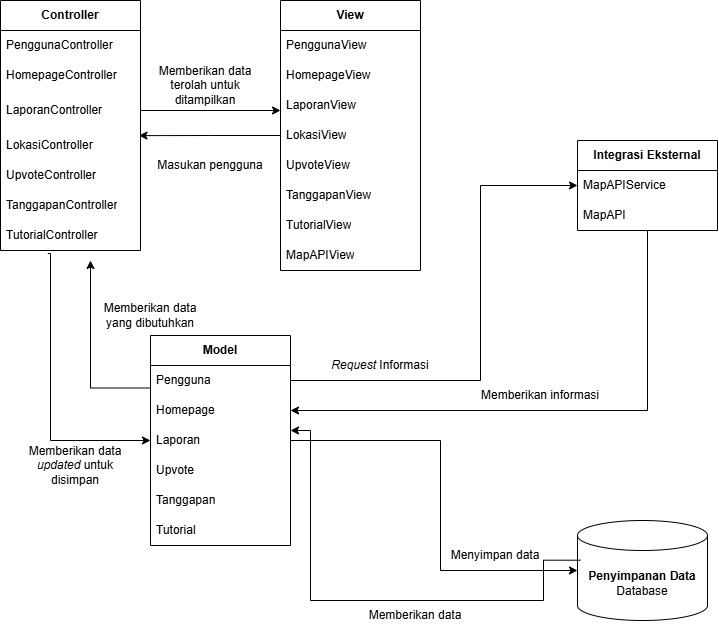
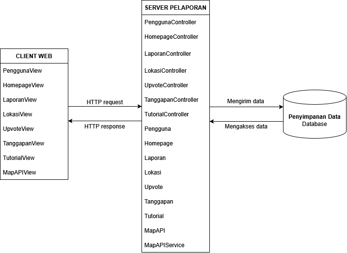

<h1>
IF2150 REKAYASA PERANGKAT LUNAK
 
TUGAS 5
 
SPESIFIKASI KEBUTUHAN PERANGKAT LUNAK (SKPL)
</h1>
 

## *RAWAT (Ruang Aspirasi Warga dan Aduan Terpadu)*

### Untuk: *Agatha Tatianingseto*

Dipersiapkan oleh:
| Informasi | Keterangan |
| --- | --- |
| Kelas | *K01* |
| Kelompok | *01* |

| NIM | Nama |
|---|---|
| *13525103* | *Ravinka Fathia Adinegara* |
| *13525013* | *Samantha Michelle S Silaban* |
| *13525055* | *Syakira Azzahra Rachmania* |
| *13525043* | *Aufa Tatsbita Zahra* |
| *13525046* | *Ghiffari Arya Adhitya* |
---

 
 

# BAB 1: Style/Pattern Arsitektur Acuan

<!--Pada bagian ini, tentukan *architectural style* atau *pattern* yang menjadi acuan untuk aplikasi yang Anda kembangkan. Misalnya *layered architecture*, *client-server*, *repository*, *pipe and filter architecture*, atau MVC (*Model-View-Controller*).-->

## Pemilihan Arsitektur 1:  MVC
Arsitektur Model-View-Controller (MVC) dipakai dengan penjelasan fungsi per komponen sebagai berikut.
- Model : Menyimpan dan merepresentasikan data suatu objek serta menyediakan data ketika dibutuhkan  
- View : Mengatur penyajian data dari Model agar dapat dibaca dan dipahami pengguna dan menjadi media untuk menerima masukan pengguna.
- Controller : Menerima masukan pengguna, melakukan pengolahan yang diperlukan terhadap data dari Model, dan memberikan hasilnya kepada View untuk ditampilkan. 

Alasan pemilihan arsitektur ini adalah: 
- Banyak pengerjaan fitur yang membutuhkan pemisahan antara antarmuka pengguna dan proses pengolahan data. Contohnya pada kebutuhan fungsional yang berkaitan dengan pengisian form, seperti KF01, KF12, dan KF14. Bagian View akan bertanggung jawab untuk menampilkan formulir, sedangkan Controller dan Model akan menangani input dan penyimpanan data. Ini sesuai dengan prinsip MVC. 
- Mayoritas UI menggunakan data dari Model yang sama. Contohnya, KF04 menggunakan Model Laporan untuk menampilkan informasi umum pada peta, sedangkan KF05 menggunakan Model Laporan untuk menampilkan informasi laporan secara rinci. Dengan menggunakan arsitektur MVC, satu Model dapat digunakan beberapa View tanpa menduplikasi. 
- Dari sisi jenis pengguna, MVC cocok karena P/L ini banyak berinteraksi langsung dengan _user_, yaitu masyarakat umum. Ini juga didukung dengan KNF03 dan KNF08 yang berparameter Intercation Capability.

<i>Gambar 1. Gambar Diagram Arsitektur MVC</i>

## Pemilihan Arsitektur 2:  Client-Server
Arsitektur *client-server* membagi sistem menjadi *client* yang meminta *service* dan *server* yang menyediakan *service*.
- Client : Mengirim *request* ke server dengan menggunakan protokol HTTP. Pada P/L ini, *client* dapat mengajukan laporan serta memberikan *upvote* dan komentar pada laporan. Data-data tadi kemudian akan diproses oleh *server*.
- Server : Menerima *request* dan memprosesnya, lalu mengembalikan *response* ke *client*. *Server* akan memproses data laporan serta menyusun homepage yang bisa diakses *client*.

*Client* memerlukan *service* bersama dengan keadaan data terpusat yakni laporan-laporan yang diajukan. Seperti yang tertera pada Kebutuhan Non-Fungsional KNF05 dan KNF06 pada SKPL, sistem harus mampu melayani 1000 pengguna aktif secara bersamaan pada fitur trending dengan tingkat kegagalan *request* kurang dari 1% dan sistem harus menjaga layanan laporan tersedia 24 jam. Selain itu, sesuai KNF09 dan KNF10 sistem harus bisa melakukan sinkronisasi data dan menerapkan *Role-Based Access Control*. Jadi arsitektur *client-server* cocok untuk mendukung kebutuhan-kebutuhan yang disebutkan tadi sebab pengguna dan admin perlu mengakses data yang sudah disinkronisasi. 

<i>Gambar 2. Diagram Arsitektur Client-Server</i>

## Lingkungan Operasi
Tabel 1.1. Lingkungan Operasi Perangkat Lunak
| Komponen | Spesifikasi |
| :--- | :--- |
| *Server* | *Node.js* |
| *Client* | *Web browser modern, sistem dapat dijalankan di web browser seperti Firefox, Chrome, Edge, Opera, Safari, dan web browser serupa.* |
| *DBMS* | *PostgreSQL* |
| *OS* | *Cross-Platform, diharapkan sistem dapat berjalan di seluruh OS seperti Windows, Linux, MacOS, Android, dan IOS melalui web browser* |

Node.js digunakan sebagai _runtime environment_ untuk menjalankan aplikasi pada sisi server atau _backend_. Web browser akan digunakan sebagai *client* yang menerima lingkungan View untuk ditampilkan agar pengguna dapat berinteraksi dengan sistem. PostgreSQL akan digunakan untuk menyimpan data yang dikelola dan diakses melalui Model. Sistem ini juga dapat dijalankan melalui OS apapun (_cross-platform_) karena tampilan View berbasis web dan dijalankan dengan web browser modern sehingga tidak bergantung pada sistem operasi apapun. 

<!--Isi bab ini dengan hal-hal berikut:
1. **Style/pattern yang dipilih** beserta penjelasan singkat peran setiap bagiannya. Untuk MVC, jelaskan peran *Model*, *View*, dan *Controller*.
2. **Alasan pemilihan** berdasarkan karakteristik P/L Anda, misalnya jenis pengguna, alur proses bisnis, serta KF dan KNF pada dokumen SKPL.
3. **Gambar style/pattern yang diterapkan pada P/L Anda.** Jangan hanya menyalin Gambar 1. Isi setiap bagian pattern dengan komponen milik P/L Anda. Misalnya, kotak *Controller* berisi daftar *controller* yang ada di aplikasi dan kotak *Model* berisi daftar *model* yang ada di aplikasi.

Selain *style/pattern*, tuliskan juga lingkungan operasi P/L. Tabel berikut **disalin dari subbab 2.5 *Lingkungan Operasi Perangkat Lunak* pada dokumen SKPL** tanpa perubahan. Setelah tabel, jelaskan kaitan teknologi yang dipakai dengan *style/pattern* yang dipilih. Contohnya, Django (Python) secara bawaan mengikuti pola MVT (*Model-View-Template*), yaitu varian dari MVC.

Tabel 1.1. Lingkungan Operasi Perangkat Lunak

| Komponen | Spesifikasi |
| :--- | :--- |
| *Server* | *[contoh: Node.js v20 dengan Next.js, dijalankan secara lokal (localhost)]* |
| *Client* | *[contoh: Web Browser modern (Chrome, Firefox terbaru)]* |
| *DBMS* | *[contoh: PostgreSQL 15 pada Supabase sebagai basis data terpusat]* |
| *OS* | *[contoh: Cross-platform (Windows/Linux/MacOS) melalui browser]* |
| *...* | *...* |

<b><i>Catatan</i></b>: <i>Style/pattern yang dipilih di bab ini menjadi acuan untuk BAB 2 (pengelompokan komponen) dan BAB 3 (model arsitektur). Contoh pada dokumen ini memakai MVC secara konsisten dari BAB 1 sampai BAB 3. Kelompok boleh memakai pattern lain selama alasannya dijelaskan dan BAB 2 serta BAB 3 disesuaikan. Tabel 1.1 harus sama persis dengan subbab 2.5 dokumen SKPL; jangan menambah atau mengubah isinya karena SKPL sudah final.</i> -->

---

# BAB 2: Identifikasi Komponen / Modul / Subsistem

<!--Pada bagian ini, lakukan identifikasi terhadap komponen, modul, atau subsistem yang menyusun aplikasi berdasarkan *pattern* arsitektur yang telah ditetapkan sebelumnya. Setiap komponen memiliki tanggung jawab tertentu dalam mendukung fungsionalitas sistem.

Setiap komponen memiliki tanggung jawab tertentu dalam mendukung fungsionalitas sistem secara keseluruhan. Komponen dapat dikelompokkan berdasarkan lapisan arsitektur (misalnya *Model*, *View*, dan *Controller* pada pattern MVC), atau berdasarkan fungsi atau peran komponen di dalam sistem (misalnya modul autentikasi, manajemen data, dan integrasi eksternal).-->

Tabel 2.1. Identifikasi Komponen/Modul/Subsistem

| Nama Komponen/Modul/Subsistem | Jenis                 | Penjelasan                                                                                                           |
| :---------------------------- | :-------------------- | :------------------------------------------------------------------------------------------------------------------- |
| *PenggunaView*                 | *View, Client*                | *Menampilkan halaman registrasi dan login serta informasi pengguna sesuai dengan hak akses berdasarkan role.*     |
| *HomepageView*               | *View, Client*                | *Menampilkan halaman utama sistem beserta daftar laporan dan fitur yang dapat diakses pengguna maupun admin.*                                                       |
| *LaporanView*                | *View, Client*                | *Menampilkan informasi laporan serta halaman untuk membuat, melihat, memeriksa, dan memperbarui laporan.*                                      |
| *LokasiView*          | *View, Client*                | *Menampilkan informasi lokasi laporan dan peta interaktif yang digunakan untuk melihat laporan berdasarkan lokasi.*                                         |
| *UpvoteView* | *View, Client* | *Menampilkan tombol dan jumlah upvote pada laporan serta memungkinkan pengguna memberikan upvote.* |
| *TanggapanView* | *View, Client* | *Menampilkan tanggapan admin pada laporan serta menyediakan tampilan untuk memberikan tanggapan terhadap laporan.* |
| *TutorialView* | *View, Client* | *Menampilkan tutorial navigasi dan menyediakan tombol Next, Skip, dan Selesai.* |
| *MapAPIView* | *View, Client* | *Menampilkan peta, lokasi, dan informasi yang diperoleh dari API peta kepada pengguna.* |
| *PenggunaController*           | *Controller, Server*          | *Menangani proses registrasi, login, validasi data akun, verifikasi kredensial, dan pengaturan hak akses pengguna berdasarkan role.*                                             |
| *HomepageController*         | *Controller, Server*          | *Menangani proses pengambilan dan pengelolaan informasi yang ditampilkan pada halaman utama serta navigasi ke fitur laporan dan fitur-fitur lainnya yang tersedia.*                                          |
| *LaporanController*        | *Controller, Server*          | *Menangani proses pembuatan, pengambilan, pemeriksaan, dan pembaruan data laporan serta pengelolaan informasi terkait laporan.*                |
| *LokasiController*           | *Controller, Server*          | *Menangani proses pengambilan dan pengelolaan data lokasi laporan serta pencarian laporan berdasarkan lokasi untuk ditampilkan pada peta.*                                                              |
| *UpvoteController* | *Controller, Server* | *Menangani proses pemberian upvote oleh pengguna terhadap suatu laporan serta pengelolaan jumlah upvote.* |
| *TanggapanController* | *Controller, Server* | *Menangani proses pembuatan, pengambilan, dan penyimpanan tanggapan admin terhadap suatu laporan.* |
| *TutorialController* | *Controller, Server* | *Menangani proses perpindahan langkah tutorial serta aksi Next, Skip, dan Selesai.* |
| *Pengguna*                      | *Model, Server*               | *Merepresentasikan data pengguna maupun admin yang dapat melakukan registrasi, login, mengedit profil, membuat laporan, melihat laporan dan peta lokasi laporan, memberikan upvote, memeriksa laporan, mengatur status laporan, dan memberikan tanggapan sesuai dengan hak akses berdasarkan role.*                        |
| *Homepage*                   | *Model, Server*               | *Merepresentasikan informasi yang ditampilkan pada halaman utama sistem, termasuk daftar laporan, fitur-fitur yang tersedia, dan informasi ringkas laporan.*       |
| *Laporan*                     | *Model, Server*               | *Merepresentasikan informasi laporan mengenai masalah fasilitas atau ruang umum, termasuk nama masalah, lokasi, kategori, tingkat permasalahan, foto (opsional), deskripsi (opsional), dan status laporan.*          |
| *Lokasi*                   | *Model, Server*               | *Merepresentasikan informasi lokasi geografis yang terkait dengan suatu laporan dan digunakan untuk menampilkan laporan pada peta.*                                |
| *Upvote*                    | *Model, Server*           | *Merepresentasikan informasi pemberian upvote oleh pengguna terhadap suatu laporan.*                                                     |
  | *Tanggapan* | *Model, Server* | *Merepresentasikan data tanggapan yang diberikan admin terhadap laporan yang sedang diproses.* |
| *Tutorial* | *Model, Server* | *Merepresentasikan informasi tutorial navigasi yang ditampilkan kepada pengguna.* |
| *MapAPI*       | *Integrasi Eksternal, Server* | *Menyimpan konfigurasi layanan API eksternal seperti apiKey dan baseURL.* |
| *MapAPIService* | *Integrasi Eksternal, Server* | *Mengatur proses request ke API, memproses response, dan mengirim hasil ke MapAPIView.* |
| *Database*                    | *Penyimpanan Data*    | *Menyimpan data Model secara persisten menggunakan PostgreSQL sebagai DBMS.*   |
<!--
Ketentuan pengisian Tabel 2.1:
1. Kolom **Jenis** mengikuti pengelompokan pada *style/pattern* di BAB 1. Untuk MVC, jenisnya adalah *Model*, *View*, dan *Controller*. Jenis lain boleh ditambahkan, misalnya *Pendukung* untuk komponen bantu yang dipakai bersama, atau *Integrasi Eksternal* untuk penghubung ke sistem di luar P/L yang disebutkan pada subbab 2.2 dokumen SKPL. Kolom ini juga boleh diisi dengan *Subsistem*, *Modul*, atau *Komponen* apabila komponen dikelompokkan berdasarkan fungsinya. Tuliskan subsistem terlebih dahulu, lalu komponen penyusunnya di baris-baris berikutnya.
2. Komponen **tidak sama dengan** kelas. Satu komponen boleh mewadahi beberapa kelas dari diagram kelas pada dokumen SKPL. Pastikan seluruh kelas tercakup oleh setidaknya satu komponen.
3. Pastikan seluruh use case pada dokumen SKPL dapat dijalankan oleh komponen-komponen yang didaftarkan di tabel ini. Jangan menambahkan komponen untuk fitur yang tidak ada di SKPL.

<b><i>Catatan</i></b>: <i>Nama komponen pada Tabel 2.1 harus dipakai sama persis pada gambar di BAB 1 dan setiap view di BAB 3. Jika saat membuat view ternyata dibutuhkan komponen baru, tambahkan komponen tersebut ke Tabel 2.1 terlebih dahulu.</i>
-->
---

# BAB 3: Model Arsitektur Perangkat Lunak

*Architectural View* adalah bagaimana cara kita melihat/mendeskripsikan arsitektur sebuah sistem dari sudut pandang tertentu. Dalam perancangan arsitektur aplikasi, dibutuhkan *Architectural View* yang dapat mempermudah pemahaman dari proses aplikasi yang akan dikembangkan. Tujuan dari *Architectural View* adalah menjadi bahan komunikasi, pemisahan masalah, mempermudah analisis, dan pemandu saat eksekusi pengembangan sistem.

<!--Buatlah model arsitektur dari aplikasi yang akan dirancang dalam bentuk *view*. Model arsitektur ini berfungsi untuk memperlihatkan bagaimana setiap komponen, modul, dan subsistem saling berinteraksi serta berkolaborasi dalam menjalankan fungsi utama sistem secara keseluruhan. Anda dapat membuat satu atau lebih *view* tergantung kebutuhan dalam bentuk gambar. Pilihlah notasi yang sesuai. Contoh *view* yang dapat digunakan antara lain ***Logical View***, ***Process View***, ***Development View***, serta ***Physical View***.

Ketentuan pengisian BAB 3:
1. Setiap view menggambarkan **keseluruhan sistem**, bukan satu use case atau satu fitur saja.
2. Buat **minimal satu view**. Setiap view dituliskan dalam subbab tersendiri (3.1, 3.2, dan seterusnya). Tidak perlu membuat keempat view, pilih yang paling membantu menjelaskan P/L Anda, lalu jelaskan alasan pemilihannya.
3. Setiap view harus **konsisten dengan BAB 2**. Seluruh komponen pada Tabel 2.1 harus muncul dengan nama yang sama, dan tidak boleh ada komponen pada view yang tidak terdaftar di Tabel 2.1.
4. Setiap view harus **mencerminkan style/pattern pada BAB 1**. Misalnya, jika memilih MVC, pembagian *Model*, *View*, dan *Controller* harus terlihat jelas pada diagram.
5. Jika membuat lebih dari satu view, setiap view harus menggambarkan sistem yang sama dari sudut pandang berbeda. View tambahan melengkapi view pertama, bukan mengulanginya.
6. Beri label pada setiap garis atau panah yang menghubungkan komponen agar hubungan antarkomponen dapat dipahami tanpa penjelasan tambahan.
7. Jika membuat *Physical View*, gambarkan lingkungan operasi pada Tabel 1.1.-->

## 3.1 Development View

<!-- Tuliskan secara singkat mengenai model arsitektur perangkat lunak yang Anda pilih dan sertakan alasan mengapa model arsitektur tersebut cocok untuk aplikasi Anda.

<i>Gambar 2. Contoh Logical View pada P/L E-Commerce</i>

Gambar 2 adalah contoh *Logical View* dalam bentuk *block diagram*. Seluruh komponen pada Tabel 2.1 digambarkan dan dikelompokkan sesuai pola MVC (*View*, *Controller*, *Model*), ditambah komponen pendukung dan basis data. Sistem di luar P/L, seperti *Payment Gateway (dummy)*, digambarkan dengan garis putus-putus dan tidak perlu dimasukkan ke Tabel 2.1. Setiap garis diberi label: "Memanggil" untuk *View* yang memanggil *Controller*, "akses" untuk *Controller* yang mengakses *Model*, serta agregasi dan komposisi untuk hubungan antar-*Model*.

<b><i>Catatan</i></b>: <i>Ganti XXX dengan nama view yang dibuat, misalnya Logical View. Gambar 2 hanya contoh untuk P/L e-commerce, ganti dengan view milik kelompok Anda yang memuat seluruh komponen pada Tabel 2.1. Jenis view dan notasinya boleh berbeda dari contoh. Jika membuat view tambahan, lanjutkan pola 3.x ini (3.2, 3.3, dan seterusnya).</i> -->

Model arsitektur yang dipilih adalah Development View dengan jenis Component Diagram karena dapat menggambarkan sistem RAWAT dengan jelas termasuk dependensi antarkomponen dan membuatnya mudah untuk dilihat. Dalam diagram ini, fungsionalitas setiap komponen dapat terlihat sekaligus hubungan fungsi tersebut dengan komponen lain.

<i>Gambar 3. Development View</i>  

---

# Referensi

- Sommerville, I. (2016). *Software Engineering* (10th ed.). Pearson. Chapter 6: *Architectural Design*: [https://software-engineering-book.com/slides/](https://software-engineering-book.com/slides/)
- Diagram arsitektur: [https://drive.google.com/file/d/1a9N-nzasATQvmG2plCPrJ9EqbMEHwKSg/view?usp=sharing](https://drive.google.com/file/d/1a9N-nzasATQvmG2plCPrJ9EqbMEHwKSg/view?usp=sharing)
