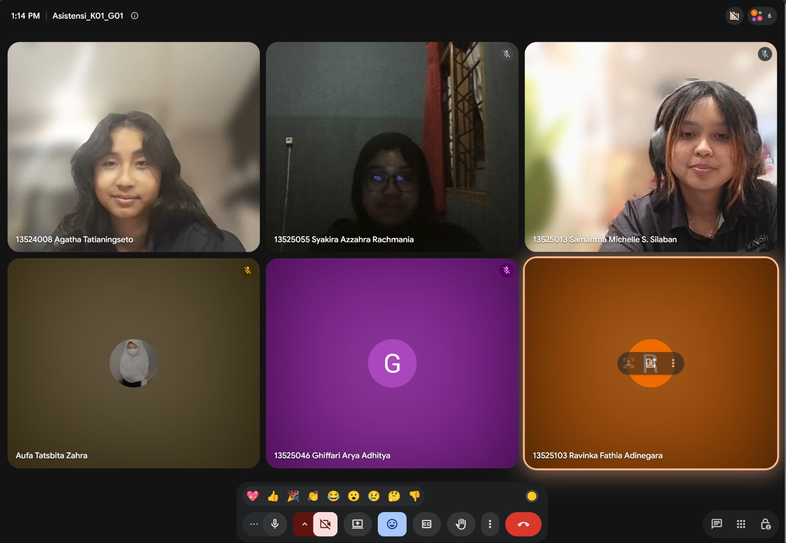

# Form Asistensi

## Tugas Besar IF2150 - Rekayasa Perangkat Lunak

| Informasi | Keterangan |
| --- | --- |
| **Hari** | *Selasa* |
| **Tanggal** | *06/10/2006* |
| **Kelas** | *01* |
| **Nomor Kelompok** | *01*  |
| **Nama Kelompok** | *berjiwa ksatria*  |
| **Nama Perangkat Lunak** | *RAWAT (Ruang Aspirasi Warga dan Aduan Terpadu)*  |
| **Dokumen** | *K01_G01_APL*  |

### Anggota Kelompok

| NIM | Nama |
| --- | --- |
| *13525103* | *Ravinka Fathia Adinegara* |
| *13525013* | *Samantha Michelle S Silaban* |
| *13525055* | *Syakira Azzahra Rachmania* |
| *13525043* | *Aufa Tatsbita Zahra* |
| *13525046* | *Ghiffari Arya Adhitya* |

### Catatan

| Catatan |
| --- |
| 1. Tabel 1.1 digabung untuk dua arsitektur  |
| 2. Database pada arsitektur client-server yang awalnya di Entitiy seharusnya dipindah ke Server |
| 3. Database pada arsitektur MVC dua arah |
| 4. Integrasi Eksternal dibuat diagram terpisah |

## Dokumentasi

<!--  -->

  

  <i>Gambar 1. Dokumentasi kegiatan asistensi.</i>

